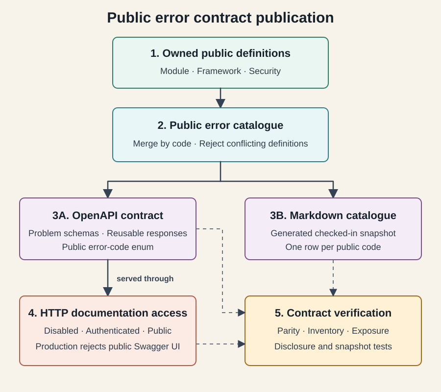

# API Error Contract

[Back to the API guide](README.md)

OptraBidz returns RFC 9457 Problem Details for HTTP failures. The public error
descriptor is intentionally separated from internal diagnostics so responses
remain stable without exposing implementation details.

<a href="assets/public-error-contract-flow.svg">
  
</a>

[High-resolution PNG for Jira and offline review](assets/public-error-contract-flow.png)

Module catalogues own public descriptors. The documentation adapter adds the
fixed framework and security problems, normalizes and validates the combined
set, then publishes the same contract to OpenAPI and the generated Markdown
catalogue. Runtime exception handling does not query the documentation
catalogue. The fail-closed documentation policy separately controls access to
the HTTP OpenAPI and Swagger UI endpoints; it does not filter catalogue entries.

## Response Shape

Every problem response contains:

| Field | Meaning |
|---|---|
| `type` | Stable URI derived from the public error code |
| `title` | Short client-facing summary |
| `status` | HTTP status |
| `detail` | Safe explanation for the caller |
| `instance` | Request-specific problem identifier |
| `code` | Stable machine-readable error code |
| `requestId` | Correlation identifier shared with logs |
| `timestamp` | Time the response was created |
| `violations` | Optional field-level validation details |

The response never includes stack traces, SQL details, secret material,
provider credentials, or internal exception messages.

## Category Mapping

| Error category | HTTP status |
|---|---:|
| Validation | 400 |
| Authentication | 401 |
| Authorization | 403 |
| Not found | 404 |
| Conflict | 409 |
| Business rule | 422 |
| Internal failure | 500 |

Authentication entry points, access-denied handlers, MVC validation, and
application exceptions all use the same Problem Details factory. Controllers
do not build error payloads directly.

## Adding an Error

1. Define the stable public descriptor in the owning module catalogue.
2. Throw an application exception with that descriptor and separate internal
   diagnostic information.
3. Test the service rule and the HTTP mapping.
4. Regenerate and verify the [public catalogue](error-catalogue.md):

```powershell
.\mvnw.cmd -q "-Dtest=ErrorCatalogueMarkdownSnapshotTest" "-Doptrabidz.update-error-catalogue=true" test
.\mvnw.cmd -q "-Dtest=ErrorCatalogueMarkdownSnapshotTest" test
```
