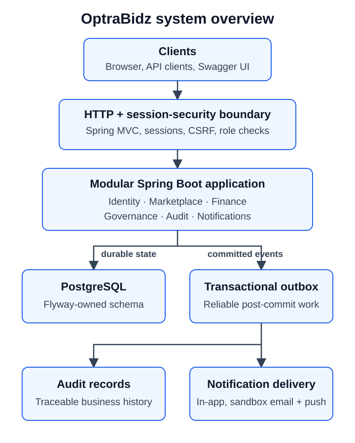

# Architecture

[Back to the documentation portal](../README.md)

OptraBidz is a Spring Boot modular monolith backed by PostgreSQL. Start with the
view that matches the question you are answering:

| Question | View |
|---|---|
| Who uses the system and what lies outside it? | [System context](system-context.md) |
| What starts and runs inside one application instance? | [Runtime](runtime.md) |
| How are modules grouped into business capabilities? | [Capability views](capabilities/README.md) |
| Which capability owns a change? | [Module catalogue](modules/README.md) |
| Which current source dependencies cross module boundaries? | [Module dependencies](module-dependencies.md) |
| How is an authenticated request handled? | [Request and security flow](flows/request-security.md) |
| How do committed events reach audit and notification processing? | [Event-delivery flow](flows/event-delivery.md) |
| How does an internal failure become a safe public response? | [Error-disclosure flow](flows/error-disclosure.md) |

[High-resolution PNG fallback](assets/optrabidz-system-overview.png)

The synchronous request path ends at committed application state. Audit and
notification side effects begin from committed outbox records, which prevents a
successful business transaction from depending on an external delivery channel.

## Capability Map

| Area | Modules | Responsibility |
|---|---|---|
| Identity and access | `security`, `identity`, `participation` | Authentication, accounts, sessions, roles, and participant profiles |
| Marketplace | `classification`, `marketplace`, `governance` | Eligibility, listings, bids, agreements, and lifecycle rules |
| Finance | `financial` | Settlement, repayment, payment intents, provider attempts, and webhook processing |
| Supporting capabilities | `notification`, `audit`, `common`, `documentation` | Delivery, traceability, domain events, shared contracts, outbox infrastructure, and API-document adapters |

Controllers adapt HTTP requests. Application services coordinate use cases;
domain rules protect state transitions; repositories and integration adapters
handle infrastructure. Modules should depend on public contracts rather than
another module's persistence implementation.

The package structure implements these capability boundaries. Automated
architecture rules currently protect the exception, documentation, and webhook
boundaries; complete repository-wide module dependency enforcement is not yet
implemented.

## Persistence and Event Delivery

1. Flyway migrates PostgreSQL before Hibernate validates entity mappings.
2. A business transaction stores its state change and outbox event atomically.
3. The outbox dispatcher locks committed work and invokes registered
   processors.
4. Audit records are persisted and notification deliveries enter their own
   retry lifecycle.

The database is the current durable queue. Kafka, Redis, and external delivery
providers are not part of the implemented architecture.

Read the [architecture decisions](../decisions/README.md) for the reasoning
behind the modular monolith, Flyway, outbox, and error-contract boundaries.

See the [diagram publication guide](diagram-publication.md) for source and
fallback maintenance rules.
