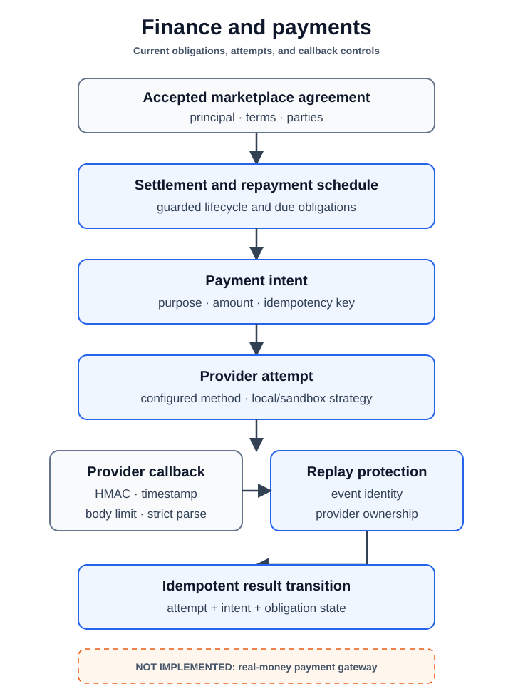

# Finance and Payments

[Back to capability views](README.md)

The `financial` module owns settlement, repayment schedules, payment intents,
provider attempts, webhook processing, and replay protection.

[High-resolution PNG fallback](assets/finance-payments.png)

It consumes agreement, identity, participation, governance, security, audit,
and shared contracts through the current modular-monolith boundaries. Provider
implementations remain local or sandbox strategies; the repository does not
claim a live real-money provider integration.

Read the [`financial` module page](../modules/financial.md) for ownership and
the [database guide](../../database/README.md) for persistent relationships.
