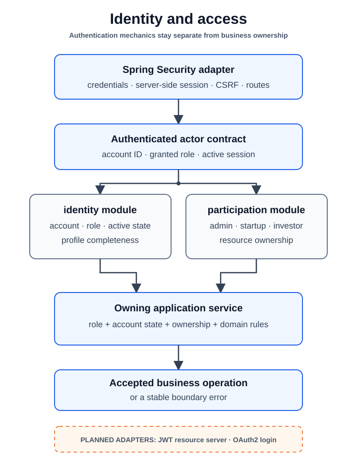

# Identity and Access

[Back to capability views](README.md)

This capability separates authentication mechanics from account and
participant ownership.

[High-resolution PNG fallback](assets/identity-access.png)

| Module | Owns |
|---|---|
| [`security`](../modules/security.md) | Credentials, server-side sessions, login attempts, CSRF, and route policy |
| [`identity`](../modules/identity.md) | Accounts, roles, activation, and profile-completeness state |
| [`participation`](../modules/participation.md) | Administrator, startup, and investor records |

Spring Security establishes the authenticated caller. Application services then
use identity and participant ports to enforce account state, role, profile, and
resource-ownership rules. JWT and OAuth2 are planned alternatives, not current
runtime components.
