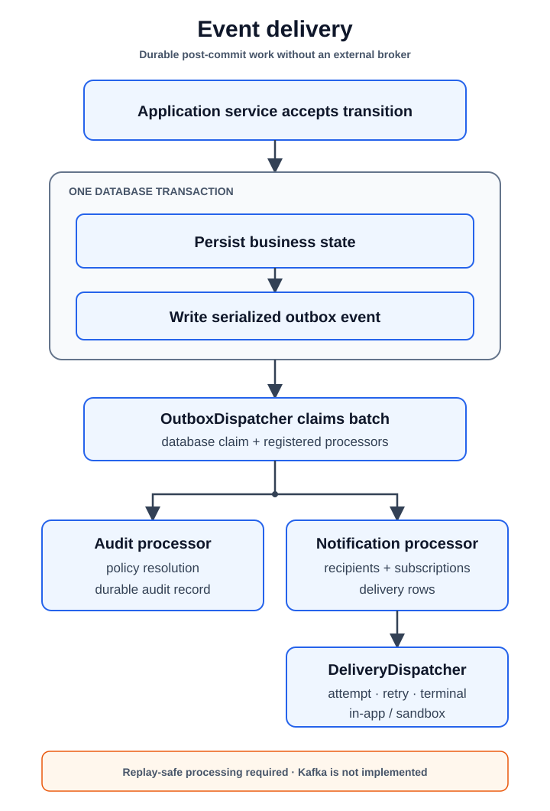

# Platform Support

[Back to capability views](README.md)

These modules provide shared behavior without becoming a general business
domain.

| Module | Owns |
|---|---|
| [`common`](../modules/common.md) | Shared HTTP contracts, errors, observability, domain events, and outbox infrastructure |
| [`audit`](../modules/audit.md) | Durable business and security audit records |
| [`notification`](../modules/notification.md) | Notification subscriptions and retryable channel delivery |
| [`documentation`](../modules/documentation.md) | Public error catalogue, OpenAPI components, and documentation exposure controls |

Committed domain events enter the transactional outbox before audit and
notification processing. Documentation adapters assemble public contracts but
do not own the business errors contributed by other modules.

Read the [event-delivery flow](../flows/event-delivery.md) for the shared
post-commit path.
