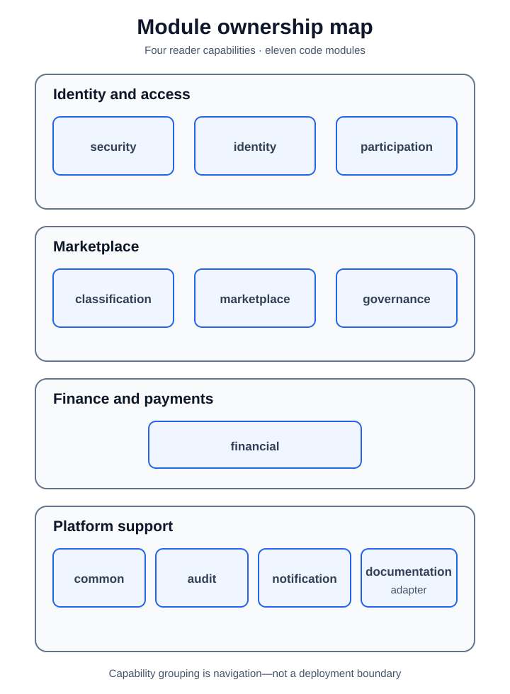

# Module Catalogue

[Back to architecture](../README.md)

The catalogue mirrors the eleven top-level production packages. Capability
grouping helps navigation but does not merge module ownership or hide current
dependencies.

[High-resolution PNG fallback](../assets/complete-module-map.png)

| Module | Primary responsibility | Capability |
|---|---|---|
| [`audit`](audit.md) | Durable business and security audit records | [Platform support](../capabilities/platform-support.md) |
| [`classification`](classification.md) | Startup classifications and investor preferences | [Marketplace](../capabilities/marketplace.md) |
| [`common`](common.md) | Shared HTTP, error, observability, event, and outbox infrastructure | [Platform support](../capabilities/platform-support.md) |
| [`documentation`](documentation.md) | Public error catalogue and OpenAPI/security adapters | [Platform support](../capabilities/platform-support.md) |
| [`financial`](financial.md) | Settlements, repayments, payment attempts, and webhooks | [Finance and payments](../capabilities/finance-payments.md) |
| [`governance`](governance.md) | Authority, eligibility, boundary, and lifecycle rules | [Marketplace](../capabilities/marketplace.md) |
| [`identity`](identity.md) | Accounts, roles, and profile state | [Identity and access](../capabilities/identity-access.md) |
| [`marketplace`](marketplace.md) | Listings, bids, agreements, and recommendation | [Marketplace](../capabilities/marketplace.md) |
| [`notification`](notification.md) | Notification subscriptions and channel delivery | [Platform support](../capabilities/platform-support.md) |
| [`participation`](participation.md) | Administrator, startup, and investor records | [Identity and access](../capabilities/identity-access.md) |
| [`security`](security.md) | Credentials, sessions, authentication, CSRF, and route policy | [Identity and access](../capabilities/identity-access.md) |

Use [module dependencies](../module-dependencies.md) for the current import
graph. `ArchitectureModuleCatalogTest` derives current dependency edges from
production imports and fails when this guide drifts.
