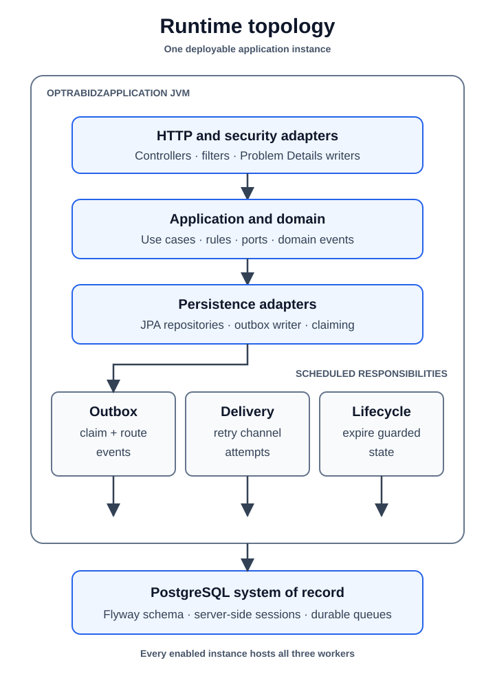

# Runtime

[Back to architecture](README.md)

One `OptrabidzApplication` process hosts HTTP adapters, application services,
domain rules, JPA adapters, and scheduled workers. The runtime is a modular
monolith; modules are package boundaries, not independently deployed services.

[High-resolution PNG fallback](assets/runtime-topology.png)

## Startup sequence

1. Spring loads the selected configuration profile.
2. Flyway validates migration history and applies pending migrations from
   `db/migration`.
3. Hibernate validates entity mappings with `ddl-auto=validate`; it does not
   create or update the schema.
4. Security, error, documentation, provider, outbox, audit, notification, and
   governance components are assembled.
5. Development-only administrator bootstrap or local provider initializers run
   only when their configuration enables them.
6. Scheduled workers begin after their configured initial delays.

## Synchronous request path

Spring Security establishes or rejects caller identity before a controller
adapts an accepted request. The controller builds a command or query, the
application service coordinates domain rules and ports, and a repository
adapter commits state to PostgreSQL. Controllers do not verify credentials or
construct error payloads.

## Scheduled responsibilities

| Worker | Current responsibility |
|---|---|
| `OutboxDispatcher` | Claims committed outbox rows and invokes registered processors |
| `NotificationDeliveryDispatcher` | Claims pending channel deliveries and records bounded retries |
| `LifecycleExpiryScheduler` | Applies listing, settlement, payment-intent, and repayment lifecycle rules |

All three workers run inside every enabled application instance. Their database
claiming and idempotency rules therefore matter before horizontal scaling.

## State and integration boundaries

- PostgreSQL is the system of record and the durable queue for outbox work.
- Sessions are server-side records, not JWTs.
- Email and push delivery are sandbox strategies; in-app delivery is local.
- Local and sandbox payment strategies exercise the payment lifecycle without
  transferring real money.

Operational switches and profile behavior are documented in the
[operations guide](../operations/README.md).
