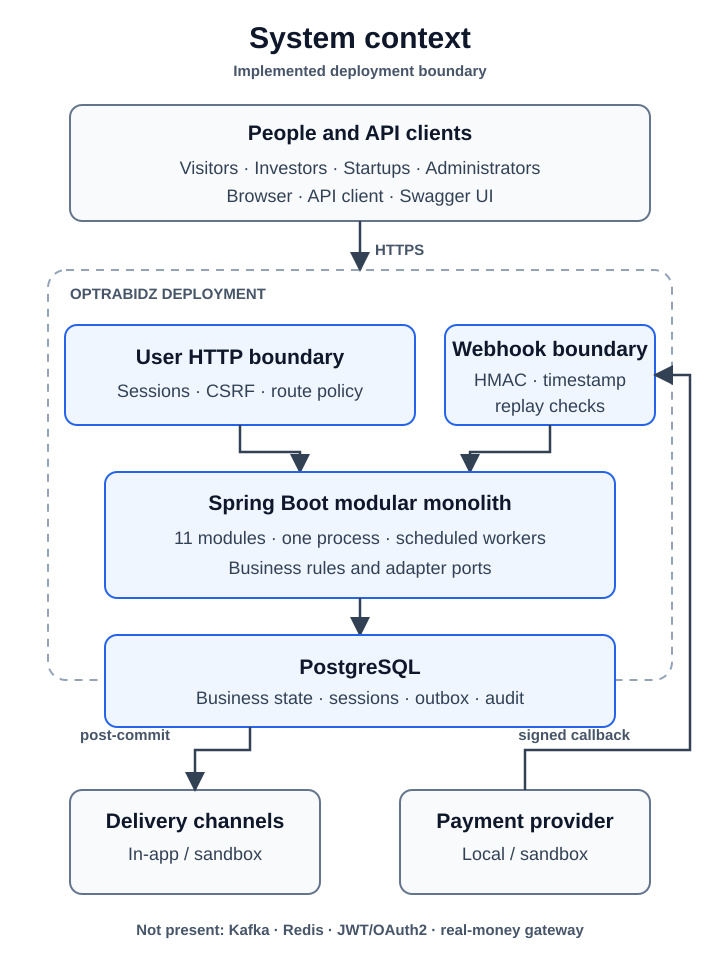

# System Context

[Back to architecture](README.md)

OptraBidz currently runs as one web application and one PostgreSQL database.
Browser and API clients cross the Spring MVC and Spring Security boundary.
Payment-provider callbacks enter through a separate signed webhook boundary;
the repository currently supplies local and sandbox provider adapters rather
than a real-money provider integration.

[High-resolution PNG fallback](assets/system-context.png)

## People and callers

| Caller | Current interaction |
|---|---|
| Anonymous visitor | Registration, login, and the currently public standard listing reads |
| Investor | Profile, preferences, discovery, bids, agreements, settlements, repayments, and notifications |
| Startup | Profile, classifications, listings, bids received, agreements, settlements, repayments, and notifications |
| Administrator | Recovery-governed authority transfer and audit queries |
| Payment provider | HMAC-authenticated callback with timestamp and replay protection |

## System boundary

The deployed boundary contains all eleven application modules, Spring Security,
scheduled workers, and persistence adapters. PostgreSQL stores business state,
sessions, outbox events, audit records, notification delivery state, and payment
webhook replay state.

No Kafka broker, Redis cache, OAuth2 provider, JWT issuer, external notification
provider, or real payment gateway is part of the implemented system.

## Trust boundaries

- User requests require the route's configured session and role policy.
- Browser mutations are protected by CSRF tokens.
- Payment callbacks do not use user sessions; provider identity is established
  through the configured signature, timestamp, payload, and replay checks.
- Public errors and API documentation are filtered before crossing the HTTP
  boundary.

See [request security](flows/request-security.md) and
[event delivery](flows/event-delivery.md) for the two principal runtime paths.
