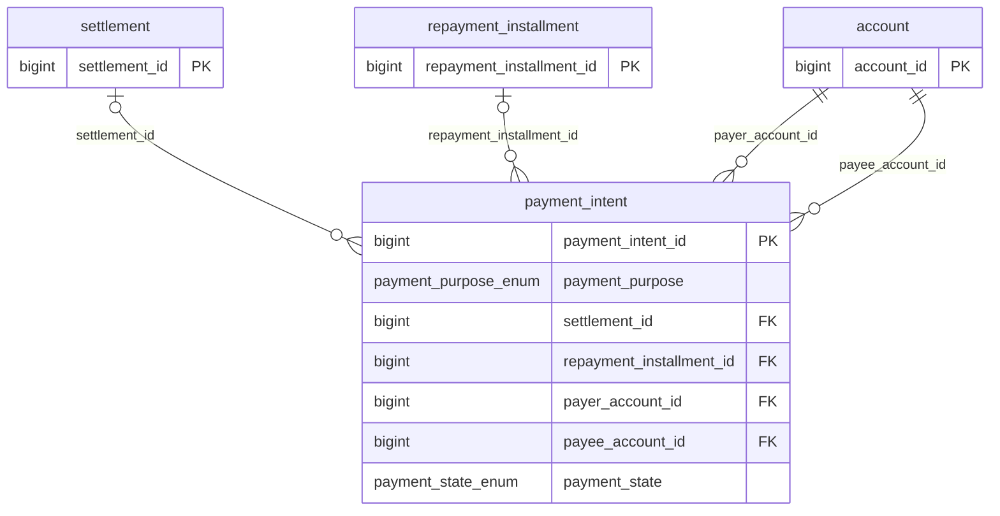
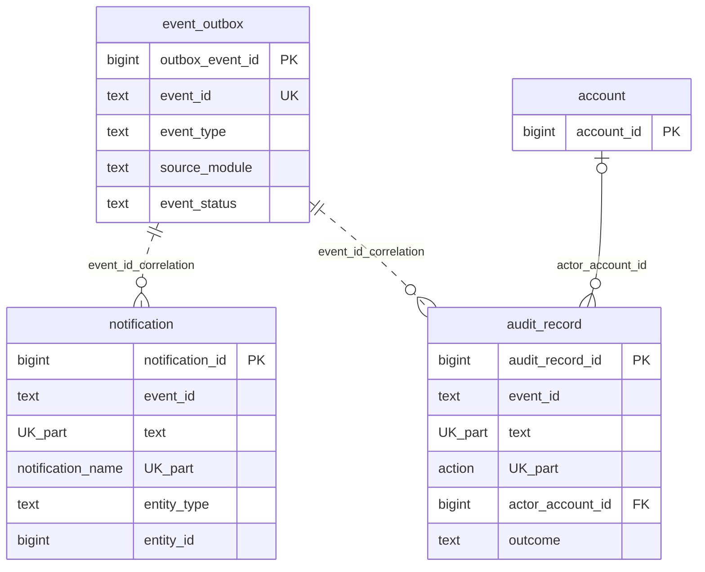

# OptraBidz ER Diagram Source

The rendered ER diagrams in `assets/` are hand-authored SVGs for reliable
previewing in GitHub, GitHub mobile, and IDE Markdown viewers. These Mermaid
references capture the same schema-backed relationships.

Cardinality is derived from the PostgreSQL schema only: FK nullability, FK
uniqueness, primary keys, and unique constraints. Partial unique indexes are
not treated as base relationship cardinality.

## Identity and Access: Account Access and Security Context

```mermaid
erDiagram
    account {
        bigint account_id PK
        account_state_enum account_state
        timestamptz created_at
        timestamptz deactivated_at
    }
    role {
        bigint role_id PK
        bigint account_id FK_UK
        role_type_enum role_type
    }
    credential {
        bigint credential_id PK
        bigint account_id FK_UK
        varchar email UK
        credential_status_enum credential_status
    }
    session {
        bigint session_id PK
        bigint account_id FK
        session_status_enum session_status
    }
    admin {
        bigint admin_id PK
        bigint account_id FK_UK
        admin_state_enum admin_state
        bigint revoked_by_account_id FK
    }

    account ||--o| role : role_account_id
    account ||--o| credential : credential_account_id
    account ||--o{ session : session_account_id
    account ||--o| admin : admin_account_id
    account o|--o{ admin : revoked_by_account_id
```

## Identity and Access: Participant Profile Context

```mermaid
erDiagram
    account {
        bigint account_id PK
        account_state_enum account_state
    }
    profile {
        bigint profile_id PK
        bigint account_id FK_UK
        profile_status_enum profile_status
    }
    startup {
        bigint startup_id PK
        bigint account_id FK_UK
        varchar legal_entity_name
        varchar public_display_name
    }
    startup_legal_registration {
        bigint registration_id PK
        bigint startup_id FK
        text registration_type
        text registration_value
    }
    startup_web_presence {
        bigint web_presence_id PK
        bigint startup_id FK
        text url
    }
    startup_classification {
        bigint startup_classification_id PK
        bigint startup_id FK
        text classification_type UK_part
        text classification_value UK_part
    }
    investor {
        bigint investor_id PK
        bigint account_id FK_UK
        varchar public_display_name
        varchar legal_entity_name
    }
    investor_web_presence {
        bigint web_presence_id PK
        bigint investor_id FK
        text url
    }
    investor_preference {
        bigint investor_preference_id PK
        bigint investor_id FK
        text preference_type UK_part
        text preference_value UK_part
    }

    account ||--o| profile : profile_account_id
    account ||--o| startup : startup_account_id
    account ||--o| investor : investor_account_id
    startup ||--o{ startup_legal_registration : startup_id
    startup ||--o{ startup_web_presence : startup_id
    startup ||--o{ startup_classification : startup_id
    investor ||--o{ investor_web_presence : investor_id
    investor ||--o{ investor_preference : investor_id
```

## Marketplace: Listing and Bidding Context

```mermaid
erDiagram
    startup {
        bigint startup_id PK
        bigint account_id FK_UK
    }
    investor {
        bigint investor_id PK
        bigint account_id FK_UK
    }
    funding_listing {
        bigint listing_id PK
        bigint startup_id FK
        listing_state_enum listing_state
        funding_model_enum funding_model
    }
    listing_debt_terms {
        bigint listing_debt_terms_id PK
        bigint listing_id FK_UK
        numeric requested_amount
        repayment_plan_type_enum repayment_plan_type
    }
    bid {
        bigint bid_id PK
        bigint listing_id FK
        bigint investor_id FK
        bid_state_enum bid_state
    }
    bid_debt_terms {
        bigint bid_debt_terms_id PK
        bigint bid_id FK_UK
        numeric proposed_amount
        repayment_plan_type_enum repayment_plan_type
    }

    startup ||--o{ funding_listing : listing_startup_id
    funding_listing ||--o| listing_debt_terms : listing_id
    funding_listing ||--o{ bid : bid_listing_id
    investor ||--o{ bid : bid_investor_id
    bid ||--o| bid_debt_terms : bid_id
```

## Marketplace: Agreement Acceptance and Debt Terms Context

```mermaid
erDiagram
    startup {
        bigint startup_id PK
    }
    investor {
        bigint investor_id PK
    }
    funding_listing {
        bigint listing_id PK
        bigint startup_id FK
    }
    bid {
        bigint bid_id PK
        bigint listing_id FK
        bigint investor_id FK
        bid_state_enum bid_state
    }
    agreement {
        bigint agreement_id PK
        bigint listing_id FK
        bigint bid_id FK_UK
        bigint startup_id FK
        bigint investor_id FK
    }
    agreement_debt_terms {
        bigint agreement_debt_terms_id PK
        bigint agreement_id FK_UK
        numeric principal_amount
        repayment_plan_type_enum repayment_plan_type
    }

    funding_listing ||--o{ agreement : agreement_listing_id
    bid ||--o| agreement : agreement_bid_id
    startup ||--o{ agreement : agreement_startup_id
    investor ||--o{ agreement : agreement_investor_id
    agreement ||--o| agreement_debt_terms : agreement_id
```

## Finance: Settlement Context

```mermaid
erDiagram
    agreement {
        bigint agreement_id PK
    }
    startup {
        bigint startup_id PK
    }
    investor {
        bigint investor_id PK
    }
    settlement {
        bigint settlement_id PK
        bigint agreement_id FK_UK
        bigint startup_id FK
        bigint investor_id FK
        settlement_state_enum settlement_state
    }

    agreement ||--o| settlement : settlement_agreement_id
    startup ||--o{ settlement : settlement_startup_id
    investor ||--o{ settlement : settlement_investor_id
```

## Finance: Repayment Schedule Context

```mermaid
erDiagram
    agreement {
        bigint agreement_id PK
    }
    startup {
        bigint startup_id PK
    }
    investor {
        bigint investor_id PK
    }
    repayment {
        bigint repayment_id PK
        bigint agreement_id FK_UK
        bigint startup_id FK
        bigint investor_id FK
        repayment_status_enum repayment_status
    }
    repayment_installment {
        bigint repayment_installment_id PK
        bigint repayment_id FK
        int installment_number UK_part
        repayment_installment_status_enum installment_status
    }

    agreement ||--o| repayment : repayment_agreement_id
    startup ||--o{ repayment : repayment_startup_id
    investor ||--o{ repayment : repayment_investor_id
    repayment ||--o{ repayment_installment : repayment_id
```

## Payments: Payment Intent Context



## Payments: Payment Attempt and Provider Context

```mermaid
erDiagram
    payment_intent {
        bigint payment_intent_id PK
        payment_purpose_enum payment_purpose
        payment_state_enum payment_state
        varchar idempotency_key UK
    }
    payment_attempt {
        bigint payment_attempt_id PK
        bigint payment_intent_id FK
        varchar provider_code FK
        payment_method_type_enum method_type
        payment_attempt_state_enum attempt_state
    }
    payment_provider {
        varchar provider_code PK
        varchar display_name
        boolean enabled
    }
    payment_provider_method {
        varchar provider_code PK_FK
        payment_method_type_enum method_type PK
        varchar currency_code PK
        boolean enabled
    }

    payment_intent ||--o{ payment_attempt : payment_intent_id
    payment_provider ||--o{ payment_attempt : provider_code
    payment_provider ||--o{ payment_provider_method : provider_code
```

## Payments: Payment Webhook Context

```mermaid
erDiagram
    payment_provider {
        varchar provider_code PK
        varchar display_name
        boolean enabled
    }
    payment_webhook_event {
        bigint payment_webhook_event_id PK
        varchar provider_code FK
        text provider_event_id UK_part
        bigint payment_intent_id FK
        bigint payment_attempt_id FK
        payment_webhook_processing_state_enum processing_state
    }
    payment_intent {
        bigint payment_intent_id PK
        payment_purpose_enum payment_purpose
        payment_state_enum payment_state
    }
    payment_attempt {
        bigint payment_attempt_id PK
        bigint payment_intent_id FK
        payment_attempt_state_enum attempt_state
    }

    payment_provider ||--o{ payment_webhook_event : provider_code
    payment_intent o|--o{ payment_webhook_event : payment_intent_id
    payment_attempt o|--o{ payment_webhook_event : payment_attempt_id
```

## Notifications, Outbox, and Audit: Notification Delivery and Subscription Context

```mermaid
erDiagram
    notification {
        bigint notification_id PK
        text event_id UK_part
        text notification_name UK_part
        text entity_type
        bigint entity_id
    }
    notification_recipient {
        bigint recipient_id PK
        bigint notification_id FK
        bigint account_id FK
        recipient_delivery_status_enum recipient_delivery_status
        read_status_enum read_status
    }
    notification_delivery {
        bigint delivery_id PK
        bigint recipient_id FK
        channel_type_enum channel_type UK_part
        channel_delivery_status_enum channel_delivery_status
    }
    notification_delivery_attempt {
        bigint delivery_attempt_id PK
        bigint delivery_id FK
        int attempt_number UK_part
        text attempt_status
    }
    notification_subscription {
        bigint subscription_id PK
        bigint account_id FK
        channel_type_enum channel_type UK_part
        text endpoint UK_part
        text subscription_state
    }
    account {
        bigint account_id PK
    }

    notification ||--o{ notification_recipient : notification_id
    account ||--o{ notification_recipient : account_id
    notification_recipient ||--o{ notification_delivery : recipient_id
    notification_delivery ||--o{ notification_delivery_attempt : delivery_id
    account ||--o{ notification_subscription : account_id
```

## Notifications, Outbox, and Audit: Outbox and Audit Correlation Context


