# OptraBidz ER Diagrams

These diagrams show the main database relationships in a reviewer-friendly
format. Cardinality is based on the PostgreSQL schema only: foreign-key
nullability, foreign-key uniqueness, primary keys, and unique constraints.
Application lifecycle expectations are not assumed here. The complete schema is
available in [`optrabidz-schema.sql`](optrabidz-schema.sql).

## Legend

| Marker | Meaning |
|---|---|
| `PK` | Primary key |
| `FK` | Foreign key |
| `UK` | Unique key |
| `1` | Exactly one row on that side is required by the FK |
| `0..1` | Zero or one row on that side is allowed by the schema |
| `0..N` | Zero or many rows on that side are allowed by the schema |
| Solid line | Database foreign-key relationship |
| Dotted line | Event correlation by `event_id`, not a database foreign key |

## Identity and Access

### Account Access and Security Context

<a href="assets/account-access-security-er.svg">
  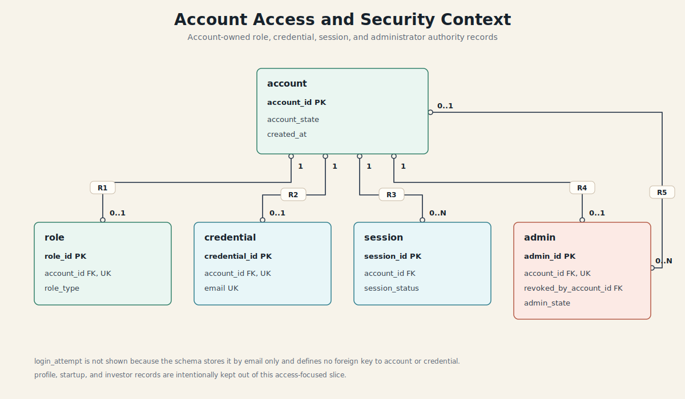
</a>

This slice focuses only on account-owned access records. `login_attempt` is left
out because it stores attempted email values and has no database foreign key to
`account` or `credential`.

| Rel | Parent | Cardinality | Child | Schema basis |
|---|---|---:|---|---|
| `R1` | `account` | `1 -> 0..1` | `role` | `role.account_id` is `FK`, `NOT NULL`, `UNIQUE` |
| `R2` | `account` | `1 -> 0..1` | `credential` | `credential.account_id` is `FK`, `NOT NULL`, `UNIQUE` |
| `R3` | `account` | `1 -> 0..N` | `session` | `session.account_id` is `FK`, `NOT NULL` |
| `R4` | `account` | `1 -> 0..1` | `admin` | `admin.account_id` is `FK`, `NOT NULL`, `UNIQUE` |
| `R5` | `account` | `0..1 -> 0..N` | `admin` | `admin.revoked_by_account_id` is nullable `FK` |

### Participant Profile Context

<a href="assets/participant-profile-er.svg">
  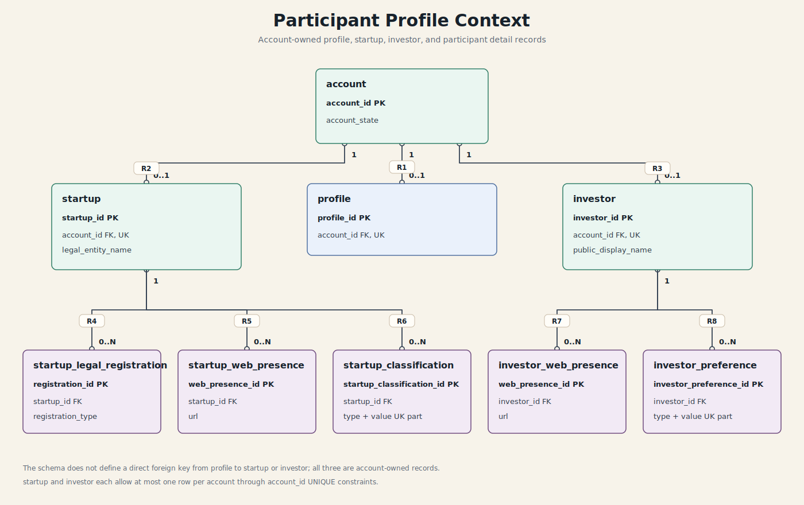
</a>

This slice focuses on account-owned participant records and the detail rows
attached to startup and investor profiles. `profile`, `startup`, and `investor`
are separate account-owned tables; the schema does not define a direct foreign
key from `profile` to either participant table.

| Rel | Parent | Cardinality | Child | Schema basis |
|---|---|---:|---|---|
| `R1` | `account` | `1 -> 0..1` | `profile` | `profile.account_id` is `FK`, `NOT NULL`, `UNIQUE` |
| `R2` | `account` | `1 -> 0..1` | `startup` | `startup.account_id` is `FK`, `NOT NULL`, `UNIQUE` |
| `R3` | `account` | `1 -> 0..1` | `investor` | `investor.account_id` is `FK`, `NOT NULL`, `UNIQUE` |
| `R4` | `startup` | `1 -> 0..N` | `startup_legal_registration` | `startup_legal_registration.startup_id` is `FK`, `NOT NULL` |
| `R5` | `startup` | `1 -> 0..N` | `startup_web_presence` | `startup_web_presence.startup_id` is `FK`, `NOT NULL` |
| `R6` | `startup` | `1 -> 0..N` | `startup_classification` | `startup_classification.startup_id` is `FK`, `NOT NULL`; `UNIQUE (startup_id, classification_type, classification_value)` |
| `R7` | `investor` | `1 -> 0..N` | `investor_web_presence` | `investor_web_presence.investor_id` is `FK`, `NOT NULL` |
| `R8` | `investor` | `1 -> 0..N` | `investor_preference` | `investor_preference.investor_id` is `FK`, `NOT NULL`; `UNIQUE (investor_id, preference_type, preference_value)` |

## Marketplace

### Marketplace Listing and Bidding Context

<a href="assets/marketplace-listing-bidding-er.svg">
  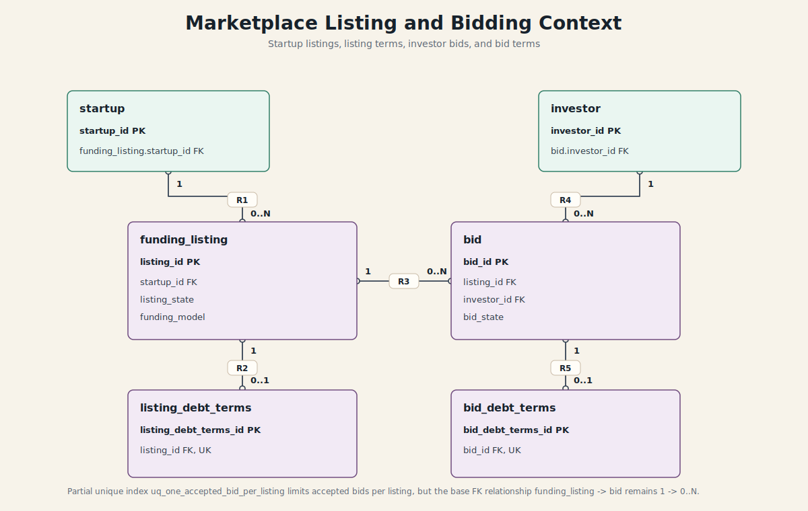
</a>

This slice focuses only on listings and bids. Agreement acceptance is documented
separately so the marketplace bidding model stays readable.

| Rel | Parent | Cardinality | Child | Schema basis |
|---|---|---:|---|---|
| `R1` | `startup` | `1 -> 0..N` | `funding_listing` | `funding_listing.startup_id` is `FK`, `NOT NULL` |
| `R2` | `funding_listing` | `1 -> 0..1` | `listing_debt_terms` | `listing_debt_terms.listing_id` is `FK`, `NOT NULL`, `UNIQUE` |
| `R3` | `funding_listing` | `1 -> 0..N` | `bid` | `bid.listing_id` is `FK`, `NOT NULL` |
| `R4` | `investor` | `1 -> 0..N` | `bid` | `bid.investor_id` is `FK`, `NOT NULL` |
| `R5` | `bid` | `1 -> 0..1` | `bid_debt_terms` | `bid_debt_terms.bid_id` is `FK`, `NOT NULL`, `UNIQUE` |

`uq_one_accepted_bid_per_listing` limits accepted bids per listing, but the base
`funding_listing -> bid` relationship remains `1 -> 0..N`.

### Agreement Acceptance and Debt Terms Context

<a href="assets/agreement-acceptance-terms-er.svg">
  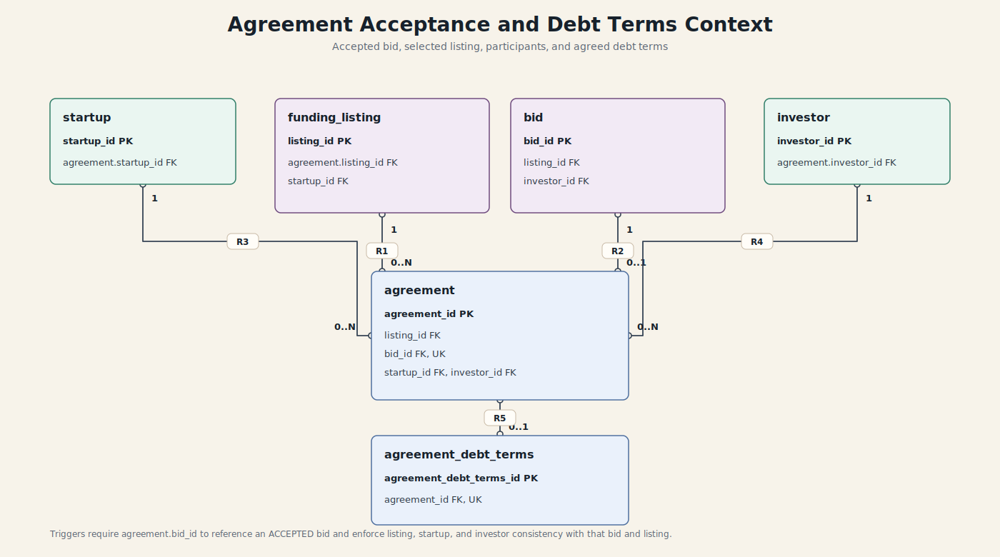
</a>

This slice focuses on the accepted agreement record and the final agreed debt
terms. Triggers require the agreement bid to be accepted and enforce consistency
between the selected bid, listing, startup, and investor.

| Rel | Parent | Cardinality | Child | Schema basis |
|---|---|---:|---|---|
| `R1` | `funding_listing` | `1 -> 0..N` | `agreement` | `agreement.listing_id` is `FK`, `NOT NULL` |
| `R2` | `bid` | `1 -> 0..1` | `agreement` | `agreement.bid_id` is `FK`, `NOT NULL`, `UNIQUE` |
| `R3` | `startup` | `1 -> 0..N` | `agreement` | `agreement.startup_id` is `FK`, `NOT NULL` |
| `R4` | `investor` | `1 -> 0..N` | `agreement` | `agreement.investor_id` is `FK`, `NOT NULL` |
| `R5` | `agreement` | `1 -> 0..1` | `agreement_debt_terms` | `agreement_debt_terms.agreement_id` is `FK`, `NOT NULL`, `UNIQUE` |

## Finance

### Settlement Context

<a href="assets/settlement-context-er.svg">
  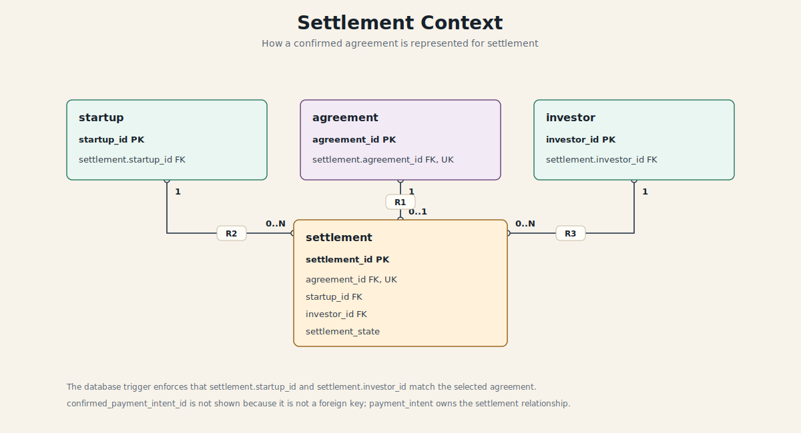
</a>

This slice focuses only on how a settlement belongs to an accepted agreement and
its participants. Repayment scheduling is documented separately so the settlement
model stays readable.

| Rel | Parent | Cardinality | Child | Schema basis |
|---|---|---:|---|---|
| `R1` | `agreement` | `1 -> 0..1` | `settlement` | `settlement.agreement_id` is `FK`, `NOT NULL`, `UNIQUE` |
| `R2` | `startup` | `1 -> 0..N` | `settlement` | `settlement.startup_id` is `FK`, `NOT NULL` |
| `R3` | `investor` | `1 -> 0..N` | `settlement` | `settlement.investor_id` is `FK`, `NOT NULL` |

### Repayment Schedule Context

<a href="assets/repayment-schedule-er.svg">
  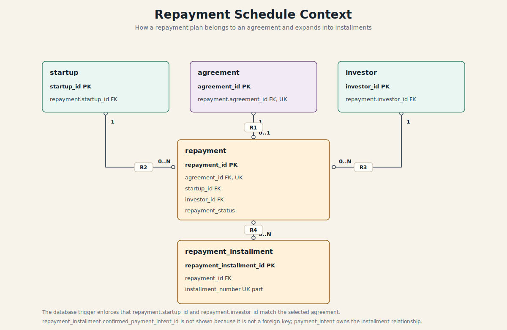
</a>

This slice focuses only on the repayment schedule created for an accepted
agreement. Payment execution is documented in the payment diagrams so the
repayment model stays readable.

| Rel | Parent | Cardinality | Child | Schema basis |
|---|---|---:|---|---|
| `R1` | `agreement` | `1 -> 0..1` | `repayment` | `repayment.agreement_id` is `FK`, `NOT NULL`, `UNIQUE` |
| `R2` | `startup` | `1 -> 0..N` | `repayment` | `repayment.startup_id` is `FK`, `NOT NULL` |
| `R3` | `investor` | `1 -> 0..N` | `repayment` | `repayment.investor_id` is `FK`, `NOT NULL` |
| `R4` | `repayment` | `1 -> 0..N` | `repayment_installment` | `repayment_installment.repayment_id` is `FK`, `NOT NULL` |

## Payments

### Payment Intent Context

<a href="assets/payment-intent-er.svg">
  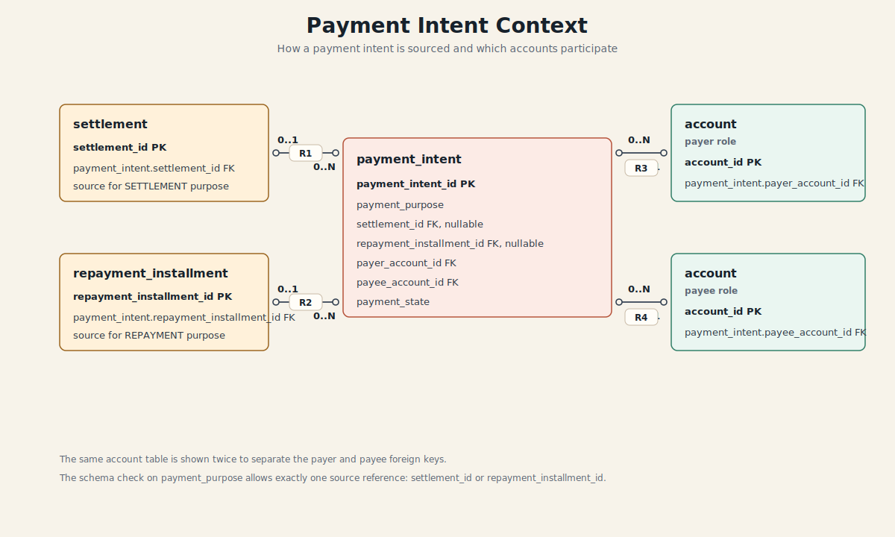
</a>

This slice focuses only on how a `payment_intent` is sourced and which accounts
participate. Provider, attempt, and webhook relationships are intentionally left
out of this diagram so the payment intent model stays readable.

| Rel | Parent | Cardinality | Child | Schema basis |
|---|---|---:|---|---|
| `R1` | `settlement` | `0..1 -> 0..N` | `payment_intent` | `payment_intent.settlement_id` is nullable `FK` |
| `R2` | `repayment_installment` | `0..1 -> 0..N` | `payment_intent` | `payment_intent.repayment_installment_id` is nullable `FK` |
| `R3` | `account` | `1 -> 0..N` | `payment_intent` | `payment_intent.payer_account_id` is `FK`, `NOT NULL` |
| `R4` | `account` | `1 -> 0..N` | `payment_intent` | `payment_intent.payee_account_id` is `FK`, `NOT NULL` |

### Payment Attempt and Provider Context

<a href="assets/payment-attempt-provider-er.svg">
  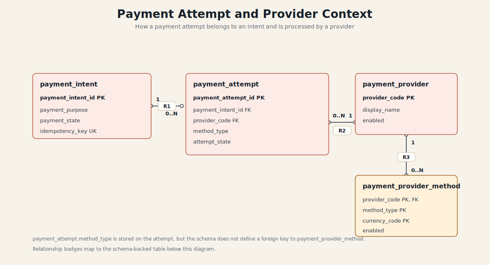
</a>

This slice focuses on payment attempts and provider configuration. Webhook
relationships are intentionally left out because webhook events have optional
references back to both `payment_intent` and `payment_attempt`.

| Rel | Parent | Cardinality | Child | Schema basis |
|---|---|---:|---|---|
| `R1` | `payment_intent` | `1 -> 0..N` | `payment_attempt` | `payment_attempt.payment_intent_id` is `FK`, `NOT NULL` |
| `R2` | `payment_provider` | `1 -> 0..N` | `payment_attempt` | `payment_attempt.provider_code` is `FK`, `NOT NULL` |
| `R3` | `payment_provider` | `1 -> 0..N` | `payment_provider_method` | `payment_provider_method.provider_code` is `FK`, part of composite `PK` |

### Payment Webhook Context

<a href="assets/payment-webhook-er.svg">
  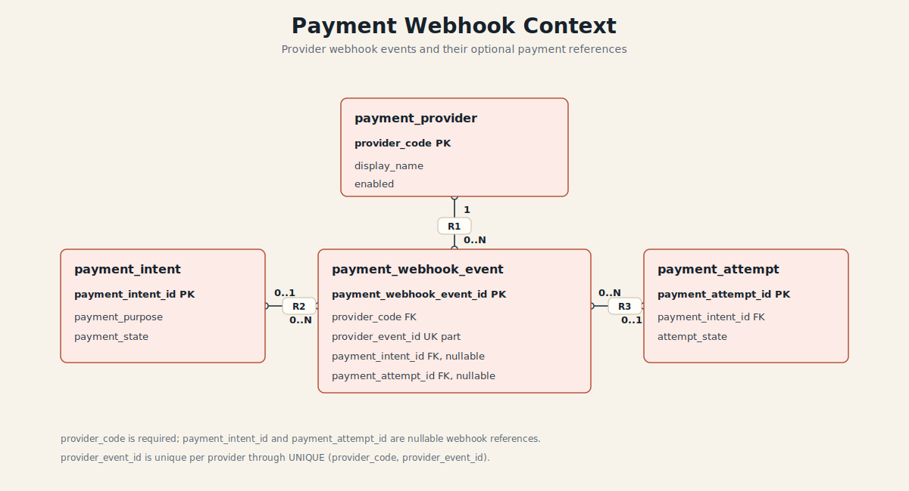
</a>

This slice focuses on provider webhook idempotency and the optional references a
webhook event may carry back to payment records.

| Rel | Parent | Cardinality | Child | Schema basis |
|---|---|---:|---|---|
| `R1` | `payment_provider` | `1 -> 0..N` | `payment_webhook_event` | `payment_webhook_event.provider_code` is `FK`, `NOT NULL` |
| `R2` | `payment_intent` | `0..1 -> 0..N` | `payment_webhook_event` | `payment_webhook_event.payment_intent_id` is nullable `FK` |
| `R3` | `payment_attempt` | `0..1 -> 0..N` | `payment_webhook_event` | `payment_webhook_event.payment_attempt_id` is nullable `FK` |

## Notifications, Outbox, and Audit

### Notification Delivery and Subscription Context

<a href="assets/notification-delivery-subscription-er.svg">
  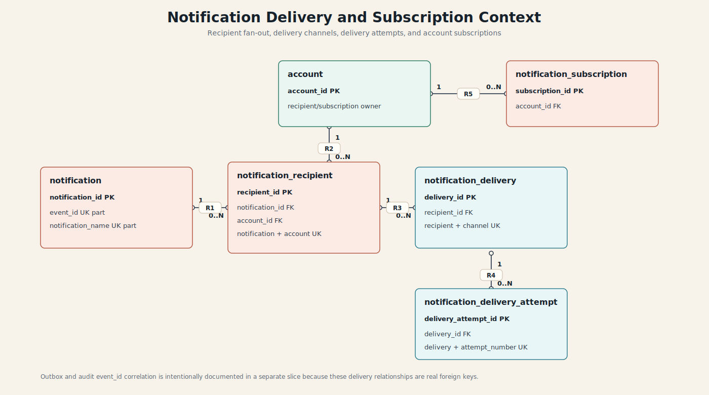
</a>

This slice focuses on notification fan-out, delivery tracking, retry attempts,
and account subscriptions. Outbox and audit event correlation is documented
separately because it is not modeled with notification delivery foreign keys.

| Rel | Parent | Cardinality | Child | Schema basis |
|---|---|---:|---|---|
| `R1` | `notification` | `1 -> 0..N` | `notification_recipient` | `notification_recipient.notification_id` is `FK`, `NOT NULL`; `UNIQUE (notification_id, account_id)` |
| `R2` | `account` | `1 -> 0..N` | `notification_recipient` | `notification_recipient.account_id` is `FK`, `NOT NULL` |
| `R3` | `notification_recipient` | `1 -> 0..N` | `notification_delivery` | `notification_delivery.recipient_id` is `FK`, `NOT NULL`; `UNIQUE (recipient_id, channel_type)` |
| `R4` | `notification_delivery` | `1 -> 0..N` | `notification_delivery_attempt` | `notification_delivery_attempt.delivery_id` is `FK`, `NOT NULL`; `UNIQUE (delivery_id, attempt_number)` |
| `R5` | `account` | `1 -> 0..N` | `notification_subscription` | `notification_subscription.account_id` is `FK`, `NOT NULL`; `UNIQUE (account_id, channel_type, endpoint)` |

### Outbox and Audit Correlation Context

<a href="assets/outbox-audit-correlation-er.svg">
  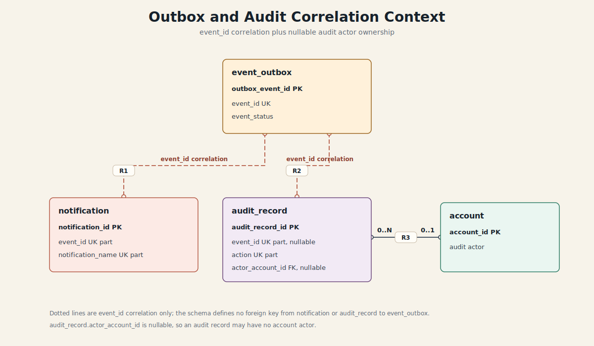
</a>

This slice focuses on `event_id` correlation. The dotted lines are not foreign
keys; the only solid FK in this slice is the nullable audit actor account.

| Rel | Parent | Cardinality | Child | Schema basis |
|---|---|---:|---|---|
| `R1` | `event_outbox` | correlation | `notification` | shared `event_id`; no FK exists; `event_outbox.event_id` is `UNIQUE`; `notification` has `UNIQUE (event_id, notification_name)` |
| `R2` | `event_outbox` | correlation | `audit_record` | shared nullable `event_id`; no FK exists; `event_outbox.event_id` is `UNIQUE`; `audit_record` has `UNIQUE (event_id, action)` |
| `R3` | `account` | `0..1 -> 0..N` | `audit_record` | `audit_record.actor_account_id` is nullable `FK` |

Editable diagram source: [`er-diagram-source.md`](er-diagram-source.md).
