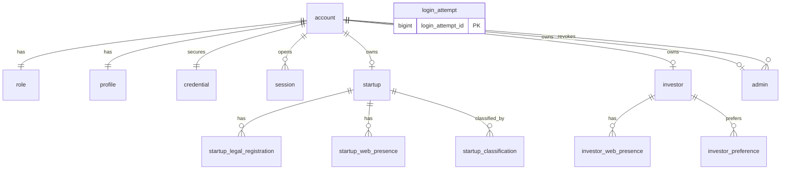
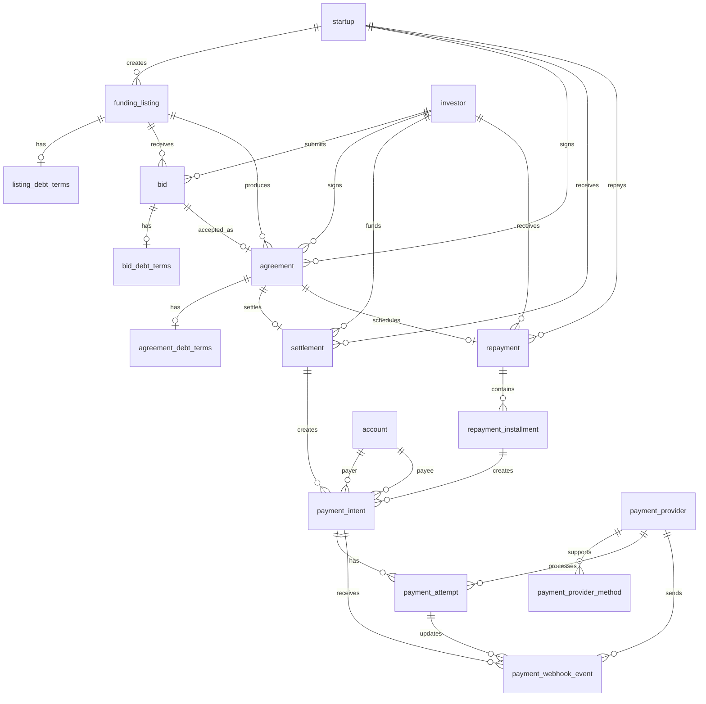
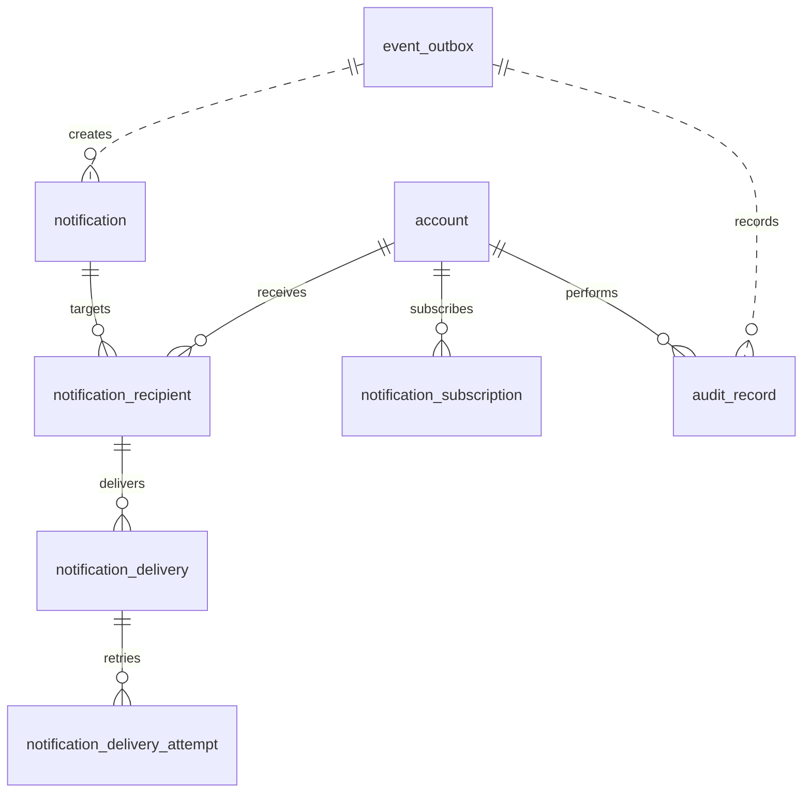

# OptraBidz ER Diagram

### ER Diagram — Identity, Security, and Participation

```mermaid
erDiagram
    account ||--|| role : has
    account ||--|| profile : has
    account ||--|| credential : secures
    account ||--o{ session : opens
    account ||--o| startup : owns
    account ||--o| investor : owns
    account ||--o| admin : owns
    account ||--o{ admin : revokes
    startup ||--o{ startup_legal_registration : has
    startup ||--o{ startup_web_presence : has
    startup ||--o{ startup_classification : classified_by
    investor ||--o{ investor_web_presence : has
    investor ||--o{ investor_preference : prefers

    login_attempt {
        bigint login_attempt_id PK
    }
```

### ER Diagram — Marketplace and Finance

```mermaid
erDiagram
    startup ||--o{ funding_listing : creates
    startup ||--o{ agreement : signs
    startup ||--o{ settlement : receives
    startup ||--o{ repayment : repays

    investor ||--o{ bid : submits
    investor ||--o{ agreement : signs
    investor ||--o{ settlement : funds
    investor ||--o{ repayment : receives

    funding_listing ||--o| listing_debt_terms : has
    funding_listing ||--o{ bid : receives
    funding_listing ||--o{ agreement : produces

    bid ||--o| bid_debt_terms : has
    bid ||--o| agreement : accepted_as

    agreement ||--o| agreement_debt_terms : has
    agreement ||--o| settlement : settles
    agreement ||--o| repayment : schedules

    repayment ||--o{ repayment_installment : contains
    settlement ||--o{ payment_intent : creates
    repayment_installment ||--o{ payment_intent : creates

    account ||--o{ payment_intent : payer
    account ||--o{ payment_intent : payee

    payment_intent ||--o{ payment_attempt : has
    payment_intent ||--o{ payment_webhook_event : receives

    payment_provider ||--o{ payment_provider_method : supports
    payment_provider ||--o{ payment_attempt : processes
    payment_provider ||--o{ payment_webhook_event : sends

    payment_attempt ||--o{ payment_webhook_event : updates
```

### ER Diagram — Notifications, Outbox, and Audit

```mermaid
erDiagram
    event_outbox ||..o{ notification : creates
    event_outbox ||..o{ audit_record : records

    account ||--o{ notification_recipient : receives
    account ||--o{ notification_subscription : subscribes
    account ||--o{ audit_record : performs

    notification ||--o{ notification_recipient : targets
    notification_recipient ||--o{ notification_delivery : delivers
    notification_delivery ||--o{ notification_delivery_attempt : retries
```
