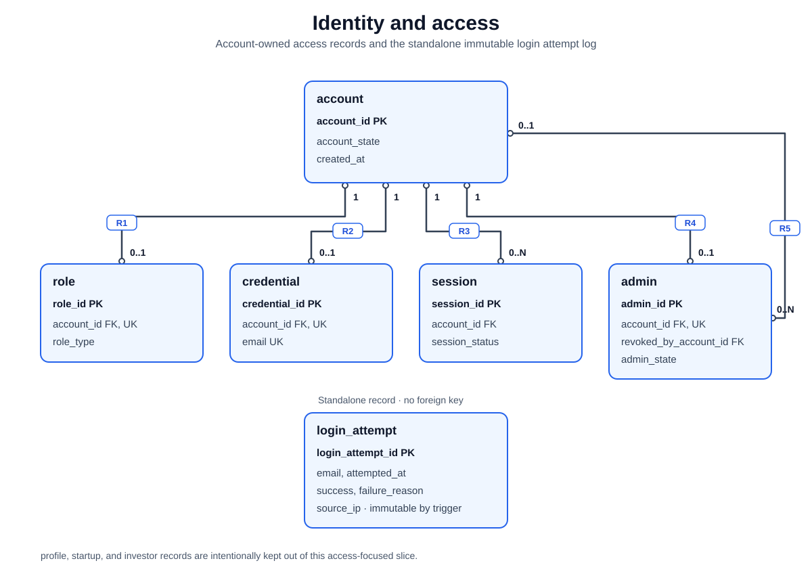
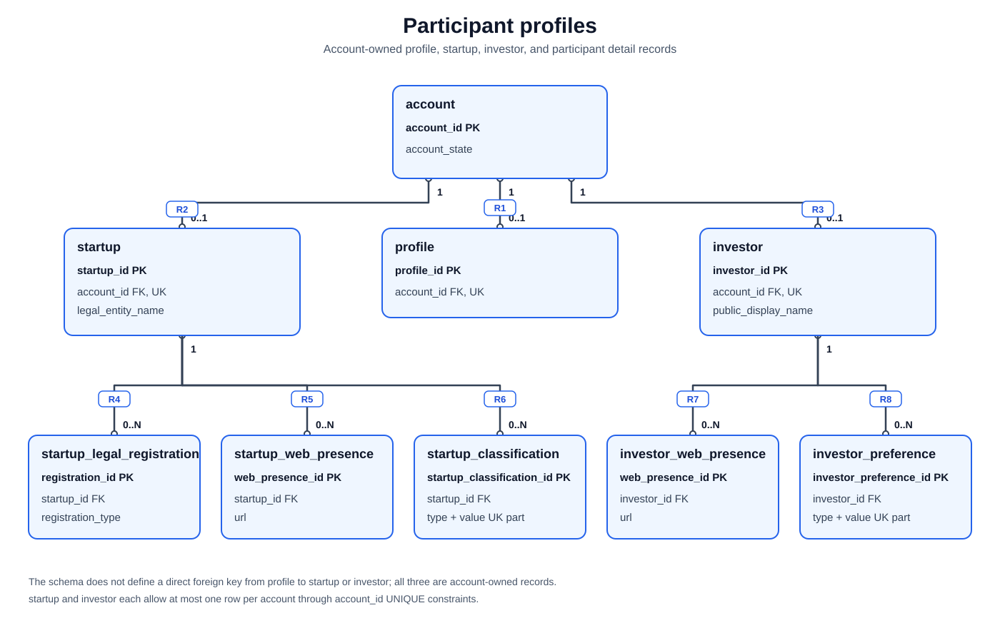
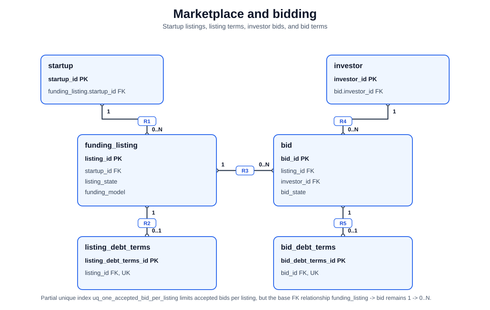
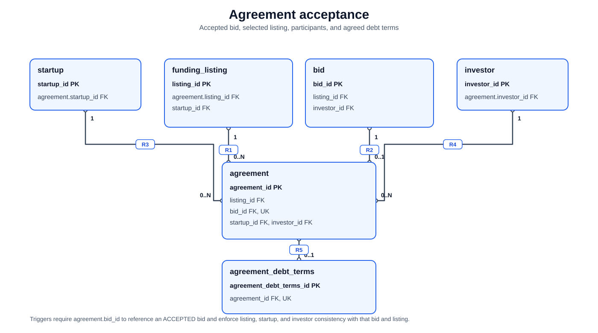
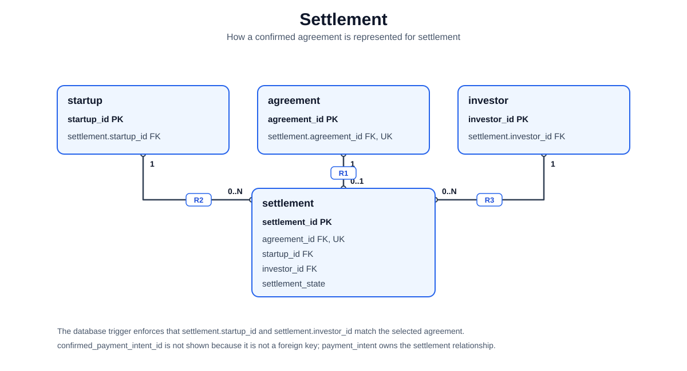
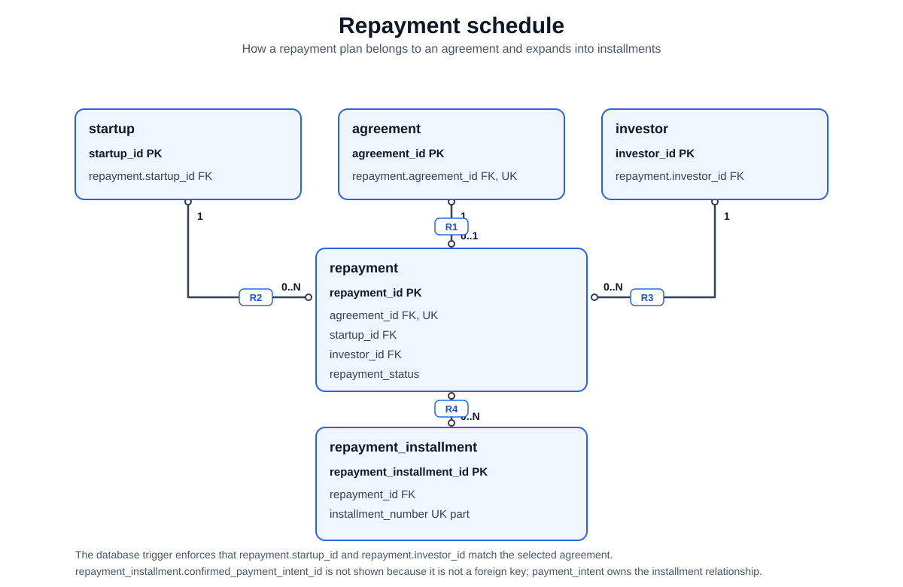
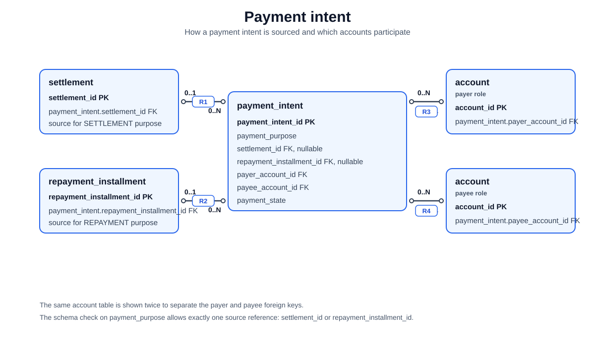
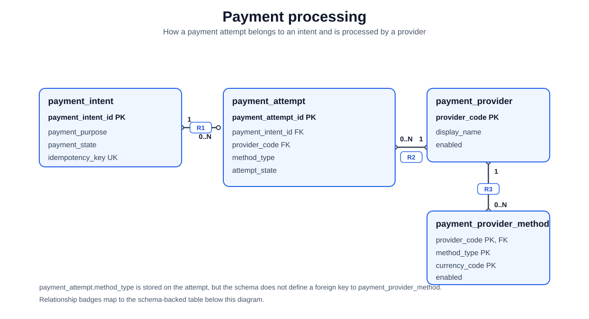
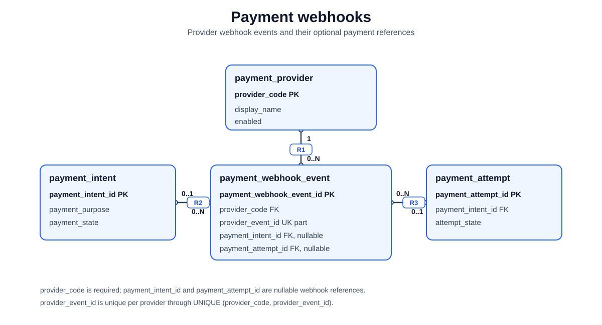
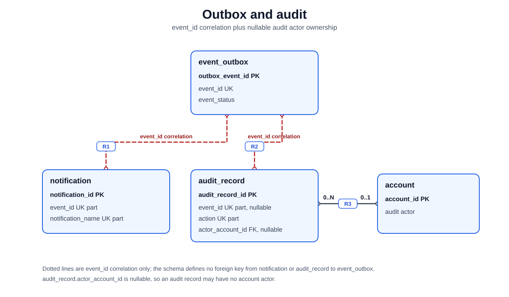

# OptraBidz ER Diagrams

These diagrams show the main database relationships in a reviewer-friendly
format. Cardinality is based on the PostgreSQL schema only: foreign-key
nullability, foreign-key uniqueness, primary keys, and unique constraints.
Application lifecycle expectations are not assumed here. The complete schema is
available in the executable Flyway migration
[`V1__baseline.sql`](../../src/main/resources/db/migration/V1__baseline.sql).

## Legend

| Marker | Meaning |
|---|---|
| `PK` | Primary key |
| `FK` | Foreign key |
| `UK` | Unique key |
| `1` | Exactly one row on that side is required by the FK |
| `0..1` | Zero or one row on that side is allowed by the schema |
| `0..N` | Zero or many rows on that side are allowed by the schema |
| Solid line | Database foreign-key relationship |
| Dotted line | Event correlation by `event_id`, not a database foreign key |

## Intentional non-FK correlations

These links are maintained by application behavior or shared business identifiers.
They are documented separately so they cannot be mistaken for database-enforced
foreign keys.

| ID | From | To | Basis |
|---|---|---|---|
| `outbox-notification-event` | `event_outbox.event_id` | `notification.event_id` | Shared event identifier; `notification` has `UNIQUE (event_id, notification_name)`, but no foreign key. |
| `outbox-audit-event` | `event_outbox.event_id` | `audit_record.event_id` | Shared nullable event identifier; `audit_record` has `UNIQUE (event_id, action)`, but no foreign key. |
| `payment-attempt-method` | `payment_attempt.(provider_code, method_type)` | `payment_provider_method.(provider_code, method_type)` | Application provider-method lookup; the provider-method primary key also includes `currency_code`, so no matching foreign key exists. |
| `settlement-confirmed-intent` | `settlement.confirmed_payment_intent_id` | `payment_intent.payment_intent_id` | Application-maintained confirmation reference; the schema declares no foreign key. |
| `installment-confirmed-intent` | `repayment_installment.confirmed_payment_intent_id` | `payment_intent.payment_intent_id` | Application-maintained confirmation reference; the schema declares no foreign key. |
| `login-attempt-email` | `login_attempt.email` | `credential.email` | Submitted-email security-log correlation only; immutable login attempts deliberately have no account or credential foreign key. |

## Choose a relationship view

| Question | Focused view |
|---|---|
| How are accounts, credentials, sessions, roles, and administrators related? | [Identity and access](#identity-and-access) |
| How are startup and investor details attached? | [Participant profiles](#participant-profiles) |
| How do listings and bids connect? | [Marketplace and bidding](#marketplace-and-bidding) |
| What becomes durable when a bid is accepted? | [Agreement acceptance](#agreement-acceptance) |
| How does money owed to a startup become a settlement? | [Settlement](#settlement) |
| How is investor repayment scheduled? | [Repayment schedule](#repayment-schedule) |
| How is a payment purpose tied to payer and payee accounts? | [Payment intent](#payment-intent) |
| How do attempts select a configured provider? | [Payment processing](#payment-processing) |
| How are provider callbacks deduplicated and linked? | [Payment webhooks](#payment-webhooks) |
| How are notification recipients, channels, and attempts tracked? | [Notification delivery](#notification-delivery) |
| Which event links are correlations rather than foreign keys? | [Outbox and audit](#outbox-and-audit) |

For the end-to-end order in which these areas participate, read the
[relational journey](relationship-journey.md).

## Identity and Access

### Identity and access

[High-resolution PNG fallback](assets/identity-access-schema.png)

This slice includes account-owned access records and the standalone
`login_attempt` security log. A login attempt stores the submitted email value
but has no database foreign key to `account` or `credential`; update and delete
triggers make these records immutable.

| Rel | Parent | Cardinality | Child | Schema basis |
|---|---|---:|---|---|
| `R1` | `account` | `1 -> 0..1` | `role` | `role.account_id` is `FK`, `NOT NULL`, `UNIQUE`; `fk_role_account`; `ON DELETE RESTRICT` |
| `R2` | `account` | `1 -> 0..1` | `credential` | `credential.account_id` is `FK`, `NOT NULL`, `UNIQUE`; `fk_credential_account`; `ON DELETE RESTRICT` |
| `R3` | `account` | `1 -> 0..N` | `session` | `session.account_id` is `FK`, `NOT NULL`; `fk_session_account`; `ON DELETE CASCADE` |
| `R4` | `account` | `1 -> 0..1` | `admin` | `admin.account_id` is `FK`, `NOT NULL`, `UNIQUE`; `fk_admin_account`; `ON DELETE RESTRICT` |
| `R5` | `account` | `0..1 -> 0..N` | `admin` | `admin.revoked_by_account_id` is nullable `FK`; `fk_admin_revoked_by_account`; `ON DELETE SET NULL` |

### Participant profiles

[High-resolution PNG fallback](assets/participant-profile-schema.png)

This slice focuses on account-owned participant records and the detail rows
attached to startup and investor profiles. `profile`, `startup`, and `investor`
are separate account-owned tables; the schema does not define a direct foreign
key from `profile` to either participant table.

| Rel | Parent | Cardinality | Child | Schema basis |
|---|---|---:|---|---|
| `R1` | `account` | `1 -> 0..1` | `profile` | `profile.account_id` is `FK`, `NOT NULL`, `UNIQUE`; `fk_profile_account`; `ON DELETE RESTRICT` |
| `R2` | `account` | `1 -> 0..1` | `startup` | `startup.account_id` is `FK`, `NOT NULL`, `UNIQUE`; `fk_startup_account`; `ON DELETE RESTRICT` |
| `R3` | `account` | `1 -> 0..1` | `investor` | `investor.account_id` is `FK`, `NOT NULL`, `UNIQUE`; `fk_investor_account`; `ON DELETE RESTRICT` |
| `R4` | `startup` | `1 -> 0..N` | `startup_legal_registration` | `startup_legal_registration.startup_id` is `FK`, `NOT NULL`; `fk_startup_registration`; `ON DELETE CASCADE` |
| `R5` | `startup` | `1 -> 0..N` | `startup_web_presence` | `startup_web_presence.startup_id` is `FK`, `NOT NULL`; `fk_startup_web_presence`; `ON DELETE CASCADE` |
| `R6` | `startup` | `1 -> 0..N` | `startup_classification` | `startup_classification.startup_id` is `FK`, `NOT NULL`; `fk_startup_classification`; `ON DELETE CASCADE`; `UNIQUE (startup_id, classification_type, classification_value)` |
| `R7` | `investor` | `1 -> 0..N` | `investor_web_presence` | `investor_web_presence.investor_id` is `FK`, `NOT NULL`; `fk_investor_web_presence`; `ON DELETE CASCADE` |
| `R8` | `investor` | `1 -> 0..N` | `investor_preference` | `investor_preference.investor_id` is `FK`, `NOT NULL`; `fk_investor_preference`; `ON DELETE CASCADE`; `UNIQUE (investor_id, preference_type, preference_value)` |

## Marketplace

### Marketplace and bidding

[High-resolution PNG fallback](assets/marketplace-bidding-schema.png)

This slice focuses only on listings and bids. Agreement acceptance is documented
separately so the marketplace bidding model stays readable.

| Rel | Parent | Cardinality | Child | Schema basis |
|---|---|---:|---|---|
| `R1` | `startup` | `1 -> 0..N` | `funding_listing` | `funding_listing.startup_id` is `FK`, `NOT NULL`; `fk_listing_startup`; `ON DELETE RESTRICT` |
| `R2` | `funding_listing` | `1 -> 0..1` | `listing_debt_terms` | `listing_debt_terms.listing_id` is `FK`, `NOT NULL`, `UNIQUE`; `fk_listing_debt_terms_listing`; `ON DELETE CASCADE` |
| `R3` | `funding_listing` | `1 -> 0..N` | `bid` | `bid.listing_id` is `FK`, `NOT NULL`; `fk_bid_listing`; `ON DELETE RESTRICT` |
| `R4` | `investor` | `1 -> 0..N` | `bid` | `bid.investor_id` is `FK`, `NOT NULL`; `fk_bid_investor`; `ON DELETE RESTRICT` |
| `R5` | `bid` | `1 -> 0..1` | `bid_debt_terms` | `bid_debt_terms.bid_id` is `FK`, `NOT NULL`, `UNIQUE`; `fk_bid_debt_terms_bid`; `ON DELETE CASCADE` |

`uq_one_accepted_bid_per_listing` limits accepted bids per listing, but the base
`funding_listing -> bid` relationship remains `1 -> 0..N`.

### Agreement acceptance

[High-resolution PNG fallback](assets/agreement-acceptance-schema.png)

This slice focuses on the accepted agreement record and the final agreed debt
terms. Triggers require the agreement bid to be accepted and enforce consistency
between the selected bid, listing, startup, and investor.

| Rel | Parent | Cardinality | Child | Schema basis |
|---|---|---:|---|---|
| `R1` | `funding_listing` | `1 -> 0..N` | `agreement` | `agreement.listing_id` is `FK`, `NOT NULL`; `fk_agreement_listing`; `ON DELETE RESTRICT` |
| `R2` | `bid` | `1 -> 0..1` | `agreement` | `agreement.bid_id` is `FK`, `NOT NULL`, `UNIQUE`; `fk_agreement_bid`; `ON DELETE RESTRICT` |
| `R3` | `startup` | `1 -> 0..N` | `agreement` | `agreement.startup_id` is `FK`, `NOT NULL`; `fk_agreement_startup`; `ON DELETE RESTRICT` |
| `R4` | `investor` | `1 -> 0..N` | `agreement` | `agreement.investor_id` is `FK`, `NOT NULL`; `fk_agreement_investor`; `ON DELETE RESTRICT` |
| `R5` | `agreement` | `1 -> 0..1` | `agreement_debt_terms` | `agreement_debt_terms.agreement_id` is `FK`, `NOT NULL`, `UNIQUE`; `fk_agreement_debt_terms_agreement`; `ON DELETE CASCADE` |

## Finance

### Settlement

[High-resolution PNG fallback](assets/settlement-schema.png)

This slice focuses only on how a settlement belongs to an accepted agreement and
its participants. Repayment scheduling is documented separately so the settlement
model stays readable.

| Rel | Parent | Cardinality | Child | Schema basis |
|---|---|---:|---|---|
| `R1` | `agreement` | `1 -> 0..1` | `settlement` | `settlement.agreement_id` is `FK`, `NOT NULL`, `UNIQUE`; `fk_settlement_agreement`; `ON DELETE RESTRICT` |
| `R2` | `startup` | `1 -> 0..N` | `settlement` | `settlement.startup_id` is `FK`, `NOT NULL`; `fk_settlement_startup`; `ON DELETE RESTRICT` |
| `R3` | `investor` | `1 -> 0..N` | `settlement` | `settlement.investor_id` is `FK`, `NOT NULL`; `fk_settlement_investor`; `ON DELETE RESTRICT` |

### Repayment schedule

[High-resolution PNG fallback](assets/repayment-schedule-schema.png)

This slice focuses only on the repayment schedule created for an accepted
agreement. Payment execution is documented in the payment diagrams so the
repayment model stays readable.

| Rel | Parent | Cardinality | Child | Schema basis |
|---|---|---:|---|---|
| `R1` | `agreement` | `1 -> 0..1` | `repayment` | `repayment.agreement_id` is `FK`, `NOT NULL`, `UNIQUE`; `fk_repayment_agreement`; `ON DELETE RESTRICT` |
| `R2` | `startup` | `1 -> 0..N` | `repayment` | `repayment.startup_id` is `FK`, `NOT NULL`; `fk_repayment_startup`; `ON DELETE RESTRICT` |
| `R3` | `investor` | `1 -> 0..N` | `repayment` | `repayment.investor_id` is `FK`, `NOT NULL`; `fk_repayment_investor`; `ON DELETE RESTRICT` |
| `R4` | `repayment` | `1 -> 0..N` | `repayment_installment` | `repayment_installment.repayment_id` is `FK`, `NOT NULL`; `fk_repayment_installment_repayment`; `ON DELETE RESTRICT` |

## Payments

### Payment intent

[High-resolution PNG fallback](assets/payment-intent-schema.png)

This slice focuses only on how a `payment_intent` is sourced and which accounts
participate. Provider, attempt, and webhook relationships are intentionally left
out of this diagram so the payment intent model stays readable.

| Rel | Parent | Cardinality | Child | Schema basis |
|---|---|---:|---|---|
| `R1` | `settlement` | `0..1 -> 0..N` | `payment_intent` | `payment_intent.settlement_id` is nullable `FK`; `fk_payment_intent_settlement`; `ON DELETE RESTRICT` |
| `R2` | `repayment_installment` | `0..1 -> 0..N` | `payment_intent` | `payment_intent.repayment_installment_id` is nullable `FK`; `fk_payment_intent_repayment_installment`; `ON DELETE RESTRICT` |
| `R3` | `account` | `1 -> 0..N` | `payment_intent` | `payment_intent.payer_account_id` is `FK`, `NOT NULL`; `fk_payment_intent_payer_account`; `ON DELETE RESTRICT` |
| `R4` | `account` | `1 -> 0..N` | `payment_intent` | `payment_intent.payee_account_id` is `FK`, `NOT NULL`; `fk_payment_intent_payee_account`; `ON DELETE RESTRICT` |

### Payment processing

[High-resolution PNG fallback](assets/payment-processing-schema.png)

This slice focuses on payment attempts and provider configuration. Webhook
relationships are intentionally left out because webhook events have optional
references back to both `payment_intent` and `payment_attempt`.

| Rel | Parent | Cardinality | Child | Schema basis |
|---|---|---:|---|---|
| `R1` | `payment_intent` | `1 -> 0..N` | `payment_attempt` | `payment_attempt.payment_intent_id` is `FK`, `NOT NULL`; `fk_payment_attempt_intent`; `ON DELETE RESTRICT` |
| `R2` | `payment_provider` | `1 -> 0..N` | `payment_attempt` | `payment_attempt.provider_code` is `FK`, `NOT NULL`; `fk_payment_attempt_provider`; `ON DELETE RESTRICT` |
| `R3` | `payment_provider` | `1 -> 0..N` | `payment_provider_method` | `payment_provider_method.provider_code` is `FK`, part of composite `PK`; `fk_payment_provider_method_provider`; `ON DELETE RESTRICT` |

### Payment webhooks

[High-resolution PNG fallback](assets/payment-webhook-schema.png)

This slice focuses on provider webhook idempotency and the optional references a
webhook event may carry back to payment records.

| Rel | Parent | Cardinality | Child | Schema basis |
|---|---|---:|---|---|
| `R1` | `payment_provider` | `1 -> 0..N` | `payment_webhook_event` | `payment_webhook_event.provider_code` is `FK`, `NOT NULL`; `fk_payment_webhook_provider`; `ON DELETE RESTRICT` |
| `R2` | `payment_intent` | `0..1 -> 0..N` | `payment_webhook_event` | `payment_webhook_event.payment_intent_id` is nullable `FK`; `fk_payment_webhook_intent`; `ON DELETE RESTRICT` |
| `R3` | `payment_attempt` | `0..1 -> 0..N` | `payment_webhook_event` | `payment_webhook_event.payment_attempt_id` is nullable `FK`; `fk_payment_webhook_attempt`; `ON DELETE RESTRICT` |

## Notifications, Outbox, and Audit

### Notification delivery

[High-resolution PNG fallback](assets/notification-delivery-schema.png)

This slice focuses on notification fan-out, delivery tracking, retry attempts,
and account subscriptions. Outbox and audit event correlation is documented
separately because it is not modeled with notification delivery foreign keys.

| Rel | Parent | Cardinality | Child | Schema basis |
|---|---|---:|---|---|
| `R1` | `notification` | `1 -> 0..N` | `notification_recipient` | `notification_recipient.notification_id` is `FK`, `NOT NULL`; `fk_recipient_notification`; `ON DELETE CASCADE`; `UNIQUE (notification_id, account_id)` |
| `R2` | `account` | `1 -> 0..N` | `notification_recipient` | `notification_recipient.account_id` is `FK`, `NOT NULL`; `fk_recipient_account`; `ON DELETE RESTRICT` |
| `R3` | `notification_recipient` | `1 -> 0..N` | `notification_delivery` | `notification_delivery.recipient_id` is `FK`, `NOT NULL`; `fk_delivery_recipient`; `ON DELETE CASCADE`; `UNIQUE (recipient_id, channel_type)` |
| `R4` | `notification_delivery` | `1 -> 0..N` | `notification_delivery_attempt` | `notification_delivery_attempt.delivery_id` is `FK`, `NOT NULL`; `fk_notification_delivery_attempt_delivery`; `ON DELETE CASCADE`; `UNIQUE (delivery_id, attempt_number)` |
| `R5` | `account` | `1 -> 0..N` | `notification_subscription` | `notification_subscription.account_id` is `FK`, `NOT NULL`; `fk_notification_subscription_account`; `ON DELETE CASCADE`; `UNIQUE (account_id, channel_type, endpoint)` |

### Outbox and audit

[High-resolution PNG fallback](assets/outbox-audit-schema.png)

This slice focuses on `event_id` correlation. The dotted lines are not foreign
keys; the only solid FK in this slice is the nullable audit actor account.

| Rel | Parent | Cardinality | Child | Schema basis |
|---|---|---:|---|---|
| `R1` | `event_outbox` | correlation | `notification` | shared `event_id`; no FK exists; `event_outbox.event_id` is `UNIQUE`; `notification` has `UNIQUE (event_id, notification_name)` |
| `R2` | `event_outbox` | correlation | `audit_record` | shared nullable `event_id`; no FK exists; `event_outbox.event_id` is `UNIQUE`; `audit_record` has `UNIQUE (event_id, action)` |
| `R3` | `account` | `0..1 -> 0..N` | `audit_record` | `audit_record.actor_account_id` is nullable `FK`; `fk_audit_account`; `ON DELETE SET NULL` |
