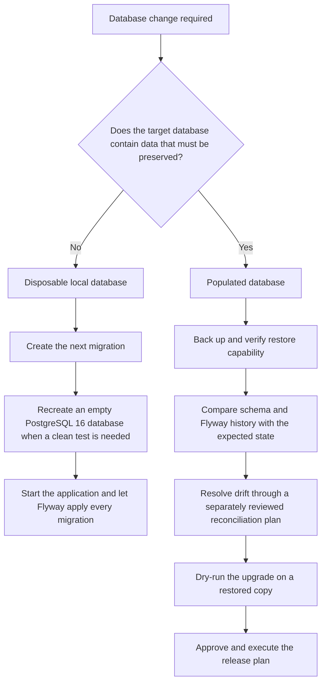

# Database Migration Guide

This guide defines how OptraBidz creates and upgrades its PostgreSQL schema.
Use it when authoring, reviewing, testing, or releasing a database change.

## Ownership and Startup Order

Flyway is the only owner of application schema creation and upgrades. It reads
versioned SQL migrations from `src/main/resources/db/migration` and records
each applied version and checksum in `flyway_schema_history`.

Application startup follows this order:

1. connect to PostgreSQL;
2. validate and apply pending Flyway migrations;
3. start Hibernate with `ddl-auto=validate`;
4. fail startup if the migrated schema and entity mappings do not agree.

Do not replace this sequence with Hibernate schema generation, Spring SQL
initialization, manual DDL, or direct execution of a versioned migration.
Automatic Flyway baselining and Flyway clean remain disabled by application
configuration.

## Versioned Migration Rules

`V1__baseline.sql` is the current source of truth for the initial schema. Once
a versioned migration has been applied or released, it is immutable: do not
edit, rename, delete, reorder, or reuse its version number. Changing an applied
file changes its checksum and correctly causes Flyway validation to fail.

Create the next unused version for every later change. For example:

```text
V2__add_account_phone_number.sql
V3__index_notification_delivery_status.sql
```

Each migration must:

- have one clear purpose and a descriptive name;
- use PostgreSQL-compatible SQL;
- preserve existing data unless destructive work is separately reviewed;
- define constraints, indexes, defaults, and backfills explicitly;
- remain compatible with the planned application deployment sequence;
- pass the PostgreSQL integration profile before release.

Small reference data required by the application may be versioned with the
schema. Environment-specific credentials, configuration, and user data must
not be placed in migrations.

Always let Flyway execute versioned files. Running one directly with `psql`
changes the schema without recording its version and checksum, leaving the
database history incomplete.

## Environment Decision Flow



## Fresh PostgreSQL 16 Database

An empty PostgreSQL 16 database needs no manual schema initialization. Create
the database, configure the application datasource, and start OptraBidz.
Flyway applies all migrations in version order and writes their versions and
checksums to `flyway_schema_history`. Hibernate then validates its entity
mappings against the migrated schema.

For the default local environment, start the named PostgreSQL container:

```powershell
docker run --name optrabidz-postgres -e POSTGRES_DB=optrabidz -e POSTGRES_USER=postgres -e POSTGRES_PASSWORD=postgres -p 5432:5432 -d postgres:16
```

Then start the application:

```powershell
.\mvnw.cmd spring-boot:run
```

## Resetting the Disposable Local Database

> **Warning:** The following procedure permanently deletes every record in the
> explicitly named `optrabidz-postgres` local container. Use it only when that
> database contains disposable development data. Never use it for a database
> whose data must be preserved.

1. Stop the OptraBidz application.
2. Remove only the named local container:

   ```powershell
   docker rm -f optrabidz-postgres
   ```

3. Recreate the named PostgreSQL 16 container:

   ```powershell
   docker run --name optrabidz-postgres -e POSTGRES_DB=optrabidz -e POSTGRES_USER=postgres -e POSTGRES_PASSWORD=postgres -p 5432:5432 -d postgres:16
   ```

4. Start OptraBidz and confirm that Flyway applies every migration successfully.

This procedure deliberately names one container. Do not substitute a broad
container, volume, directory, or database deletion command.

## Populated Database Upgrade Gate

A database containing data that must be preserved must not be reset to make a
migration pass. Its upgrade requires a separate release or migration task with
all of the following evidence:

1. a backup and a successfully tested restore procedure;
2. a capture of the current schema and `flyway_schema_history` contents;
3. a comparison with the schema and migration history expected by the release;
4. a documented reconciliation plan for every difference;
5. an upgrade rehearsal on a restored copy of the database;
6. application, constraint, and data-integrity checks after rehearsal;
7. documented rollback or forward-recovery actions;
8. separate approval for the production execution window.

Do not globally enable `baseline-on-migrate` to make an existing database look
managed. A populated legacy database without Flyway history needs a dedicated
reconciliation project that establishes how its real schema and data map to the
versioned migrations.

## Expand, Migrate, Contract

Use separate releases when old and new application versions could overlap or
when a change requires data transformation:

1. **Expand:** add compatible schema objects without removing the existing
   representation. New columns are commonly nullable at this stage.
2. **Migrate:** deploy compatible application behavior, copy or backfill data,
   and verify that the new representation is complete.
3. **Contract:** remove obsolete columns, constraints, or compatibility code
   only after no running version depends on them.

For example, do not immediately rename `funding_listing.title` while two
application versions may run. First add a `display_title` replacement column,
write both representations, backfill existing rows, switch reads after
verification, and remove `title` in a later migration.

## Failure and Recovery Rules

- Investigate a checksum mismatch. Do not edit the applied file or use
  `flyway repair` as a routine way to accept the mismatch.
- Treat a failed migration as a startup blocker until both its cause and the
  resulting database state are understood.
- Prefer a new corrective migration when a released migration needs a fix.
- Keep `baseline-on-migrate` disabled globally. Legacy onboarding requires a
  reviewed reconciliation procedure.
- Use PostgreSQL transactional DDL where possible, but do not assume every DDL
  operation or data transformation can be rolled back.
- For populated environments, follow the recovery action rehearsed before the
  release: restore the verified backup or apply a reviewed forward correction.

## Author and Reviewer Checklist

Confirm all of the following before accepting a migration:

- [ ] The migration has one stated purpose and the next unused version.
- [ ] No applied migration was edited, renamed, removed, or reordered.
- [ ] The SQL is compatible with PostgreSQL 16.
- [ ] Existing data is preserved or a separately reviewed destructive action
      is documented.
- [ ] Backfills, constraints, indexes, defaults, and locking implications are
      explicit.
- [ ] The application deployment sequence remains backward compatible or uses
      expand, migrate, and contract phases.
- [ ] A fresh database reaches the expected version through Flyway alone.
- [ ] Unit and PostgreSQL integration verification passes.
- [ ] A populated-database release includes backup, rehearsal, integrity
      checks, and recovery evidence.

## Verification Commands

Scan for obsolete schema-initialization instructions:

```powershell
rg -n "optrabidz-schema\.sql|ddl-auto=update|manual schema initialization" README.md docs/database/README.md docs/database/er-diagram.md docs/database/er-diagram-source.md src
rg -n "spring\.sql\.init" README.md docs/database/README.md docs/database/er-diagram.md docs/database/er-diagram-source.md src/main
rg -n "spring\.sql\.init" src/test
```

The first two commands should return no matches. The third should find only the
`DatabaseMigrationIT` assertions that confirm Spring SQL initialization is
absent.

Run clean unit verification:

```powershell
.\mvnw.cmd -B clean test
```

With Docker Engine running, run clean PostgreSQL integration verification:

```powershell
.\mvnw.cmd -B clean verify -Pintegration-tests
```
