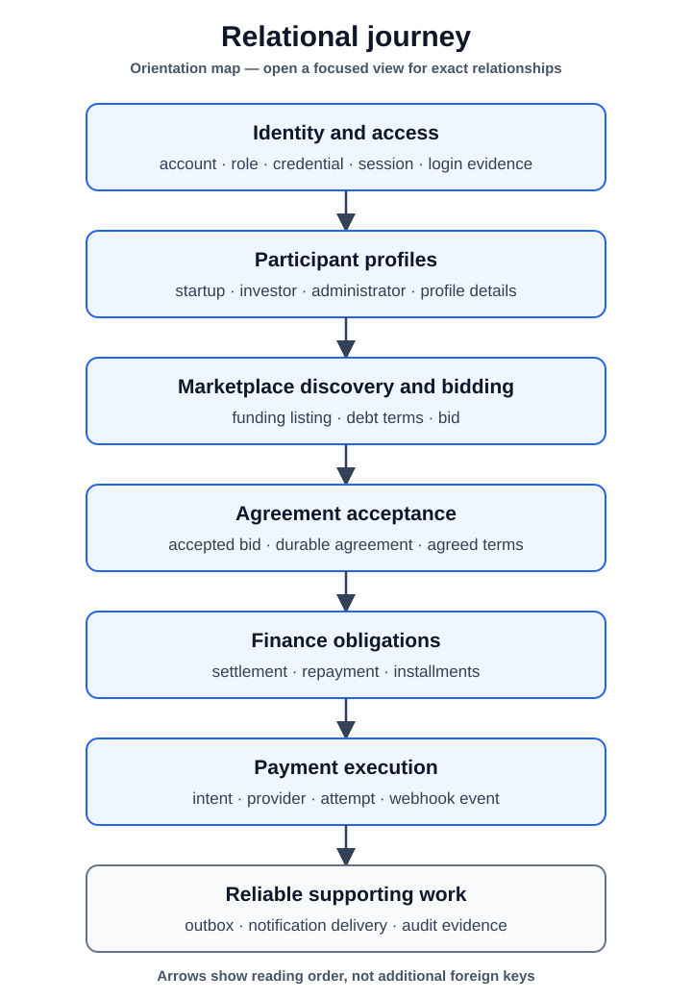

# Relational Journey

[Back to the database guide](README.md)

This page follows durable data from an account through participation,
marketplace, finance, payment, and supporting records. It is a reading route,
not a single oversized ER diagram. Use the [focused relationship chooser](views/README.md)
when you need columns and cardinality for one question, and the
[schema reference](reference/README.md) for notation and cross-cutting guarantees.

[High-resolution PNG fallback](assets/relationship-journey.png)

## Identity and access

`account` is the ownership root for application identity. A one-to-one `role`
classifies the actor, while `profile` records completeness state. `credential`
stores login material separately from account state. Active authentication is
represented by server-side `session` rows; deleting an account cascades to its
sessions only after other restricted ownership relationships permit deletion.

`login_attempt` deliberately stores the submitted email and request evidence
without an account or credential foreign key. Triggers prevent its update and
deletion, so it remains an immutable security log rather than an identity child.

Focused view: [identity and access](views/identity-access.md).

## Participant profiles

An account may own one `startup`, one `investor`, or one `admin` record according
to application role and governance rules. The database uses uniqueness plus
role-check triggers; it does not connect `profile` directly to participant rows.

Startup detail fans out to `startup_legal_registration`,
`startup_web_presence`, and `startup_classification`. Investor detail fans out
to `investor_web_presence` and `investor_preference`. Detail and classification
rows cascade when their owning participant is removed. The partial unique index
on `admin` permits only one active administrator.

Focused view: [participant profiles](views/participant-profile.md).

## Marketplace discovery and bidding

A startup creates `funding_listing` rows. Debt listings have at most one
`listing_debt_terms` row. Investors submit `bid` rows against listings, and a
debt bid has at most one `bid_debt_terms` row. State/time checks keep lifecycle
markers consistent, while a partial unique index allows at most one accepted
bid per listing.

The core listing and bid ownership foreign keys use `RESTRICT`; deleting a
listing does not silently erase submitted bids. Debt-term rows use `CASCADE`
because they are dependent value records.

Focused view: [marketplace and bidding](views/marketplace-bidding.md).

## Agreement and finance

Accepting a bid creates one `agreement` for the chosen listing and bid, startup,
and investor. `agreement_debt_terms` freezes the agreed debt values. Agreement
triggers verify that the bid is accepted and that listing and participants agree.

One agreement may then own one `settlement` and one `repayment`. Settlement
represents the investor-to-startup funding leg. Repayment represents the
startup-to-investor obligation and owns ordered `repayment_installment` rows.
Participant-consistency triggers protect both finance records. These primary
finance relationships use `RESTRICT`, preventing accidental history loss.

Focused views: [agreement acceptance](views/agreement-acceptance.md),
[settlement](views/settlement.md), and
[repayment schedule](views/repayment-schedule.md).

## Payment execution

`payment_provider` and `payment_provider_method` store enabled provider and
method configuration. A `payment_intent` belongs to exactly one payment purpose:
either a settlement or a repayment installment. It also records payer and payee
accounts. Checks enforce purpose/reference consistency, distinct participants,
positive amounts, and state timestamps.

Each processing try becomes a `payment_attempt` tied to its intent and provider.
The method lookup is application-enforced because no matching foreign key to
the three-column provider-method key exists. Partial unique indexes protect
active and confirmed intents and provider identifiers.

Every callback is stored as `payment_webhook_event`, uniquely identified per
provider and optionally linked to an intent and attempt. Nullable links reflect
callbacks that cannot yet be associated; signature and replay validation remain
application concerns.

Focused views: [payment intent](views/payment-intent.md),
[payment processing](views/payment-processing.md), and
[payment webhooks](views/payment-webhook.md).

## Reliable supporting work

A committed business event is stored in `event_outbox`. After dispatch,
`notification` records may be created for an event and fan out through
`notification_recipient`, `notification_delivery`, and
`notification_delivery_attempt`. `notification_subscription` stores an
account's channel choice and endpoint state.

`audit_record` stores business or security evidence and has only one nullable
foreign key: the actor account. Its `event_id` and notification event IDs are
correlations to the outbox, not foreign keys. Audit triggers make records
append-only; delivery constraints and partial indexes support bounded retry and
feed queries.

Focused views: [notification delivery](views/notification-delivery.md) and
[outbox and audit](views/outbox-audit.md).

## Verification boundary

`DatabaseDocumentationContractIT` migrates PostgreSQL with Flyway and compares
the effective catalogue directly with this journey, the focused relationship
pages, and the schema reference. `DatabaseDocumentationNavigationTest` keeps the
reader routes fast and independently verifiable without duplicating schema data.
