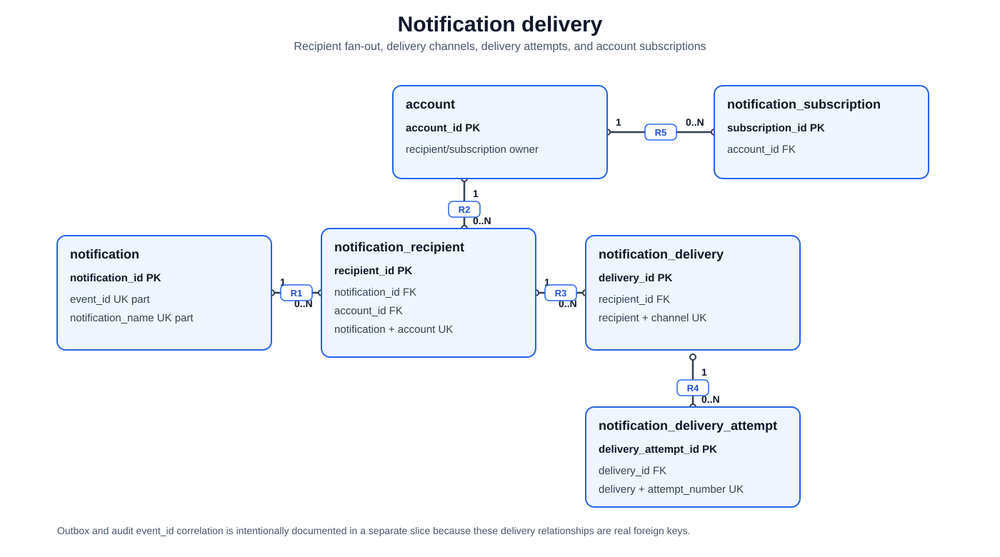

# Notification Delivery

[Back to focused views](README.md)

[High-resolution PNG fallback](../assets/notification-delivery-schema.png)

This slice shows notification fan-out, delivery tracking, retry attempts, and
account subscriptions. Outbox and audit correlation is a separate view because
those links are not notification-delivery foreign keys.

| Rel | Parent | Cardinality | Child | Schema basis |
|---|---|---:|---|---|
| `R1` | `notification` | `1 -> 0..N` | `notification_recipient` | `notification_recipient.notification_id` is `FK`, `NOT NULL`; `fk_recipient_notification`; `ON DELETE CASCADE`; `UNIQUE (notification_id, account_id)` |
| `R2` | `account` | `1 -> 0..N` | `notification_recipient` | `notification_recipient.account_id` is `FK`, `NOT NULL`; `fk_recipient_account`; `ON DELETE RESTRICT` |
| `R3` | `notification_recipient` | `1 -> 0..N` | `notification_delivery` | `notification_delivery.recipient_id` is `FK`, `NOT NULL`; `fk_delivery_recipient`; `ON DELETE CASCADE`; `UNIQUE (recipient_id, channel_type)` |
| `R4` | `notification_delivery` | `1 -> 0..N` | `notification_delivery_attempt` | `notification_delivery_attempt.delivery_id` is `FK`, `NOT NULL`; `fk_notification_delivery_attempt_delivery`; `ON DELETE CASCADE`; `UNIQUE (delivery_id, attempt_number)` |
| `R5` | `account` | `1 -> 0..N` | `notification_subscription` | `notification_subscription.account_id` is `FK`, `NOT NULL`; `fk_notification_subscription_account`; `ON DELETE CASCADE`; `UNIQUE (account_id, channel_type, endpoint)` |
