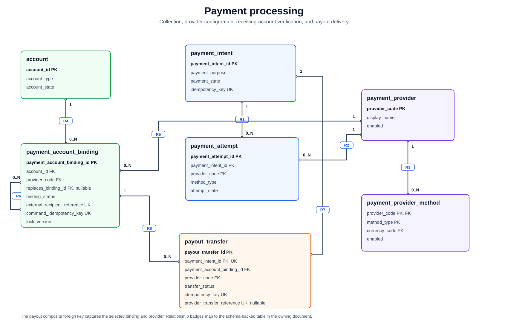

# Payment Processing

[Back to focused views](README.md)

[High-resolution PNG fallback](../assets/payment-processing-schema.png)

This slice shows collection attempts, provider configuration, receiving-account
bindings, and payout delivery. Webhook relationships are intentionally separate
because their intent and attempt references are optional.

| Rel | Parent | Cardinality | Child | Schema basis |
|---|---|---:|---|---|
| `R1` | `payment_intent` | `1 -> 0..N` | `payment_attempt` | `payment_attempt.payment_intent_id` is `FK`, `NOT NULL`; `fk_payment_attempt_intent`; `ON DELETE RESTRICT` |
| `R2` | `payment_provider` | `1 -> 0..N` | `payment_attempt` | `payment_attempt.provider_code` is `FK`, `NOT NULL`; `fk_payment_attempt_provider`; `ON DELETE RESTRICT` |
| `R3` | `payment_provider` | `1 -> 0..N` | `payment_provider_method` | `payment_provider_method.provider_code` is `FK`, part of composite `PK`; `fk_payment_provider_method_provider`; `ON DELETE RESTRICT` |
| `R4` | `account` | `1 -> 0..N` | `payment_account_binding` | `payment_account_binding.account_id` is `FK`, `NOT NULL`; `fk_payment_account_binding_account`; `ON DELETE RESTRICT` |
| `R5` | `payment_provider` | `1 -> 0..N` | `payment_account_binding` | `payment_account_binding.provider_code` is `FK`, `NOT NULL`; `fk_payment_account_binding_provider`; `ON DELETE RESTRICT` |
| `R6` | `payment_account_binding` | `0..1 -> 0..N` | `payment_account_binding` | `payment_account_binding.replaces_binding_id` is nullable `FK`; `fk_payment_account_binding_replaced`; `ON DELETE RESTRICT` |
| `R7` | `payment_intent` | `1 -> 0..1` | `payout_transfer` | `payout_transfer.payment_intent_id` is `FK`, `NOT NULL`, `UNIQUE`; `fk_payout_transfer_payment_intent`; `ON DELETE RESTRICT` |
| `R8` | `payment_account_binding` | `1 -> 0..N` | `payout_transfer` | `payout_transfer.payment_account_binding_id` and `payout_transfer.provider_code` form a composite `FK`, `NOT NULL`; `fk_payout_transfer_binding_provider`; `ON DELETE RESTRICT` |

The composite payout relationship captures both the binding identity and its
provider, preventing a transfer from naming a provider different from the one
that owns the selected binding.
