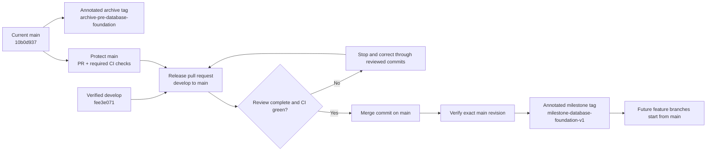

# KAN-14: Database Foundation Release Design

## Purpose

Promote the verified database-foundation work from `develop` to `main` through
a controlled, reviewable release. The release must preserve the exact
pre-release `main` revision, enforce CI and pull-request gates on `main`, and
leave a durable record of what was released and how it was verified.

This milestone establishes a reliable source-control baseline. It does not
claim that the complete application is production-ready or deploy the
application to a production environment.

## Current State

At the start of KAN-14:

- `main` and `origin/main` point to
  `10b0d93791ae7dd90a5e3d1aca90b61b1aee3945`;
- `develop` and `origin/develop` point to
  `fee3e0710b598d1d6bb6b01c53ce34f59c66035a`;
- `main` is the merge base and `develop` is 18 commits ahead;
- `main` remains the GitHub default branch;
- no release pull request is open;
- no release or archive tag exists;
- `main` does not yet enforce pull-request or CI requirements;
- CI contains independent `Unit Tests` and `PostgreSQL Integration Tests`
  jobs using Temurin Java 21;
- the verified database baseline is Flyway migration
  `V1__baseline.sql`, whose Git blob ID is
  `8784c468aa169952a87e726303d03abae4376add`.

These revision identifiers are release inputs. If any of them changes before
execution, the release pauses until the comparison and verification evidence
are refreshed.

## Release Architecture

The release has two permanent source references:

| Reference | Points to | Purpose |
| --- | --- | --- |
| `archive-pre-database-foundation` | old `main` at `10b0d937...` | immutable recovery and comparison checkpoint |
| `milestone-database-foundation-v1` | verified post-merge `main` | identifies the released database-foundation milestone |

Both references are annotated Git tags and must be pushed to `origin`.

## Why the Legacy Checkpoint Is a Tag

The old `main` revision is preserved by an annotated tag rather than a
local-only legacy branch:

- a tag remains fixed on one reviewed historical revision;
- a remote tag is available after a machine failure or fresh clone;
- a normal branch can move accidentally and suggests continuing development;
- a local-only branch can be lost with the local repository;
- the old revision also remains in `main` history after a merge commit.

No `legacy` branch is required for this milestone. The archive tag must not be
moved or deleted. It preserves repository files and commit history, but it is
not a database backup and does not preserve GitHub repository settings.

The release record therefore also captures the old and new revision IDs,
branch-protection settings, checks used for the decision, and verification
results.

## Main Branch Protection

Before opening the release pull request, `main` will require:

- changes through a pull request;
- successful `Unit Tests` and `PostgreSQL Integration Tests` checks;
- resolution of pull-request conversations;
- protection from force pushes;
- protection from branch deletion;
- enforcement of the same rule for repository administrators.

The repository currently has one contributor account. Required GitHub
approving-review count will therefore remain zero for this release because a
pull-request author cannot approve their own pull request. Review is still a
release gate: the repository owner must inspect the complete diff and record
release approval before merge. When an independent collaborator is available,
the protection rule should be changed to require at least one approving
review.

No direct commit or direct push to `main` is part of this design.

## Release Sequence

### 1. Freeze and Record the Inputs

Confirm a clean working tree, fetch the remote state, and verify that the
expected local and remote revision IDs still match. Record the default branch,
open pull requests, existing tags, and current protection state.

Any unexpected branch movement, open pull request targeting the release
range, or uncommitted change stops the release until it is understood.

### 2. Create the Archive Checkpoint

Create the annotated tag `archive-pre-database-foundation` at the exact old
`main` revision and push that tag to `origin`. Verify that the local and remote
tag objects resolve to the intended commit.

The tag is created before `main` moves. It is a comparison and source-recovery
checkpoint, not authorization to rewrite published history.

### 3. Protect Main

Apply the protection rules defined above and read the settings back from
GitHub. The release cannot proceed merely because a settings update command
returned successfully; the effective requirements must be verified.

### 4. Verify Develop

Run clean unit and PostgreSQL integration suites from the exact `develop`
revision proposed for release. Confirm that:

- all tests pass with zero failures and errors;
- Flyway applies the current migration history to PostgreSQL 16;
- Hibernate validates rather than creates or updates the schema;
- `V1__baseline.sql` still has blob ID
  `8784c468aa169952a87e726303d03abae4376add`;
- the release diff contains the intended KAN-7 through KAN-13 database
  foundation work and KAN-14 release documentation only.

A failed or flaky check is investigated and fixed on a reviewed branch. CI or
test requirements are not weakened to make the release pass.

### 5. Open and Review the Release Pull Request

Open a pull request from `develop` into `main`. Its description will include:

- the exact base and head revisions;
- the included Jira issues and outcome of each;
- the archive tag;
- the database migration and compatibility statement;
- local verification results;
- required GitHub checks;
- the rollback and forward-recovery approach;
- explicit non-goals for this milestone.

Use a merge commit so the development history and release boundary remain
visible. Do not squash, rebase, force-push, or bypass the protected-branch
checks.

### 6. Verify Main and Mark the Milestone

After the release pull request is reviewed, approved, and merged, fetch the
remote state and verify the exact new `origin/main` revision. Run the same
clean unit and PostgreSQL integration suites on that exact revision and confirm
the required GitHub checks succeeded.

Only after post-merge verification succeeds, create and push the annotated tag
`milestone-database-foundation-v1` at that verified `main` revision.

If post-merge verification fails, do not create the milestone tag. Open a
corrective or revert pull request under the same protection rules.

## Branching Model After the Milestone

After KAN-14 is complete:

- `main` remains the default and protected integration branch;
- new work starts from the latest verified `main`;
- each Jira task uses a short-lived, meaningful branch and a pull request
  directly into `main`;
- merge occurs only after the task's review and required checks pass;
- `develop` remains available as historical evidence but is no longer the
  starting point for new work;
- deletion of `develop`, if ever desired, requires a separate reviewed task.

This is a GitHub Flow model. `main` is the production-intent code line, but an
actual production deployment still requires future deployment, environment,
secret-management, monitoring, and operational-readiness work.

## Failure Handling and Recovery

| Failure point | Required response |
| --- | --- |
| Input revision changed | stop, compare the new delta, update the release record, and rerun verification |
| Archive tag points to the wrong commit | do not continue; correct it before any release PR is merged |
| Branch protection is incomplete | stop and correct the GitHub rule |
| Local unit or integration test fails | fix through a reviewed task branch, then restart verification |
| Pull-request check fails | leave the PR unmerged and investigate the failure |
| Unexpected release diff appears | remove or separately review the change; do not hide it in the release |
| Post-merge verification fails | open a corrective or revert PR; do not force-reset `main` |

A source rollback is performed through a reviewed revert or corrective pull
request. Neither `main` nor a published tag will be force-moved. The archive
tag does not restore PostgreSQL data; any future release involving preserved
data requires its own verified database backup and recovery plan.

## Verification Evidence

The KAN-14 release record must contain evidence for all of the following:

1. clean repository state and fetched remote references;
2. old `main`, release `develop`, and final `main` revision IDs;
3. zero unexpected commits on `main` before release;
4. the exact changed-file and commit range in the release;
5. local and remote archive-tag resolution;
6. effective `main` branch-protection settings;
7. clean unit-test results;
8. clean PostgreSQL integration-test results;
9. unchanged Flyway V1 blob ID;
10. successful required checks on the release pull request;
11. post-merge test results from the exact final `main` revision;
12. local and remote milestone-tag resolution;
13. confirmation that `main` remains the GitHub default branch;
14. confirmation that no open pull request still depends on `develop`.

Command output may be summarized in the Jira issue and pull request. Generated
test logs do not need to be committed to the repository.

## Separation of Responsibilities

- The design document defines the release contract and safety boundaries.
- The implementation plan defines the exact commands, expected outputs, and
  review checkpoints.
- GitHub branch protection enforces repository-level merge constraints.
- GitHub Actions supplies repeatable unit and PostgreSQL verification.
- The release pull request contains the complete reviewable change set.
- Annotated tags provide durable source checkpoints.
- Jira records the release decision, evidence, and completion state.

No application component, Flyway migration, or database content is modified by
KAN-14 release preparation.

## Out of Scope

- changing Java application behavior;
- adding, editing, renaming, or deleting a Flyway migration;
- changing Flyway, Hibernate, datasource, test, or CI configuration;
- deploying to a production environment;
- backing up or migrating a populated production database;
- declaring the whole application production-ready;
- deleting or rewriting `develop` or `main`;
- creating a continuing legacy development branch;
- introducing a release automation platform.

## Acceptance Criteria

- The exact old `main` revision is preserved by the pushed annotated archive
  tag `archive-pre-database-foundation`.
- `main` requires pull requests, both existing CI jobs, and resolved
  conversations, and blocks force pushes and deletion.
- The exact release revision of `develop` passes clean unit and PostgreSQL
  integration verification.
- The release diff is understood and limited to the approved database
  foundation milestone.
- A reviewed release pull request merges `develop` into `main` with a merge
  commit and without bypassing checks.
- The exact post-merge `main` revision passes local and GitHub verification.
- The pushed annotated tag `milestone-database-foundation-v1` identifies that
  verified post-merge revision.
- `main` remains the GitHub default branch.
- Future task branches start from `main` and target `main` through pull
  requests.
- `develop` is not deleted or rewritten during KAN-14.
