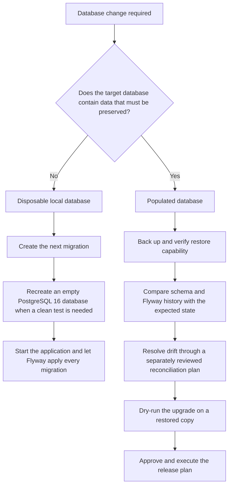

# KAN-12: Database Migration Policy Design

## Purpose

Define how OptraBidz creates and upgrades its PostgreSQL schema without making
schema ownership ambiguous or putting stored data at unnecessary risk. The
resulting migration guide will be the reference for developers who add or
review database changes.

This work documents the behavior already established by KAN-7 through KAN-11.
It does not change the database schema, Flyway configuration, or application
runtime behavior.

## Current State

- Flyway owns schema creation and upgrades.
- Versioned migrations are stored in
  `src/main/resources/db/migration`.
- `V1__baseline.sql` is the current schema baseline.
- Flyway validates migration checksums during startup.
- Automatic baselining is disabled.
- Flyway clean is disabled.
- Hibernate uses `ddl-auto=validate` and does not generate schema objects.
- PostgreSQL 16 migration and integration tests run in CI.

## Documentation Structure

The implementation will make three documentation changes:

1. Create `docs/database/migrations.md` as the complete migration policy and
   operational guide.
2. Add the migration guide to `docs/database/README.md`, which remains the
   database-documentation index.
3. Replace the short migration note in the root `README.md` with a concise
   startup explanation and a link to the complete guide.

The same rule will not be copied into several files. The detailed policy will
live in one place, while the two indexes will link to it.

## Schema Ownership

Flyway is the only schema-change mechanism. Hibernate validates mappings after
Flyway finishes. Application startup must fail when a migration is invalid or
when entity mappings do not match the migrated schema.

The policy will prohibit these alternative schema-change paths:

- editing the database manually as part of normal deployment;
- enabling Hibernate schema creation or update;
- enabling Spring SQL initialization for the application schema;
- running a versioned migration directly with `psql`;
- enabling `baseline-on-migrate` globally;
- using `flyway repair` as a routine way to accept checksum differences.

## Versioned Migration Rules

An applied versioned migration is immutable. It must not be edited, renamed,
deleted, or reordered. A later schema change receives the next unused version,
for example `V2__add_account_phone_number.sql`.

Each new migration must:

- have one clear purpose and a descriptive name;
- use PostgreSQL-compatible SQL;
- preserve data unless a separately reviewed destructive change is required;
- define constraints, indexes, and data backfills explicitly;
- be safe for the deployment sequence described below;
- pass the full PostgreSQL integration profile before merge.

Reference data required by the application may be versioned with the schema.
Environment-specific or user data must not be embedded in a migration.

## Environment Decision Flow



## Fresh and Disposable Databases

For an empty PostgreSQL 16 database, application startup runs every migration
in version order. Flyway records each successful migration and checksum in
`flyway_schema_history`; Hibernate validation runs against the resulting
schema.

Current OptraBidz development data is disposable. The guide may therefore
include a clearly labelled local-reset procedure using the explicit
`optrabidz-postgres` development container from the root README. The procedure
must not use broad paths, unresolved variables, or commands that could target
an unrelated database. It must state that the application should be stopped
and that the reset deletes all data in that named local database.

## Populated Databases

A database containing data that must be preserved must never be reset merely
to make a migration pass. Its upgrade requires a separate release or migration
task with all of the following evidence:

1. a verified backup and restore procedure;
2. the current schema and `flyway_schema_history` contents;
3. a comparison with the expected migration history;
4. a documented reconciliation plan for any drift;
5. an upgrade rehearsal on a restored copy;
6. application and data-integrity verification after the rehearsal;
7. rollback or forward-recovery steps;
8. separate approval for the production execution window.

Automatic baselining will remain disabled. If a populated legacy database has
no Flyway history, onboarding it is a dedicated reconciliation project rather
than an application-startup option.

## Expand, Migrate, Contract

Changes that can break compatibility across application versions will be split
across releases:

1. **Expand:** add compatible schema objects, such as a nullable column or a
   new table, without removing the old representation.
2. **Migrate:** deploy code that can work during the transition and backfill or
   copy existing data in a controlled way.
3. **Contract:** remove obsolete columns, constraints, or compatibility code
   only after no running application version depends on them.

For example, renaming `account.email` must not be implemented as one immediate
rename when old and new application versions may overlap. A safe sequence adds
the replacement column, writes and backfills both representations, switches
reads, and removes the old column in a later migration.

## Failure Handling and Recovery

- A checksum mismatch is investigated; the applied migration is not silently
  rewritten or repaired.
- A failed migration blocks application startup until its cause and database
  state are understood.
- A new corrective migration is preferred after a migration has been released.
- PostgreSQL transactional DDL should be used where possible, but rollback
  cannot be assumed for every operation or data transformation.
- Production recovery decisions are based on the rehearsed release plan:
  restore the verified backup or apply a reviewed forward fix.

## Verification Design

Documentation consistency will be checked with a repository search for stale
initialization guidance, including:

- `optrabidz-schema.sql`;
- `ddl-auto=update`;
- `spring.sql.init` schema configuration;
- instructions to initialize the application schema manually.

Behavior will be verified with:

```powershell
.\mvnw.cmd clean test
.\mvnw.cmd clean verify -Pintegration-tests
```

The final review must also confirm:

- `V1__baseline.sql` is byte-for-byte unchanged;
- no application configuration changed;
- no database was modified manually;
- the root README and database index point to the new guide;
- CI remains green on Java 21 and PostgreSQL 16.

## Out of Scope

- creating a new schema migration;
- changing Flyway or Hibernate configuration;
- onboarding an existing legacy database;
- backing up, resetting, or upgrading a real populated database;
- adding a deployment platform or production database service;
- defining a general disaster-recovery strategy beyond migration safety.

## Acceptance Criteria

- One migration guide defines ownership, authoring, deployment, and recovery
  rules.
- Fresh and disposable database procedures are clearly separated from
  populated-database procedures.
- Applied migrations are explicitly immutable.
- Automatic baselining and routine checksum repair are explicitly prohibited.
- Expand, migrate, and contract is explained with a concrete example.
- README guidance matches the current application and CI behavior.
- Stale schema-initialization instructions are absent.
- Clean unit and PostgreSQL integration verification passes.
