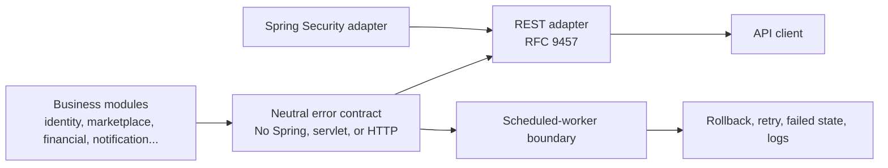
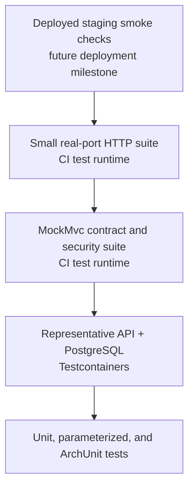

# KAN-17: Production Exception-Handling Foundation Design

- **Epic:** KAN-16 — Establish production exception-handling foundation
- **Story:** KAN-17 — Design the production exception-handling architecture and delivery backlog
- **Date:** 2026-08-14
- **Decision:** Use transport-neutral errors with execution-boundary adapters

## 1. Purpose

OptraBidz needs one consistent way to represent, translate, disclose, log, and
test failures without coupling business code to HTTP or Spring MVC. This design
defines that foundation for the existing modular monolith.

The system is production-targeted. Test tools described here run during
development and continuous integration; they are not runtime components of the
deployed application.

## 2. Current State

The application already has useful exception-handling building blocks:

- `GlobalExceptionHandler` translates application and framework exceptions;
- `ErrorResponse` provides a custom `{success,error,meta}` response;
- `RequestMetadataFilter` adds request correlation to responses and MDC;
- `RequestIdProvider` validates inbound request IDs and generates safe UUIDs;
- business modules define specific exceptions; and
- outbox and notification dispatchers already implement parts of retry and
  failure-state handling.

The current structure also has material weaknesses:

| Concern | Current effect |
|---|---|
| Business exceptions extend `common.api.exception.ApiException` | Application code depends on the REST API layer. |
| `ErrorCode` owns `HttpStatus` | Transport decisions are embedded in business-facing types. |
| Raw `IllegalArgumentException` and `IllegalStateException` are mapped globally | Programming defects can be misclassified as safe 400 or 409 responses. |
| Exception messages are often used as client messages | Internal or sensitive details can be disclosed accidentally. |
| Spring Security and Spring MVC use different failure paths | Authentication and controller failures can produce inconsistent responses. |
| Scheduled workers are outside the HTTP lifecycle | A REST-only strategy cannot govern retries, rollback, or persisted failure details. |
| No focused exception-contract test suite exists | Response consistency and disclosure rules are not protected directly. |

## 3. Goals

1. Keep domain and application failures independent of HTTP, servlet, and
   Spring MVC types.
2. Return one documented RFC 9457 Problem Details contract for REST and Spring
   Security failures.
3. Separate public client information from internal diagnostic information.
4. Make validation, framework, security, and unexpected failures predictable.
5. Give scheduled workers explicit rollback, retry, persistence, and logging
   policies without pretending they are HTTP requests.
6. Keep logging and auditing as separate responsibilities.
7. Enforce dependency and disclosure rules with automated tests.
8. Migrate incrementally on `develop` while delivering only one completed
   exception architecture to `main`.

## 4. Non-Goals

- Creating an exception microservice or separate deployable service
- Introducing Kafka, Redis, distributed tracing, or a new logging platform
- Replacing the existing authentication mechanism
- Rewriting business workflows unrelated to their failure contracts
- Automatically auditing every thrown Java exception
- Using AOP for REST exception translation
- Adding test frameworks that duplicate existing capabilities
- Preserving the current custom error-envelope JSON

## 5. Architectural Decision

OptraBidz will use a transport-neutral application-error model with
execution-boundary adapters.



“Plug-and-play” means that an execution adapter can be replaced or added
without changing business exceptions. It does not mean dynamic runtime plugin
loading. A future GraphQL, command-line, or message-consumer adapter could map
the same neutral errors according to its own transport rules.

### 5.1 Dependency direction

```text
business domain/application
        |
        v
common.error
        ^
        |
common.api.error  <--- security.infrastructure.web
        ^
        |
Spring MVC / Spring Security
```

Permitted dependencies:

- business exception packages may depend on `common.error` and Java;
- REST error components may depend on `common.error`, Spring MVC, Jackson, and
  servlet APIs;
- Spring Security web adapters may depend on the common REST renderer; and
- worker adapters may depend on neutral errors, their persistence ports, and
  observability interfaces.

Forbidden dependencies:

- `domain` or `application` exception packages must not depend on
  `common.api`, `HttpStatus`, `ResponseEntity`, servlet APIs, or Spring Web;
- the neutral error contract must not depend on an execution adapter; and
- one adapter must not call another adapter except for the security adapter's
  deliberate use of the common REST renderer.

## 6. Component Responsibilities

### 6.1 Neutral error contract

The `common.error` package will provide a small contract:

| Component | Responsibility |
|---|---|
| `ErrorCategory` | Transport-neutral meaning such as validation, conflict, or not-found |
| `ErrorDescriptor` | Stable public code, category, and fixed safe public message |
| `ApplicationException` | Runtime exception containing a descriptor, internal diagnostic code, and optional cause |
| `ErrorDetail` | Optional allowlisted structured information that is not tied to HTTP |

Module-owned descriptors avoid one growing central enum. For example,
marketplace owns listing and bid error descriptors, while finance owns payment
and settlement descriptors.

The Java exception message is internal diagnostic information. The REST layer
must never copy `exception.getMessage()` into a response automatically. A
descriptor's public message is fixed and deliberately safe. A sensitive
security exception may therefore have a specific internal diagnostic code but
map to the generic public `AUTHENTICATION_FAILED` descriptor.

### 6.2 REST adapter

The `common.api.error` package will contain:

| Component | Responsibility |
|---|---|
| `RestExceptionHandler` | Controller advice and Spring MVC exception entry point |
| `ProblemDetailsFactory` | Only component allowed to construct the public problem body |
| `HttpErrorMapping` | Maps neutral categories and web failures to HTTP semantics |
| `ValidationViolationMapper` | Produces safe field violations without rejected values |

Extending Spring's `ResponseEntityExceptionHandler` is preferred because it
provides one supported interception point for Spring MVC `ErrorResponse`
exceptions. Explicit handlers remain appropriate for neutral application
exceptions and the final unexpected-exception fallback.

### 6.3 Spring Security adapters

Spring Security operates in the servlet filter chain before controller advice
for many failures. Two adapters will delegate to `ProblemDetailsFactory`:

```text
security/infrastructure/web
├── ProblemAuthenticationEntryPoint
└── ProblemAccessDeniedHandler
```

- `ProblemAuthenticationEntryPoint` renders sanitized 401 responses.
- `ProblemAccessDeniedHandler` renders 403 responses when disclosure is safe.
- Resource-existence hiding is an application authorization policy, not a
  generic handler guess. Those use cases deliberately expose a not-found
  public descriptor.

These adapters render failures; they do not authenticate users or decide
permissions.

### 6.4 Scheduled-worker boundaries

REST Problem Details never apply to scheduled work.

| Worker | Required policy |
|---|---|
| Outbox dispatcher | Roll back the failed attempt, persist an allowlisted failure summary, calculate retry state, and log event correlation |
| Notification dispatcher | Convert expected provider failures into typed results, persist sanitized provider information, retry only retryable failures, and roll back unexpected exceptions |
| Lifecycle-expiry scheduler | Keep each enforcement transaction consistent, log an unexpected run failure once, and allow the next scheduled run to execute |

Persisted failure messages are treated as stored operational data, not as an
unrestricted exception-message dump. Provider secrets, payloads, stack traces,
SQL details, and credentials must not be stored in failure columns.

## 7. Public REST Contract

REST failures use `Content-Type: application/problem+json` and RFC 9457 fields
plus a small allowlist of extensions.

```json
{
  "type": "urn:optrabidz:problem:listing-not-found",
  "title": "Resource not found",
  "status": 404,
  "detail": "The requested funding listing is unavailable",
  "instance": "urn:optrabidz:request:3e66952c-0000-4000-8000-000000000000",
  "code": "LISTING_NOT_FOUND",
  "requestId": "3e66952c-0000-4000-8000-000000000000",
  "timestamp": "2026-08-14T12:30:00Z"
}
```

Validation failures add `violations`:

```json
{
  "type": "urn:optrabidz:problem:validation-error",
  "title": "Request validation failed",
  "status": 400,
  "detail": "One or more request values are invalid",
  "instance": "urn:optrabidz:request:3e66952c-0000-4000-8000-000000000000",
  "code": "VALIDATION_ERROR",
  "requestId": "3e66952c-0000-4000-8000-000000000000",
  "timestamp": "2026-08-14T12:30:00Z",
  "violations": [
    {
      "field": "amount",
      "message": "must be greater than zero"
    }
  ]
}
```

### 7.1 Semantic application mappings

| Neutral category | HTTP status | Public meaning |
|---|---:|---|
| `VALIDATION` | 400 | Input is structurally or syntactically invalid |
| `AUTHENTICATION` | 401 | Authentication is absent or unsuccessful |
| `AUTHORIZATION` | 403 | Authenticated actor lacks permission and disclosure is safe |
| `NOT_FOUND` | 404 | Resource or endpoint is unavailable |
| `CONFLICT` | 409 | Current state or uniqueness conflicts with the request |
| `BUSINESS_RULE` | 422 | Syntactically valid request violates a business rule |
| `INTERNAL` | 500 | Unexpected server failure; never deliberately exposed in detail |

### 7.2 Spring MVC mappings

| Failure family | Status | Public code |
|---|---:|---|
| Invalid DTO, method constraint, missing parameter/header, type mismatch | 400 | `VALIDATION_ERROR` |
| Malformed JSON | 400 | `MALFORMED_REQUEST` |
| Unmapped endpoint or resource | 404 | `ENDPOINT_NOT_FOUND` |
| Unsupported HTTP method | 405 | `METHOD_NOT_ALLOWED` |
| Unacceptable response media type | 406 | `NOT_ACCEPTABLE` |
| Unsupported request media type | 415 | `UNSUPPORTED_MEDIA_TYPE` |
| Unhandled exception | 500 | `INTERNAL_SERVER_ERROR` |

Known database conflicts must be translated by the responsible application
module. A generic database or persistence exception is never guessed to be a
safe 409; it remains an internal 500.

### 7.3 Disclosure policy

The response factory uses an allowlist. Public responses must not contain:

- Java class or package names;
- stack traces or source locations;
- SQL, constraint, table, or column details;
- filesystem paths, hosts, ports, or dependency addresses;
- credentials, tokens, cookies, authorization headers, or payment secrets;
- request bodies or rejected values; or
- raw infrastructure or provider exception messages.

Authentication failures caused by unknown email, incorrect password, locked
credential, or disabled account use the same public code and message. The
precise cause is retained only in protected diagnostics and appropriate audit
events.

Object authorization may expose 404 instead of 403 when acknowledging the
object would reveal its existence. This must be an explicit use-case policy.

## 8. Request Correlation

The existing `X-Request-Id` header remains the external correlation contract.

- An accepted inbound value is limited to 100 characters and letters, digits,
  hyphen, underscore, or period.
- Missing, blank, oversized, or invalid values are replaced with a generated
  UUID.
- The response header and Problem Details `requestId` must match.
- `instance` is an opaque request-occurrence URN rather than a raw URL or
  database identifier.
- The request ID is added to MDC for the request and removed in a `finally`
  block.

These existing safety rules require focused regression tests; their presence
must not be assumed from implementation alone.

## 9. Logging and Audit

Logging records technical diagnostics. Auditing records meaningful business or
security facts. The exception handler does not automatically create audit
records.

| Failure | Logging policy | Audit policy |
|---|---|---|
| Expected validation failure | No exception log; HTTP access logging records the status | None |
| Expected not-found, conflict, or business rejection | No exception log; HTTP access logging records the status | Only if the use case is independently auditable |
| Authentication or authorization failure | No duplicate exception log; the security boundary owns one sanitized security record when policy requires it | Created at the responsible security boundary when policy requires |
| Unexpected 500 | One error record with stack trace, diagnostic code, and request ID | Not automatically audited |
| Expected worker retry | One warning without a stack trace, with worker/event correlation and next retry time | Business outcome auditing remains owned by the worker's use case |
| Final or unexpected worker failure | One error record with stack trace and worker/event correlation | Business outcome auditing remains owned by the worker's use case |

Logging and audit payloads must continue to use the project's sensitive-data
masking rules. An expected exception must not be logged repeatedly at multiple
layers.

## 10. AOP Decision

AOP is not used to translate HTTP exceptions. Spring MVC controller advice and
Spring Security entry points are the lifecycle-aware extension points.

AOP may later be used for independent metrics or timing concerns when a clear
pointcut and ownership model exist. It must not obscure exception control flow,
duplicate logs, or create audit records for arbitrary method failures.

## 11. Verification Strategy

### 11.1 Test layers



| Layer | Purpose |
|---|---|
| Unit tests | Descriptor rules, category mappings, public-message selection, and sanitization |
| Parameterized tests | Mapping coverage, code uniqueness, and stable problem types |
| ArchUnit tests | Prevent business exception packages from depending on HTTP, servlet, Spring Web, or `common.api` |
| MockMvc tests | Exercise Spring MVC, Jackson, validation, controller advice, sessions, CSRF, and the security filter chain without a network socket |
| PostgreSQL integration tests | Prove representative module failures using the real application context and Testcontainers PostgreSQL |
| Real-port HTTP smoke tests | Start the embedded server and prove critical status, content type, header, serialization, and sanitization behavior over HTTP |
| Staging smoke tests | Verify the packaged application and deployment environment when deployment infrastructure exists |

MockMvc, JUnit, ArchUnit, Testcontainers, Spring Security Test, and real-port
test clients are test-scope tools. They are not packaged as production runtime
features. Test-only controllers or failure probes must remain under `src/test`
and must not appear in the application JAR.

No additional HTTP testing library is required initially. MockMvc matches the
existing Spring MVC suite, while a small random-port suite covers the network
boundary without duplicating every scenario.

### 11.2 Required scenarios

1. Invalid DTO produces sanitized 400 Problem Details.
2. Malformed JSON produces `MALFORMED_REQUEST`.
3. Missing parameter and type mismatch use the same response schema.
4. Unauthenticated access produces the generic 401 contract through the real
   security filter chain.
5. Unknown account, incorrect password, locked credential, and disabled account
   have indistinguishable public authentication failures.
6. Safe role denial produces 403.
7. Protected object existence is hidden with an explicit 404 policy.
8. State conflict produces 409.
9. Business-rule rejection produces 422.
10. Unknown route, unsupported method, and unsupported media type use the
    documented framework mappings.
11. A controlled test-only exception produces a generic 500, logs one internal
    diagnostic event, and exposes no raw cause.
12. Invalid inbound request IDs are replaced, while the response header and
    body remain identical.
13. Outbox, notification, and lifecycle workers follow their rollback, retry,
    persistence, and logging policies.
14. Existing success-response behaviour remains unchanged.

Disclosure tests are defense-in-depth, not mathematical proof. Safety primarily
comes from constructing responses through one allowlisted factory and never
using raw exception messages. Negative assertions, architecture tests, and code
review then protect that policy.

### 11.3 OpenAPI contract

The Problem Details schema, validation extensions, and reusable error responses
must be visible in `/v3/api-docs`. A focused test will verify the generated
schema and representative operation references. Swagger documentation must not
claim error responses that the runtime does not produce.

## 12. Environment Responsibilities

| Environment | Exception-related responsibility |
|---|---|
| Development | Fast feedback, focused unit/MVC tests, local diagnostics |
| CI | Unit, architecture, MVC, security, real-port, PostgreSQL integration, and disclosure verification |
| Staging | Packaged application, real HTTP server, production-like configuration, deployment smoke checks |
| Production | Runtime exception components, protected logs, audit records, health/monitoring integration; no test frameworks |

Production-grade engineering does not mean running test frameworks in
production. It means preventing unverified code from reaching production and
operating the deployed code with safe diagnostics.

## 13. Incremental Delivery

The implementation will be divided into small reviewed stories after this
written design is approved:

1. Neutral error contract and focused architecture rules
2. RFC 9457 response factory and REST handler
3. Spring MVC validation and framework-failure mappings
4. Spring Security adapters and disclosure policies
5. Identity, security, and participation exception migration
6. Marketplace, classification, and governance exception migration
7. Financial and notification exception migration
8. Scheduled-worker failure persistence, retry, and logging hardening
9. Real-port smoke tests, OpenAPI error catalogue, and documentation
10. Removal of the legacy handler followed by full regression verification
11. Milestone release-readiness and protected promotion to `main`

The exact Jira issue keys and implementation sequence will be recorded in the
implementation plan. Each story uses a meaningful branch and a reviewed pull
request into `develop`.

The first exception-handling branch is based on the verified `main` release.
Its first reviewed merge into `develop` also restores the released `main`
ancestry to the development line. The file diff remains limited to the story's
approved scope.

## 14. Migration and Removal Policy

The neutral contract and new adapter are introduced before module migrations.
The old `ApiException`, HTTP-coupled `ErrorCode`, custom error envelope, and
legacy global handler may coexist only inside the development milestone while
callers are migrated.

Before release to `main`:

- every module exception must use the neutral contract;
- every documented REST failure must use Problem Details;
- the old exception types and competing handler must be removed;
- no endpoint may return both old and new error formats;
- all success-response behaviour must remain explicitly verified; and
- the full CI release head must be reviewed and pinned for promotion.

## 15. Alternatives Considered

### Improve the existing `ApiException`

This is the smallest change, but it preserves the application-to-HTTP coupling
and does not provide a clean security or worker boundary. It was rejected.

### Use Spring `ProblemDetail` directly in business modules

This adopts the public standard quickly but makes business code depend on the
REST framework. It was rejected.

### Separate exception service or microservice

Exception translation is process-local control flow. A network service would
add failure modes and latency without creating meaningful autonomy. It was
rejected.

## 16. Risks and Controls

| Risk | Control |
|---|---|
| Excessive exception hierarchy | Prefer module descriptors and a small neutral base contract. |
| Sensitive disclosure | Fixed public messages, allowlisted renderer, generic security mapping, and negative tests. |
| Duplicate logging or auditing | One execution boundary owns technical logging; services own audit meaning. |
| Two error formats during migration | Keep coexistence inside `develop`; remove the legacy path before release. |
| Brittle tests | Assert contract semantics and allowlisted fields instead of complete JSON snapshots. |
| False confidence from MockMvc | Add a small real-port suite and later deployed staging smoke checks. |
| Worker failure data leaks | Persist sanitized codes/summaries rather than raw exception or provider messages. |
| Architecture erosion | Enforce targeted package rules with ArchUnit. |

## 17. Completion Criteria

The exception-handling foundation is ready for release only when:

- business exceptions contain no HTTP or Spring Web dependency;
- REST, Spring Security, validation, and Spring MVC errors share the documented
  RFC 9457 contract;
- public and internal failure information are demonstrably separated;
- scheduled workers follow explicit, tested failure policies;
- request correlation is consistent and validated;
- logging and auditing have separate, tested ownership;
- the legacy error system is removed;
- the OpenAPI error catalogue matches runtime behaviour;
- unit, architecture, MVC, security, real-port, PostgreSQL integration, and
  regression suites pass on the exact release head; and
- the protected `develop`-to-`main` release procedure completes without bypass.

## 18. References

- [Spring Framework: Error Responses](https://docs.spring.io/spring-framework/reference/web/webmvc/mvc-ann-rest-exceptions.html)
- [Spring Security: Servlet Architecture and Exception Translation](https://docs.spring.io/spring-security/reference/servlet/architecture.html)
- [Spring Security: MockMvc Setup](https://docs.spring.io/spring-security/reference/servlet/test/mockmvc/setup.html)
- [Spring Framework: MockMvc](https://docs.spring.io/spring-framework/reference/testing/mockmvc.html)
- [ArchUnit User Guide](https://www.archunit.org/userguide/html/000_Index.html)
- [RFC 9457: Problem Details for HTTP APIs](https://www.rfc-editor.org/rfc/rfc9457)
