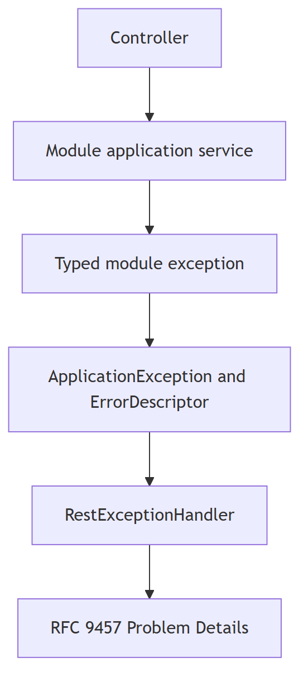

# KAN-24: Module Error Migration Implementation Plan

**Status:** Implementation verified locally; pull request pending

**Goal:** Migrate expected identity, security, and participation failures to
the transport-neutral `ApplicationException` contract while preserving every
successful workflow and preventing protected diagnostic data from entering
RFC 9457 responses.

**Source:** [KAN-24](https://0707manna0895.atlassian.net/browse/KAN-24) and
`docs/design/KAN-24-module-error-migration-design.md`.

**Architecture:** Each module owns fixed `ErrorDescriptor` catalogues and typed
application exceptions. Application services translate expected business
failures into those types. `RestExceptionHandler` remains the single HTTP
translation boundary and uses only the descriptor allowlist.



**Tech stack:** Java 21, Spring Boot 3.3.2, Spring Security 6.3, Spring MVC
`ProblemDetail`, JUnit 5, AssertJ, Mockito, MockMvc, ArchUnit, Testcontainers,
PostgreSQL 16, Flyway, and the Maven Wrapper.

## Global constraints

- Work only on `feature/KAN-24-module-error-migration`, created from verified
  `develop` commit `c36e0db1cd652ff1fda928058290ca5beaaacb03`.
- The feature pull request targets `develop`; `main` remains unchanged.
- Do not add, remove, or upgrade dependencies.
- Do not change V1, Flyway, the database schema, runtime profiles, CI,
  authentication strategy, session storage, CSRF, or endpoint permissions.
- Do not introduce AOP or a generic unexpected-500 handler.
- Do not redesign marketplace, classification, governance, financial,
  notification, or audit-owned business-error catalogues. Consumers of the
  removed generic participation exceptions may use the new participant-specific
  types or an existing owning-module access exception.
- Module catalogues and typed exceptions must not depend on HTTP status,
  Spring Web, Spring Security, servlet APIs, `common.api`, `ApiException`, or
  legacy `ErrorCode`.
- Public responses use only fixed descriptor codes and public messages.
  Account IDs, emails, credential state, diagnostic codes, rejected values,
  raw exception messages, causes, and stack traces remain protected.
- A credential or authenticated session that references a missing account is
  an internal consistency failure, not a safe 404 response.
- Unknown identity, wrong password, locked or disabled credential, and
  suspended or deactivated account produce the exact same public login
  response: `401`, `INVALID_CREDENTIALS`, `Invalid email or password`.
- Login audits use stable reasons only: `UNKNOWN_IDENTITY`, `INVALID_SECRET`,
  `CREDENTIAL_LOCKED`, `CREDENTIAL_DISABLED`, and `ACCOUNT_RESTRICTED`.
- Use TDD for each module: focused RED, minimal GREEN, focused regression,
  then an intentional module commit.

## File map

### Identity

| Path | Responsibility |
|---|---|
| `src/main/java/com/project/optrabidz/identity/application/error/IdentityErrors.java` | Fixed identity public descriptor catalogue. |
| `src/main/java/com/project/optrabidz/identity/application/exception/AccountNotFoundException.java` | Missing-account typed failure. |
| `src/main/java/com/project/optrabidz/identity/application/exception/AccountStateConflictException.java` | Invalid account transition typed failure. |
| `src/main/java/com/project/optrabidz/identity/application/exception/ProfileStateConflictException.java` | Invalid profile transition typed failure. |
| `src/main/java/com/project/optrabidz/identity/application/service/AccountApplicationService.java` | Translates expected repository/domain failures at the application boundary. |
| `src/test/java/com/project/optrabidz/identity/application/error/IdentityErrorContractTest.java` | Freezes descriptor and exception contracts. |
| `src/test/java/com/project/optrabidz/identity/application/service/AccountApplicationServiceTest.java` | Verifies missing accounts, state conflicts, persistence, and events. |

`AccountAlreadyExistsException.java` and `InvalidAccountStateException.java`
are deleted after the reference scan is green.

### Security

| Path | Responsibility |
|---|---|
| `src/main/java/com/project/optrabidz/security/application/error/SecurityErrors.java` | Fixed security public descriptor catalogue. |
| `src/main/java/com/project/optrabidz/security/application/LoginFailureReason.java` | Stable protected login reason allowlist. |
| `src/main/java/com/project/optrabidz/security/application/exception/InvalidCredentialsException.java` | One public login failure with a protected reason. |
| `src/main/java/com/project/optrabidz/security/application/exception/CurrentPasswordInvalidException.java` | Authenticated current-secret failure. |
| `src/main/java/com/project/optrabidz/security/application/exception/EmailAlreadyRegisteredException.java` | Duplicate registration/provisioning failure. |
| `src/main/java/com/project/optrabidz/security/application/exception/CredentialNotFoundException.java` | Explicit credential target not found. |
| `src/main/java/com/project/optrabidz/security/application/exception/PasswordPolicyViolationException.java` | Password policy failure. |
| `src/main/java/com/project/optrabidz/security/application/exception/SelfRegistrationNotAllowedException.java` | Unsupported self-registration role. |
| `src/main/java/com/project/optrabidz/security/application/exception/SecurityAuthorizationException.java` | Application-layer security authorization failure. |
| `src/main/java/com/project/optrabidz/security/application/AuthenticationService.java` | Applies disclosure-safe login, registration, and password-change failures. |
| `src/main/java/com/project/optrabidz/security/application/CredentialProvisioningService.java` | Applies provisioning failures without HTTP coupling. |
| `src/main/java/com/project/optrabidz/security/application/MeService.java` | Treats missing authenticated-account references as internal inconsistency. |
| `src/test/java/com/project/optrabidz/security/application/SecurityErrorContractTest.java` | Freezes descriptors, typed failures, and login-reason values. |
| `src/test/java/com/project/optrabidz/security/application/AuthenticationServiceTest.java` | Verifies every login cause, audit reason, lock policy, and success regression. |
| `src/test/java/com/project/optrabidz/security/application/CredentialProvisioningServiceTest.java` | Verifies provisioning failures and success. |
| `src/test/java/com/project/optrabidz/security/application/MeServiceTest.java` | Verifies internal consistency handling and current-user success. |
| `src/test/java/com/project/optrabidz/security/api/SecurityApiIT.java` | Verifies real MVC Problem Details and security success paths. |
| `src/test/java/com/project/optrabidz/audit/api/SecurityAuditIT.java` | Verifies stable, masked persisted login reasons. |

`CredentialLockedException.java` and `EmailAlreadyExistsException.java` are
deleted after their callers move to the new types.

### Participation

| Path | Responsibility |
|---|---|
| `src/main/java/com/project/optrabidz/participation/application/error/StartupErrors.java` | Startup descriptor catalogue. |
| `src/main/java/com/project/optrabidz/participation/application/error/InvestorErrors.java` | Investor descriptor catalogue. |
| `src/main/java/com/project/optrabidz/participation/application/error/AdminErrors.java` | Administrator descriptor catalogue. |
| `src/main/java/com/project/optrabidz/participation/application/error/ParticipationErrors.java` | Shared participation authorization descriptor. |
| `src/main/java/com/project/optrabidz/participation/application/exception/StartupAlreadyExistsException.java` | Duplicate startup failure. |
| `src/main/java/com/project/optrabidz/participation/application/exception/StartupNotFoundException.java` | Missing startup failure. |
| `src/main/java/com/project/optrabidz/participation/application/exception/InvestorAlreadyExistsException.java` | Duplicate investor failure. |
| `src/main/java/com/project/optrabidz/participation/application/exception/InvestorNotFoundException.java` | Missing investor failure. |
| `src/main/java/com/project/optrabidz/participation/application/exception/ActiveAdminAlreadyExistsException.java` | Global active-admin conflict. |
| `src/main/java/com/project/optrabidz/participation/application/exception/AdminAuthorityAlreadyGrantedException.java` | Account authority-history conflict. |
| `src/main/java/com/project/optrabidz/participation/application/exception/ActiveAdminNotFoundException.java` | Missing active administrator. |
| `src/main/java/com/project/optrabidz/participation/application/exception/ParticipationAuthorizationException.java` | Wrong application-layer actor role. |
| `src/main/java/com/project/optrabidz/participation/application/StartupService.java` | Uses startup-specific typed failures. |
| `src/main/java/com/project/optrabidz/participation/application/InvestorService.java` | Uses investor-specific typed failures. |
| `src/main/java/com/project/optrabidz/participation/application/AdminService.java` | Distinguishes active authority, authority history, and missing active admin. |
| `src/test/java/com/project/optrabidz/participation/application/ParticipationErrorContractTest.java` | Freezes all participation contracts. |
| `src/test/java/com/project/optrabidz/participation/application/StartupServiceTest.java` | Verifies startup failures and success behavior. |
| `src/test/java/com/project/optrabidz/participation/application/InvestorServiceTest.java` | Verifies investor failures and success behavior. |
| `src/test/java/com/project/optrabidz/participation/application/AdminServiceTest.java` | Verifies administrator conflict precedence and revocation. |
| `src/test/java/com/project/optrabidz/participation/api/ParticipationApiIT.java` | Verifies real participation Problem Details and success regressions. |

The three generic legacy participation exception classes are deleted after the
module-specific callers and tests are green.

### Cross-module verification

| Path | Responsibility |
|---|---|
| `src/test/java/com/project/optrabidz/architecture/ExceptionArchitectureTest.java` | Prohibits legacy HTTP-coupled exceptions in the migrated modules. |
| `docs/design/KAN-24-module-error-migration-implementation-plan.md` | Tracks implementation and verification evidence. |

---

## Task 1: Migrate identity failures

**Consumes:** `ApplicationException`, `ErrorDescriptor`, `ErrorCategory`,
`AccountRepository`, existing account/profile domain transitions, and the
unchanged `EventPublisher` contract.

**Produces:** The three identity descriptors and typed exceptions listed in the
file map. `AccountApplicationService` no longer emits
`IllegalArgumentException`, `InvalidAccountStateException`, or a raw domain
failure for expected missing-account or state-transition cases.

### Steps

- [x] Confirm the exact baseline and that only approved documentation precedes
  implementation.

  ```powershell
  git status -sb
  git branch --show-current
  git merge-base --is-ancestor c36e0db1cd652ff1fda928058290ca5beaaacb03 HEAD
  .\mvnw.cmd -B test
  ```

  Expected: the branch is `feature/KAN-24-module-error-migration`, the ancestor
  check exits `0`, the worktree is clean, and the unit suite passes.

- [x] Add `IdentityErrorContractTest` first. It must assert the catalogue
  contains exactly these values and that typed exceptions preserve protected
  diagnostics separately from the descriptor.

  ```java
  assertThat(IdentityErrors.ACCOUNT_NOT_FOUND)
          .isEqualTo(new ErrorDescriptor(
                  "ACCOUNT_NOT_FOUND",
                  ErrorCategory.NOT_FOUND,
                  "The requested account was not found"
          ));
  assertThat(IdentityErrors.ACCOUNT_STATE_CONFLICT)
          .isEqualTo(new ErrorDescriptor(
                  "ACCOUNT_STATE_CONFLICT",
                  ErrorCategory.CONFLICT,
                  "The account state does not allow this operation"
          ));
  assertThat(IdentityErrors.PROFILE_STATE_CONFLICT)
          .isEqualTo(new ErrorDescriptor(
                  "PROFILE_STATE_CONFLICT",
                  ErrorCategory.CONFLICT,
                  "The profile state does not allow this operation"
          ));

  AccountNotFoundException failure = new AccountNotFoundException(41L);
  assertThat(failure.descriptor()).isSameAs(IdentityErrors.ACCOUNT_NOT_FOUND);
  assertThat(failure.diagnosticCode()).isEqualTo("IDENTITY.ACCOUNT.NOT_FOUND");
  assertThat(failure.getMessage()).contains("41");
  assertThat(failure.descriptor().publicMessage()).doesNotContain("41");
  ```

- [x] Add `AccountApplicationServiceTest` with Mockito. Cover missing account,
  invalid account transition, invalid profile completion, unchanged status,
  successful save, and unchanged registration-event publication.

  ```java
  when(accountRepository.findById(41L)).thenReturn(Optional.empty());

  assertThatThrownBy(() -> service.activateAccount(41L))
          .isInstanceOf(AccountNotFoundException.class)
          .hasMessageContaining("41");
  verify(accountRepository, never()).save(any());
  ```

  For account and profile state conflicts, use real `Account` aggregates in a
  state that makes the requested transition fail. Assert the thrown type, its
  descriptor, retained cause, and absence of identifiers in the public
  message.

- [x] Run the focused tests and preserve RED evidence.

  ```powershell
  .\mvnw.cmd -B "-Dtest=IdentityErrorContractTest,AccountApplicationServiceTest" test
  ```

  Expected RED: compilation fails only because the new catalogue and typed
  exceptions do not exist, or behavior assertions fail against the legacy
  exceptions.

- [x] Create `IdentityErrors` as a non-instantiable fixed catalogue.

  ```java
  public final class IdentityErrors {
      public static final ErrorDescriptor ACCOUNT_NOT_FOUND =
              new ErrorDescriptor(
                      "ACCOUNT_NOT_FOUND",
                      ErrorCategory.NOT_FOUND,
                      "The requested account was not found"
              );
      public static final ErrorDescriptor ACCOUNT_STATE_CONFLICT =
              new ErrorDescriptor(
                      "ACCOUNT_STATE_CONFLICT",
                      ErrorCategory.CONFLICT,
                      "The account state does not allow this operation"
              );
      public static final ErrorDescriptor PROFILE_STATE_CONFLICT =
              new ErrorDescriptor(
                      "PROFILE_STATE_CONFLICT",
                      ErrorCategory.CONFLICT,
                      "The profile state does not allow this operation"
              );

      private IdentityErrors() {
      }
  }
  ```

- [x] Implement the three typed exceptions. Constructors accept protected
  context, but every descriptor remains fixed.

  ```java
  public final class AccountNotFoundException extends ApplicationException {
      public AccountNotFoundException(Long accountId) {
          super(
                  IdentityErrors.ACCOUNT_NOT_FOUND,
                  "IDENTITY.ACCOUNT.NOT_FOUND",
                  "Account not found: " + accountId
          );
      }
  }
  ```

  `AccountStateConflictException(Long accountId, String operation,
  Throwable cause)` uses diagnostic code `IDENTITY.ACCOUNT.STATE_CONFLICT`.
  `ProfileStateConflictException(Long accountId, String operation,
  Throwable cause)` uses diagnostic code `IDENTITY.PROFILE.STATE_CONFLICT`.
  Both pass the original domain failure as the protected cause.

- [x] Migrate `AccountApplicationService` at its application boundary.

  ```java
  private Account requireAccount(Long accountId) {
      Assert.notNull(accountId, "accountId must not be null");
      return accountRepository.findById(accountId)
              .orElseThrow(() -> new AccountNotFoundException(accountId));
  }
  ```

  `updateAccountState` catches only `IllegalStateException` from the domain
  mutation and throws `AccountStateConflictException`. `completeProfile`
  translates an invalid completion into `ProfileStateConflictException`.
  `updateProfileStatus` retains its existing idempotent behavior because its
  domain operation has no state-conflict rule. Repository mapper corruption
  remains an unmodified internal failure.

- [x] Remove `AccountAlreadyExistsException.java` and
  `InvalidAccountStateException.java`, then prove no reference remains.

  ```powershell
  rg -n "AccountAlreadyExistsException|InvalidAccountStateException" src/main src/test
  ```

  Expected: no matches.

- [x] Run focused and full unit GREEN verification.

  ```powershell
  .\mvnw.cmd -B "-Dtest=IdentityErrorContractTest,AccountApplicationServiceTest" test
  .\mvnw.cmd -B test
  git diff --check
  ```

- [x] Commit the identity slice.

  ```powershell
  git add -- src/main/java/com/project/optrabidz/identity src/test/java/com/project/optrabidz/identity
  git commit -m "refactor: migrate identity errors (KAN-24)"
  ```

---

## Task 2: Migrate security failures and disclosure policy

**Consumes:** The neutral error contract, existing password encoder,
credential/session/login-attempt repositories, identity ports,
`SecurityAuditService`, and unchanged stateful-session behavior.

**Produces:** Fixed security descriptors, typed exceptions, stable login
reasons, identical public login rejection responses, and sanitized audit
reasons.

### Steps

- [x] Add `SecurityErrorContractTest` first. Freeze all descriptors and the
  exact login-reason values.

  ```java
  assertThat(LoginFailureReason.values()).containsExactly(
          LoginFailureReason.UNKNOWN_IDENTITY,
          LoginFailureReason.INVALID_SECRET,
          LoginFailureReason.CREDENTIAL_LOCKED,
          LoginFailureReason.CREDENTIAL_DISABLED,
          LoginFailureReason.ACCOUNT_RESTRICTED
  );
  assertThat(SecurityErrors.INVALID_CREDENTIALS)
          .isEqualTo(new ErrorDescriptor(
                  "INVALID_CREDENTIALS",
                  ErrorCategory.AUTHENTICATION,
                  "Invalid email or password"
          ));
  assertThat(SecurityErrors.SELF_REGISTRATION_NOT_ALLOWED.category())
          .isEqualTo(ErrorCategory.BUSINESS_RULE);
  ```

  The same test freezes `CURRENT_PASSWORD_INVALID`,
  `EMAIL_ALREADY_REGISTERED`, `CREDENTIAL_NOT_FOUND`,
  `PASSWORD_POLICY_VIOLATION`, and `AUTHORIZATION_FAILED` against the approved
  code, category, and public message table.

- [x] Add `AuthenticationServiceTest` before production changes. Use a
  parameterized test for the public disclosure invariant.

  ```java
  assertThatThrownBy(loginCall)
          .isInstanceOfSatisfying(
                  InvalidCredentialsException.class,
                  failure -> {
                      assertThat(failure.descriptor())
                              .isSameAs(SecurityErrors.INVALID_CREDENTIALS);
                      assertThat(failure.descriptor().publicMessage())
                              .isEqualTo("Invalid email or password");
                      assertThat(failure.diagnosticCode())
                              .isEqualTo("SECURITY.LOGIN." + expectedReason.name());
                  }
          );
  verify(securityAuditService).recordLoginFailure(
          eq(inputEmail),
          eq(expectedReason.name()),
          same(httpRequest)
  );
  ```

  Supply unknown identity, wrong password, pre-locked credential, disabled
  credential, suspended account, and deactivated account. Also assert:

  - the lock threshold still persists a locked credential;
  - successful login persists success and creates the same managed session;
  - missing account behind a persisted credential throws
    `IllegalStateException`, not `ApplicationException`;
  - wrong current password uses `CURRENT_PASSWORD_INVALID`;
  - admin password change uses `AUTHORIZATION_FAILED`;
  - unsupported registration role uses 422 business-rule semantics;
  - weak password, duplicate email, and missing credential use their approved
    typed failures;
  - successful registration and password change retain existing responses.

- [x] Add focused `CredentialProvisioningServiceTest` and `MeServiceTest`.

  ```java
  assertThatThrownBy(() -> provisioning.disableCredentialForAccount(41L))
          .isInstanceOf(CredentialNotFoundException.class);

  assertThatThrownBy(() -> meService.getCurrentUser(principal))
          .isInstanceOf(IllegalStateException.class)
          .isNotInstanceOf(ApplicationException.class);
  ```

- [x] Extend `SecurityApiIT` and `SecurityAuditIT` before implementation.
  Compare normalized JSON bodies for every login cause after removing only
  `requestId`, `timestamp`, and `instance`.

  ```java
  assertThat(normalizeProblem(unknownIdentityResult))
          .isEqualTo(normalizeProblem(wrongPasswordResult))
          .isEqualTo(normalizeProblem(lockedResult))
          .isEqualTo(normalizeProblem(disabledResult))
          .isEqualTo(normalizeProblem(restrictedAccountResult));
  ```

  Each body must be `application/problem+json` with status `401`, code
  `INVALID_CREDENTIALS`, and detail `Invalid email or password`. Assert it
  contains no tested email, credential status, stable reason, password, class
  name, or raw exception text. Update self-registration to expect `422` and
  `SELF_REGISTRATION_NOT_ALLOWED`. Add current-password, password-policy,
  duplicate-email, and credential-target assertions.

  `SecurityAuditIT` must assert persisted `details` contains only the expected
  stable reason and masked email, never the raw email/password or Spring
  Security exception text.

- [x] Run focused RED verification.

  ```powershell
  .\mvnw.cmd -B "-Dtest=SecurityErrorContractTest,AuthenticationServiceTest,CredentialProvisioningServiceTest,MeServiceTest" test
  .\mvnw.cmd -B -Pintegration-tests "-Dit.test=SecurityApiIT,SecurityAuditIT" verify
  ```

  Expected RED: missing catalogue/types and legacy response-shape assertions.

- [x] Create `SecurityErrors` with exactly these descriptors.

  ```java
  public static final ErrorDescriptor INVALID_CREDENTIALS = descriptor(
          "INVALID_CREDENTIALS", ErrorCategory.AUTHENTICATION,
          "Invalid email or password");
  public static final ErrorDescriptor CURRENT_PASSWORD_INVALID = descriptor(
          "CURRENT_PASSWORD_INVALID", ErrorCategory.AUTHENTICATION,
          "Current password is incorrect");
  public static final ErrorDescriptor EMAIL_ALREADY_REGISTERED = descriptor(
          "EMAIL_ALREADY_REGISTERED", ErrorCategory.CONFLICT,
          "Email is already registered");
  public static final ErrorDescriptor CREDENTIAL_NOT_FOUND = descriptor(
          "CREDENTIAL_NOT_FOUND", ErrorCategory.NOT_FOUND,
          "The requested credential was not found");
  public static final ErrorDescriptor PASSWORD_POLICY_VIOLATION = descriptor(
          "PASSWORD_POLICY_VIOLATION", ErrorCategory.VALIDATION,
          "Password must contain at least one letter and one digit");
  public static final ErrorDescriptor SELF_REGISTRATION_NOT_ALLOWED = descriptor(
          "SELF_REGISTRATION_NOT_ALLOWED", ErrorCategory.BUSINESS_RULE,
          "Only startup or investor accounts can self-register");
  public static final ErrorDescriptor AUTHORIZATION_FAILED = descriptor(
          "AUTHORIZATION_FAILED", ErrorCategory.AUTHORIZATION,
          "You are not authorized to perform this action");
  ```

  `descriptor` is a private helper that only calls the `ErrorDescriptor`
  constructor. The catalogue has a private constructor and no mutable fields.

- [x] Implement `LoginFailureReason` and typed exceptions. The login exception
  accepts only the enum, so callers cannot invent public or audit text.

  ```java
  public enum LoginFailureReason {
      UNKNOWN_IDENTITY,
      INVALID_SECRET,
      CREDENTIAL_LOCKED,
      CREDENTIAL_DISABLED,
      ACCOUNT_RESTRICTED
  }

  public final class InvalidCredentialsException extends ApplicationException {
      public InvalidCredentialsException(LoginFailureReason reason) {
          super(
                  SecurityErrors.INVALID_CREDENTIALS,
                  "SECURITY.LOGIN." + reason.name(),
                  "Login rejected: " + reason.name()
          );
      }
  }
  ```

  The remaining typed exceptions use fixed descriptors and diagnostic codes:
  `SECURITY.PASSWORD.CURRENT_INVALID`, `SECURITY.EMAIL.ALREADY_REGISTERED`,
  `SECURITY.CREDENTIAL.NOT_FOUND`, `SECURITY.PASSWORD.POLICY_VIOLATION`,
  `SECURITY.REGISTRATION.ROLE_NOT_ALLOWED`, and
  `SECURITY.AUTHORIZATION.FAILED`.

- [x] Migrate `AuthenticationService` with one login-rejection helper.

  ```java
  private void rejectLogin(
          String email,
          LoginFailureReason reason,
          String sourceIp,
          HttpServletRequest request
  ) {
      recordFailedLogin(email, reason, sourceIp, request);
      throw new InvalidCredentialsException(reason);
  }

  private void recordFailedLogin(
          String email,
          LoginFailureReason reason,
          String sourceIp,
          HttpServletRequest request
  ) {
      loginAttemptRepository.save(
              LoginAttempt.failure(email, reason.name(), sourceIp)
      );
      securityAuditService.recordLoginFailure(email, reason.name(), request);
  }
  ```

  Map each protected cause to its enum value. Keep missing-account references
  as `IllegalStateException("Credential references a missing account")`.
  Replace registration/password/authorization failures with the approved
  typed exceptions. Do not alter session creation, expiration, logout, password
  hashing, lock threshold, or success responses.

- [x] Migrate `CredentialProvisioningService` and `MeService`. Provisioning
  uses the same email, password-policy, and credential-target failures.
  `MeService` throws `IllegalStateException("Authenticated session references a missing account")`
  for the broken reference and retains its existing success response.

- [x] Delete `CredentialLockedException.java` and
  `EmailAlreadyExistsException.java`, and verify no legacy security dependency
  remains.

  ```powershell
  rg -n "ApiException|ErrorCode|CredentialLockedException|EmailAlreadyExistsException" src/main/java/com/project/optrabidz/security
  ```

  Expected: no matches.

- [x] Run focused and full security GREEN verification.

  ```powershell
  .\mvnw.cmd -B "-Dtest=SecurityErrorContractTest,AuthenticationServiceTest,CredentialProvisioningServiceTest,MeServiceTest" test
  .\mvnw.cmd -B -Pintegration-tests "-Dit.test=SecurityApiIT,SecurityAuditIT" verify
  .\mvnw.cmd -B test
  git diff --check
  ```

- [x] Commit the security slice.

  ```powershell
  git add -- src/main/java/com/project/optrabidz/security src/test/java/com/project/optrabidz/security src/test/java/com/project/optrabidz/audit/api/SecurityAuditIT.java
  git commit -m "refactor: migrate security errors (KAN-24)"
  ```

---

## Task 3: Migrate participation failures

**Consumes:** The neutral error contract, startup/investor/admin repositories,
existing domain models, unchanged profile events, and existing role inputs.

**Produces:** Profile-specific and administrator-specific public errors with
unchanged successful persistence, event, and transfer behavior.

### Steps

- [x] Add `ParticipationErrorContractTest` first. Freeze all catalogue entries.

  ```java
  assertThat(StartupErrors.STARTUP_ALREADY_EXISTS.code())
          .isEqualTo("STARTUP_ALREADY_EXISTS");
  assertThat(StartupErrors.STARTUP_NOT_FOUND.category())
          .isEqualTo(ErrorCategory.NOT_FOUND);
  assertThat(InvestorErrors.INVESTOR_ALREADY_EXISTS.code())
          .isEqualTo("INVESTOR_ALREADY_EXISTS");
  assertThat(AdminErrors.ACTIVE_ADMIN_ALREADY_EXISTS.code())
          .isEqualTo("ACTIVE_ADMIN_ALREADY_EXISTS");
  assertThat(AdminErrors.ADMIN_AUTHORITY_ALREADY_GRANTED.publicMessage())
          .isEqualTo("Administrator authority was previously granted to this account");
  assertThat(AdminErrors.ACTIVE_ADMIN_NOT_FOUND.code())
          .isEqualTo("ACTIVE_ADMIN_NOT_FOUND");
  assertThat(ParticipationErrors.AUTHORIZATION_FAILED.category())
          .isEqualTo(ErrorCategory.AUTHORIZATION);
  ```

  Also assert every typed exception references the exact catalogue constant and
  that account IDs and actual/expected roles appear only in protected
  diagnostics.

- [x] Add `StartupServiceTest`, `InvestorServiceTest`, and `AdminServiceTest`
  before production changes.

  ```java
  when(startupRepository.existsByAccountId(41L)).thenReturn(true);
  assertThatThrownBy(() -> service.createStartup(
          41L, RoleType.STARTUP, request
  )).isInstanceOf(StartupAlreadyExistsException.class);

  assertThatThrownBy(() -> service.getMyStartup(41L, RoleType.INVESTOR))
          .isInstanceOf(ParticipationAuthorizationException.class);
  ```

  Administrator tests must prove precedence:

  1. an existing globally active administrator produces
     `ACTIVE_ADMIN_ALREADY_EXISTS`;
  2. with no active administrator, an existing historical record for the
     account produces `ADMIN_AUTHORITY_ALREADY_GRANTED`;
  3. no active administrator during revoke produces `ACTIVE_ADMIN_NOT_FOUND`;
  4. successful grant and revoke retain existing repository/domain behavior.

- [x] Extend `ParticipationApiIT` with real Problem Details assertions for
  duplicate, not-found, and wrong-role failures. Replace legacy envelope
  assertions with the shared shape.

  ```java
  mockMvc.perform(post("/api/v1/investors")
                  .session(startup.session())
                  .cookie(startup.xsrfCookie())
                  .header("X-CSRF-TOKEN", startup.csrfToken())
                  .header("X-Request-Id", REQUEST_ID)
                  .contentType(MediaType.APPLICATION_JSON)
                  .content(json(investorRequest)))
          .andExpect(status().isForbidden())
          .andExpect(content().contentType(MediaType.APPLICATION_PROBLEM_JSON))
          .andExpect(jsonPath("$.code").value("AUTHORIZATION_FAILED"))
          .andExpect(jsonPath("$.detail").value(
                  "You are not authorized to perform this action"
          ))
          .andExpect(jsonPath("$.success").doesNotExist())
          .andExpect(jsonPath("$.error").doesNotExist());
  ```

  Preserve all existing startup/investor success and profile-completeness
  assertions.

- [x] Run focused RED verification.

  ```powershell
  .\mvnw.cmd -B "-Dtest=ParticipationErrorContractTest,StartupServiceTest,InvestorServiceTest,AdminServiceTest" test
  .\mvnw.cmd -B -Pintegration-tests "-Dit.test=ParticipationApiIT" verify
  ```

- [x] Create the four fixed catalogues with the exact approved contracts.

  ```java
  public static final ErrorDescriptor STARTUP_ALREADY_EXISTS = descriptor(
          "STARTUP_ALREADY_EXISTS", ErrorCategory.CONFLICT,
          "A startup profile already exists");
  public static final ErrorDescriptor STARTUP_NOT_FOUND = descriptor(
          "STARTUP_NOT_FOUND", ErrorCategory.NOT_FOUND,
          "The requested startup profile was not found");
  public static final ErrorDescriptor INVESTOR_ALREADY_EXISTS = descriptor(
          "INVESTOR_ALREADY_EXISTS", ErrorCategory.CONFLICT,
          "An investor profile already exists");
  public static final ErrorDescriptor INVESTOR_NOT_FOUND = descriptor(
          "INVESTOR_NOT_FOUND", ErrorCategory.NOT_FOUND,
          "The requested investor profile was not found");
  public static final ErrorDescriptor ACTIVE_ADMIN_ALREADY_EXISTS = descriptor(
          "ACTIVE_ADMIN_ALREADY_EXISTS", ErrorCategory.CONFLICT,
          "An active administrator already exists");
  public static final ErrorDescriptor ADMIN_AUTHORITY_ALREADY_GRANTED = descriptor(
          "ADMIN_AUTHORITY_ALREADY_GRANTED", ErrorCategory.CONFLICT,
          "Administrator authority was previously granted to this account");
  public static final ErrorDescriptor ACTIVE_ADMIN_NOT_FOUND = descriptor(
          "ACTIVE_ADMIN_NOT_FOUND", ErrorCategory.NOT_FOUND,
          "No active administrator was found");
  public static final ErrorDescriptor AUTHORIZATION_FAILED = descriptor(
          "AUTHORIZATION_FAILED", ErrorCategory.AUTHORIZATION,
          "You are not authorized to perform this action");
  ```

  Each constant belongs to the catalogue named in the file map. Each catalogue
  is non-instantiable and mutable state is prohibited.

- [x] Implement the eight typed participation exceptions. Use fixed diagnostic
  codes under `PARTICIPATION.STARTUP`, `PARTICIPATION.INVESTOR`,
  `PARTICIPATION.ADMIN`, and `PARTICIPATION.AUTHORIZATION`. Constructors accept
  only the protected context required by the relevant service.

- [x] Migrate all three services. Startup and investor services choose their
  own duplicate/not-found types. Their role guards use
  `ParticipationAuthorizationException(actualRole, expectedRole)`.
  `AdminService` keeps the existing conflict-check order and chooses distinct
  active-authority and authority-history exceptions.

  ```java
  if (adminRepository.existsActiveAdmin()) {
      throw new ActiveAdminAlreadyExistsException();
  }
  if (adminRepository.existsByAccountId(accountId)) {
      throw new AdminAuthorityAlreadyGrantedException(accountId);
  }
  ```

  Revocation uses `ActiveAdminNotFoundException`. Do not add a reactivation
  method, modify `AdminState`, or change persistence constraints.

- [x] Delete `ParticipationAlreadyExistsException.java`,
  `ParticipationNotFoundException.java`, and `InvalidRoleException.java`, then
  prove the migrated module has no HTTP-coupled error dependency.

  ```powershell
  rg -n "ApiException|ErrorCode|ParticipationAlreadyExistsException|ParticipationNotFoundException|InvalidRoleException" src/main/java/com/project/optrabidz/participation
  ```

  Expected: no matches.

- [x] Run focused and full participation GREEN verification.

  ```powershell
  .\mvnw.cmd -B "-Dtest=ParticipationErrorContractTest,StartupServiceTest,InvestorServiceTest,AdminServiceTest" test
  .\mvnw.cmd -B -Pintegration-tests "-Dit.test=ParticipationApiIT" verify
  .\mvnw.cmd -B test
  git diff --check
  ```

- [x] Commit the participation slice.

  ```powershell
  git add -- src/main/java/com/project/optrabidz/participation src/test/java/com/project/optrabidz/participation
  git commit -m "refactor: migrate participation errors (KAN-24)"
  ```

---

## Task 4: Enforce boundaries and complete regression verification

**Consumes:** The three independently green module slices.

**Produces:** Executable architecture enforcement, complete regression
evidence, a clean exact diff, and a reviewable KAN-24 feature branch.

### Steps

- [x] Add a targeted ArchUnit rule before checking the migrated source tree.

  ```java
  @ArchTest
  static final ArchRule MIGRATED_MODULES_DO_NOT_USE_LEGACY_API_EXCEPTIONS =
          noClasses()
                  .that().resideInAnyPackage(
                          "..identity..",
                          "..security..",
                          "..participation.."
                  )
                  .should().dependOnClassesThat().resideInAPackage(
                          "..common.api.exception.."
                  )
                  .as("migrated modules must use the neutral error contract");
  ```

  Keep the existing framework-free `common.error` rule and frozen global
  transition rule. Do not weaken or delete either one.

- [x] Run architecture and source scans.

  ```powershell
  .\mvnw.cmd -B "-Dtest=ExceptionArchitectureTest" test
  rg -n "com\.project\.optrabidz\.common\.api\.exception\.(ApiException|ErrorCode)" src/main/java/com/project/optrabidz/identity src/main/java/com/project/optrabidz/security src/main/java/com/project/optrabidz/participation
  rg -n "org\.springframework\.(http|security|web)|jakarta\.servlet|common\.api" src/main/java/com/project/optrabidz/identity/application/exception src/main/java/com/project/optrabidz/security/application/exception src/main/java/com/project/optrabidz/participation/application/exception
  ```

  Expected: architecture tests pass and both scans return no matches.

- [x] Run the complete unit and PostgreSQL integration suites from a clean
  Docker-enabled environment.

  ```powershell
  docker version
  .\mvnw.cmd -B test
  .\mvnw.cmd -B verify -Pintegration-tests
  ```

  Expected: both Maven commands exit `0`; no test has a failure or error;
  Testcontainers uses PostgreSQL 16; Flyway applies unchanged V1.

- [x] Verify scope and protected files.

  ```powershell
  git diff --check origin/develop...HEAD
  git diff --name-status origin/develop...HEAD
  git diff --exit-code origin/develop...HEAD -- pom.xml .github src/main/resources/db/migration
  git status --short
  ```

  Expected: the first and third commands exit `0`; the diff contains only the
  approved KAN-24 documentation, identity, security, participation, audit-test,
  and architecture-test paths; the worktree is clean.

- [x] Record final evidence in this plan without pasting console dumps:
  exact HEAD SHA, unit and integration counts, zero failures/errors, unchanged
  V1 blob hash, and the reviewed file list.

- [x] Commit only the architecture/evidence slice if it changed tracked files.

  ```powershell
  git add -- src/test/java/com/project/optrabidz/architecture/ExceptionArchitectureTest.java docs/design/KAN-24-module-error-migration-implementation-plan.md
  git commit -m "test: enforce migrated error boundaries (KAN-24)"
  ```

- [ ] Push the single feature branch and open one pull request targeting
  `develop`. The pull request description lists the identity, security, and
  participation commits separately and includes exact test evidence. Do not
  merge it as part of this task.

## Local verification evidence

Verified on 2026-08-21 at implementation commit
`9cc1df61bad77bd17af0e698db7991c65199b132` against `origin/develop`
`c36e0db1cd652ff1fda928058290ca5beaaacb03`:

- Maven unit suite: 174 tests, 0 failures, 0 errors, 0 skipped.
- PostgreSQL integration suite: 70 tests, 0 failures, 0 errors, 0 skipped.
- Architecture suite: 3 rules, including the migrated-module boundary rule.
- Testcontainers used PostgreSQL 16; Flyway validated and applied only V1.
- V1 Git blob remained
  `8784c468aa169952a87e726303d03abae4376add` at both range endpoints.
- `pom.xml`, `.github`, and `src/main/resources/db/migration` were unchanged.
- Both legacy-dependency source scans and `git diff --check` were clean.
- The reviewed 65-file range comprised 6 design/assets files; identity,
  security, and participation implementation/tests; the security audit test;
  the architecture rule/store; and 5 required financial/marketplace consumer
  updates for the removed generic participation exceptions.
- Pull-request-head verification remains pending until the documentation-only
  evidence commit is pushed and CI runs on the exact remote head.

## Completion checklist

- [x] Identity expected failures use only their neutral catalogue and typed
  exceptions.
- [x] Security expected failures use only their neutral catalogue and typed
  exceptions.
- [x] All protected login causes have one identical public response.
- [x] Login attempts and audits store stable reasons without raw secrets.
- [x] Participation errors distinguish startup, investor, active-admin,
  authority-history, and missing-active-admin cases.
- [x] The three modules contain no `ApiException` or legacy `ErrorCode` use.
- [x] Broken account references remain internal failures.
- [x] Public Problem Details contain no protected diagnostic content.
- [x] Successful responses, events, sessions, account lifecycle, profiles, and
  administrator transfer behavior remain unchanged.
- [x] V1, dependencies, runtime configuration, and CI remain unchanged.
- [ ] Full unit and PostgreSQL integration suites pass at the exact PR head.
