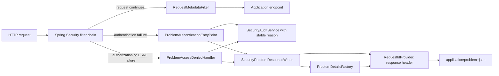

# KAN-23: Spring Security Problem Details Implementation Plan

**Status:** Implemented and locally verified; awaiting pull-request review.

**Goal:** Replace the legacy Spring Security 401/403 response writer with safe,
allowlisted RFC 9457 Problem Details adapters while preserving authentication,
authorization, CSRF, session, audit, and success-path behavior.

**Source:** [KAN-23](https://0707manna0895.atlassian.net/browse/KAN-23),
the approved written specification, and
`docs/error-handling/work-items/KAN-17-foundation/design.md`.

**Architecture:** A public `SecurityProblem` catalogue and
`SecurityProblemResponseWriter` live in the shared REST error boundary. The
writer delegates body construction to `ProblemDetailsFactory` and owns servlet
serialization. `ProblemAuthenticationEntryPoint` and
`ProblemAccessDeniedHandler` remain Spring Security adapters: they choose only
an allowlisted problem, record a sanitized audit reason, and call the writer.
`SecurityConfig` only wires the adapters.

**Tech stack:** Java 21, Spring Boot 3.3.2, Spring Security 6.3, Jackson,
RFC 9457 `ProblemDetail`, JUnit 5, AssertJ, Mockito, MockMvc, ArchUnit,
Testcontainers, PostgreSQL 16, Flyway, Maven Wrapper, and GitHub Actions.

## Global constraints

- Work only on `feature/KAN-23-security-problem-details`, created from verified
  `develop` commit `6fab061457015f99bfb2951f900e38849ad6b44c`.
- Pull requests target `develop`. Never merge into `main` during KAN-23.
- Do not add, remove, or upgrade dependencies.
- Do not change Flyway, database schema, runtime profiles, CI workflows,
  session storage, authentication strategy, endpoint permissions, CSRF
  enablement, or authorization rules.
- Keep Spring Security and servlet types outside `common.error`, domain, and
  application-layer exception contracts.
- `ProblemDetailsFactory` remains the only component that constructs public
  Problem Details bodies.
- Public content is allowlisted. Never copy exception messages, credentials,
  authorization headers, cookies, session identifiers, CSRF tokens, principal
  details, class names, causes, or stack traces into a response.
- Audit reasons are stable public-style codes, not raw Spring Security
  exception messages.
- Expected 401/403 outcomes do not produce duplicate exception logs or stack
  traces.
- Preserve all successful anonymous, authenticated, role-authorized, and
  CSRF-valid behavior.
- Use TDD for each production slice: focused RED, minimal GREEN, regression
  suite, then a small commit.
- Do not merge the pull request without the required pull-request approval and
  exact-head CI success.

## Stable security problem catalogue

| Problem | Status | Title | Detail |
|---|---:|---|---|
| `AUTHENTICATION_REQUIRED` | 401 | Authentication required | Authentication is required |
| `AUTHORIZATION_FAILED` | 403 | Access denied | You are not authorized to perform this action |
| `CSRF_VALIDATION_FAILED` | 403 | Request security validation failed | Request security validation failed |

Every response uses `application/problem+json` and contains exactly the shared
RFC 9457 fields plus `code`, `requestId`, and `timestamp`. Security responses do
not contain `violations`.

## Runtime flow



## File map

| Path | Responsibility |
|---|---|
| `src/main/java/com/project/optrabidz/common/api/error/SecurityProblem.java` | Public allowlist of the three security response contracts. |
| `src/main/java/com/project/optrabidz/common/api/error/ProblemDetailsFactory.java` | Adds the security catalogue entry point while retaining sole body-construction ownership. |
| `src/main/java/com/project/optrabidz/common/api/error/SecurityProblemResponseWriter.java` | Serializes an allowlisted security Problem Detail to the servlet response. |
| `src/main/java/com/project/optrabidz/security/infrastructure/web/ProblemAuthenticationEntryPoint.java` | Handles filter-chain authentication failures and sanitized audit ownership. |
| `src/main/java/com/project/optrabidz/security/infrastructure/web/ProblemAccessDeniedHandler.java` | Distinguishes authorization from CSRF failures and records actor-aware sanitized audits. |
| `src/main/java/com/project/optrabidz/security/infrastructure/config/SecurityConfig.java` | Wires the two adapters and removes inline legacy JSON rendering. |
| `src/main/java/com/project/optrabidz/audit/application/AuditService.java` | Owns the isolated `REQUIRES_NEW` audit transaction at the proxy boundary. |
| `src/main/java/com/project/optrabidz/audit/application/SecurityAuditService.java` | Contains audit persistence and commit failures without changing the security response. |
| `src/test/java/com/project/optrabidz/common/api/error/SecurityProblemTest.java` | Freezes exact status, title, detail, and code mappings. |
| `src/test/java/com/project/optrabidz/common/api/error/ProblemDetailsFactoryTest.java` | Verifies exact security Problem Detail fields and disclosure boundaries. |
| `src/test/java/com/project/optrabidz/common/api/error/SecurityProblemResponseWriterTest.java` | Verifies servlet status, content type, request correlation, JSON shape, and safe content. |
| `src/test/java/com/project/optrabidz/security/infrastructure/web/ProblemAuthenticationEntryPointTest.java` | Verifies 401 selection, stable audit reason, and no raw exception propagation. |
| `src/test/java/com/project/optrabidz/security/infrastructure/web/ProblemAccessDeniedHandlerTest.java` | Verifies authorization/CSRF classification and actor-aware stable audits. |
| `src/test/java/com/project/optrabidz/security/api/SecurityApiIT.java` | Migrates real-filter-chain 401/403 assertions and preserves security success paths. |
| `src/test/java/com/project/optrabidz/audit/api/SecurityAuditIT.java` | Verifies persisted stable audit reasons and absence of raw failure text. |
| `src/test/java/com/project/optrabidz/audit/application/SecurityAuditServiceTest.java` | Proves audit persistence failure remains isolated from callers. |
| `src/test/java/com/project/optrabidz/architecture/ExceptionArchitectureTest.java` | Preserves neutral and business-module framework boundaries. |
| Affected module `*ApiIT` classes | Migrates existing Spring Security 401/403 consumers while preserving controller-generated business-error assertions. |
| `docs/error-handling/work-items/KAN-23-security-adapter/implementation-plan.md` | Approved checklist and execution evidence. |

---

## Task 1: Define the allowlisted security catalogue and factory path

**Consumes:** Existing `HttpErrorMapping`, `ProblemDetailsFactory`, request-ID
policy, and exact contract conventions from KAN-21/KAN-22.

**Produces:**

```java
public enum SecurityProblem {
    AUTHENTICATION_REQUIRED,
    AUTHORIZATION_FAILED,
    CSRF_VALIDATION_FAILED;

    public String code();
    public HttpErrorMapping mapping();
    public String detail();
}

public ProblemDetail ProblemDetailsFactory.createSecurity(
        SecurityProblem securityProblem,
        HttpServletRequest request
);
```

### Steps

- [x] Confirm the isolated branch and clean baseline before writing tests.

  ```powershell
  git status -sb
  git branch --show-current
  git rev-parse HEAD
  git rev-parse origin/develop
  git rev-parse origin/main
  .\mvnw.cmd -B test
  ```

  Expected: branch is `feature/KAN-23-security-problem-details`; `HEAD` and
  `origin/develop` are `6fab061457015f99bfb2951f900e38849ad6b44c`;
  `origin/main` remains `bc7727b0b2e09ebbfef8b9c6c5dc729cd4aab4fb`;
  baseline unit tests pass with zero failures and errors.

- [x] Add `SecurityProblemTest` first. Freeze the enum order and all exact
  mappings with a parameterized test.

  ```java
  @ParameterizedTest
  @MethodSource("securityProblems")
  void definesStableSecurityProblem(
          SecurityProblem problem,
          HttpStatus status,
          String title,
          String detail
  ) {
      assertThat(problem.code()).isEqualTo(problem.name());
      assertThat(problem.mapping().status()).isEqualTo(status);
      assertThat(problem.mapping().title()).isEqualTo(title);
      assertThat(problem.detail()).isEqualTo(detail);
  }
  ```

  The method source must assert `values()` contains exactly the three catalogue
  entries in the table above and supply their exact status/title/detail values.

- [x] Extend `ProblemDetailsFactoryTest` with a security response test using the
  existing fixed clock and request ID `request-123`.

  ```java
  ProblemDetail problem = factory.createSecurity(
          SecurityProblem.CSRF_VALIDATION_FAILED,
          request
  );

  assertThat(problem.getType()).isEqualTo(
          URI.create("urn:optrabidz:problem:csrf-validation-failed")
  );
  assertThat(problem.getTitle()).isEqualTo(
          "Request security validation failed"
  );
  assertThat(problem.getStatus()).isEqualTo(403);
  assertThat(problem.getDetail()).isEqualTo(
          "Request security validation failed"
  );
  assertThat(problem.getProperties())
          .containsOnlyKeys("code", "requestId", "timestamp")
          .containsEntry("code", "CSRF_VALIDATION_FAILED")
          .containsEntry("requestId", "request-123")
          .containsEntry("timestamp", NOW.toString());
  ```

  Add a negative case whose request carries secret-looking headers and
  attributes; assert the resulting `ProblemDetail.toString()` contains none of
  those values and no `violations` property.

- [x] Run the focused tests and preserve meaningful RED evidence.

  ```powershell
  .\mvnw.cmd -B `
    "-Dtest=SecurityProblemTest,ProblemDetailsFactoryTest" test
  ```

  Expected RED: test compilation fails only because `SecurityProblem` and
  `createSecurity` do not exist.

- [x] Create `SecurityProblem` as a public enum in `common.api.error`. Use only
  fixed `HttpErrorMapping` and detail literals from the approved catalogue.
  Reject nulls through the existing record/constructor contracts; do not add a
  free-form public-message constructor.

- [x] Add `ProblemDetailsFactory.createSecurity`. It must null-check the
  catalogue value and call the existing private `createProblem` with an empty
  violations list. Do not copy any exception, request body, URL, header, cookie,
  or principal value.

  ```java
  public ProblemDetail createSecurity(
          SecurityProblem securityProblem,
          HttpServletRequest request
  ) {
      Objects.requireNonNull(
              securityProblem,
              "securityProblem must not be null"
      );
      return createProblem(
              securityProblem.code(),
              securityProblem.detail(),
              securityProblem.mapping(),
              List.of(),
              request
      );
  }
  ```

- [x] Run catalogue, factory, existing REST, neutral-contract, and architecture
  regressions.

  ```powershell
  .\mvnw.cmd -B `
    "-Dtest=SecurityProblemTest,ProblemDetailsFactoryTest,RestExceptionHandlerTest,RestExceptionHandlerValidationTest,RestExceptionHandlerFrameworkTest,ApplicationExceptionTest,ExceptionArchitectureTest" test
  ```

  Expected GREEN: every selected test passes, and KAN-21/KAN-22 response shapes
  are unchanged.

- [x] Commit the catalogue slice.

  ```powershell
  git add `
    src/main/java/com/project/optrabidz/common/api/error/SecurityProblem.java `
    src/main/java/com/project/optrabidz/common/api/error/ProblemDetailsFactory.java `
    src/test/java/com/project/optrabidz/common/api/error/SecurityProblemTest.java `
    src/test/java/com/project/optrabidz/common/api/error/ProblemDetailsFactoryTest.java
  git commit -m "feat: define security problem catalogue (KAN-23)"
  ```

---

## Task 2: Add one servlet response writer for security failures

**Consumes:** `SecurityProblem` and
`ProblemDetailsFactory.createSecurity(SecurityProblem, HttpServletRequest)`.

**Produces:**

```java
public void SecurityProblemResponseWriter.write(
        SecurityProblem problem,
        HttpServletRequest request,
        HttpServletResponse response
) throws IOException;
```

### Steps

- [x] Create `SecurityProblemResponseWriterTest` before production code. Use a
  real `ObjectMapper`, a real `ProblemDetailsFactory`,
  `MockHttpServletRequest`, and `MockHttpServletResponse`.

  The exact 401 test must assert:

  ```java
  writer.write(
          SecurityProblem.AUTHENTICATION_REQUIRED,
          request,
          response
  );

  assertThat(response.getStatus()).isEqualTo(401);
  assertThat(response.getContentType()).isEqualTo(
          MediaType.APPLICATION_PROBLEM_JSON_VALUE
  );
  JsonNode body = objectMapper.readTree(response.getContentAsByteArray());
  assertThat(body.get("type").asText()).isEqualTo(
          "urn:optrabidz:problem:authentication-required"
  );
  assertThat(body.get("code").asText()).isEqualTo(
          "AUTHENTICATION_REQUIRED"
  );
  assertThat(body.get("requestId").asText()).isEqualTo("request-123");
  assertThat(body.has("violations")).isFalse();
  ```

  Add one test for each 403 classification and a negative test that inserts a
  secret into unrelated request headers, cookies, attributes, and URI. Assert
  response content contains none of them.

- [x] Run the writer test and preserve RED.

  ```powershell
  .\mvnw.cmd -B "-Dtest=SecurityProblemResponseWriterTest" test
  ```

  Expected RED: compilation fails only because
  `SecurityProblemResponseWriter` does not exist.

- [x] Implement `SecurityProblemResponseWriter` as a final Spring component in
  `common.api.error`. Constructor-inject `ProblemDetailsFactory` and
  `ObjectMapper`. Its write method must:

  1. null-check the problem, request, and response;
  2. obtain the body only through `problemDetailsFactory.createSecurity`;
  3. set the catalogue HTTP status;
  4. set `application/problem+json`; and
  5. serialize the `ProblemDetail` directly to the response output stream.

  ```java
  public void write(
          SecurityProblem problem,
          HttpServletRequest request,
          HttpServletResponse response
  ) throws IOException {
      Objects.requireNonNull(problem, "problem must not be null");
      Objects.requireNonNull(request, "request must not be null");
      Objects.requireNonNull(response, "response must not be null");

      ProblemDetail body = problemDetailsFactory.createSecurity(
              problem,
              request
      );
      response.setStatus(problem.mapping().status().value());
      response.setContentType(MediaType.APPLICATION_PROBLEM_JSON_VALUE);
      objectMapper.writeValue(response.getOutputStream(), body);
  }
  ```

- [x] Run the writer, factory, catalogue, and existing REST adapter tests.

  ```powershell
  .\mvnw.cmd -B `
    "-Dtest=SecurityProblemResponseWriterTest,SecurityProblemTest,ProblemDetailsFactoryTest,RestExceptionHandlerTest,RestExceptionHandlerValidationTest,RestExceptionHandlerFrameworkTest" test
  ```

  Expected GREEN: all selected tests pass; the response writer returns only the
  approved Problem Details shape.

- [x] Commit the serialization boundary.

  ```powershell
  git add `
    src/main/java/com/project/optrabidz/common/api/error/SecurityProblemResponseWriter.java `
    src/test/java/com/project/optrabidz/common/api/error/SecurityProblemResponseWriterTest.java
  git commit -m "feat: add security problem response writer (KAN-23)"
  ```

---

## Task 3: Add dedicated authentication and access-denied adapters

**Consumes:** `SecurityProblem`, `SecurityProblemResponseWriter`, the existing
`SecurityAuditService`, `AuthenticatedUserPrincipal`, and Spring Security's
`AuthenticationEntryPoint`/`AccessDeniedHandler` extension points.

**Produces:** Two Spring components with standard Spring Security interfaces:

```java
public final class ProblemAuthenticationEntryPoint
        implements AuthenticationEntryPoint;

public final class ProblemAccessDeniedHandler
        implements AccessDeniedHandler;
```

### Steps

- [x] Add `ProblemAuthenticationEntryPointTest` first with mocked
  `SecurityAuditService` and `SecurityProblemResponseWriter`, plus servlet
  request/response mocks and an `AuthenticationCredentialsNotFoundException`
  carrying a secret diagnostic string.

  Assert exactly:

  ```java
  verify(securityAuditService).recordAuthenticationRequired(
          request,
          "AUTHENTICATION_REQUIRED"
  );
  verify(responseWriter).write(
          SecurityProblem.AUTHENTICATION_REQUIRED,
          request,
          response
  );
  verifyNoMoreInteractions(securityAuditService, responseWriter);
  ```

  Capture audit arguments or use strict verification to prove the exception's
  message is never forwarded.

- [x] Add `ProblemAccessDeniedHandlerTest` first. Clear the
  `SecurityContextHolder` in `@AfterEach`. Cover these exact cases:

  1. ordinary `AccessDeniedException` with no recognized principal selects
     `AUTHORIZATION_FAILED` and audits null actor ID/role;
  2. ordinary denial with an `AuthenticatedUserPrincipal(42L, secretEmail,
     RoleType.STARTUP)` audits account `42` and role `STARTUP`, but never the
     email or exception message;
  3. mocked `CsrfException` selects `CSRF_VALIDATION_FAILED` while retaining the
     same actor extraction rules.

  Each case verifies the writer receives only the selected enum, request, and
  response.

- [x] Run both adapter tests and preserve RED.

  ```powershell
  .\mvnw.cmd -B `
    "-Dtest=ProblemAuthenticationEntryPointTest,ProblemAccessDeniedHandlerTest" test
  ```

  Expected RED: compilation fails only because the two adapters do not exist.

- [x] Implement `ProblemAuthenticationEntryPoint` in
  `security.infrastructure.web`. It owns no logger, response JSON, or exception
  classification beyond its fixed 401 contract.

  ```java
  @Component
  public final class ProblemAuthenticationEntryPoint
          implements AuthenticationEntryPoint {
      private static final String AUDIT_REASON =
              "AUTHENTICATION_REQUIRED";

      private final SecurityAuditService securityAuditService;
      private final SecurityProblemResponseWriter responseWriter;

      @Override
      public void commence(
              HttpServletRequest request,
              HttpServletResponse response,
              AuthenticationException exception
      ) throws IOException {
          securityAuditService.recordAuthenticationRequired(
                  request,
                  AUDIT_REASON
          );
          responseWriter.write(
                  SecurityProblem.AUTHENTICATION_REQUIRED,
                  request,
                  response
          );
      }
  }
  ```

  Constructor-inject and null-check both collaborators. Never call
  `exception.getMessage()`.

- [x] Implement `ProblemAccessDeniedHandler` in
  `security.infrastructure.web`. Use one private classifier and one private
  principal accessor.

  ```java
  private SecurityProblem classify(AccessDeniedException exception) {
      return exception instanceof CsrfException
              ? SecurityProblem.CSRF_VALIDATION_FAILED
              : SecurityProblem.AUTHORIZATION_FAILED;
  }
  ```

  `handle` must select the enum, extract only account ID and role from a
  recognized principal, call `recordAuthorizationDenied` with
  `problem.code()`, then call the response writer. It must not log the raw
  exception, email, authentication object, cookie, or token.

- [x] Run adapter, writer, catalogue, factory, and architecture tests.

  ```powershell
  .\mvnw.cmd -B `
    "-Dtest=ProblemAuthenticationEntryPointTest,ProblemAccessDeniedHandlerTest,SecurityProblemResponseWriterTest,SecurityProblemTest,ProblemDetailsFactoryTest,ExceptionArchitectureTest" test
  ```

  Expected GREEN: all selected tests pass and neutral error boundaries remain
  framework-free.

- [x] Perform the CSRF-classification mutation check. Temporarily classify
  `CsrfException` as `AUTHORIZATION_FAILED`, run the exact CSRF unit test, and
  preserve RED showing expected `CSRF_VALIDATION_FAILED`. Restore the approved
  classifier and rerun the test to GREEN before committing.

- [x] Commit the two security adapters.

  ```powershell
  git add `
    src/main/java/com/project/optrabidz/security/infrastructure/web/ProblemAuthenticationEntryPoint.java `
    src/main/java/com/project/optrabidz/security/infrastructure/web/ProblemAccessDeniedHandler.java `
    src/test/java/com/project/optrabidz/security/infrastructure/web/ProblemAuthenticationEntryPointTest.java `
    src/test/java/com/project/optrabidz/security/infrastructure/web/ProblemAccessDeniedHandlerTest.java
  git commit -m "feat: add Spring Security problem adapters (KAN-23)"
  ```

---

## Task 4: Wire the adapters through the real Spring Security filter chain

**Consumes:** The two tested adapter components and existing security request
matchers, session policy, CSRF repository, filters, and endpoint behavior.

**Produces:** `SecurityConfig` with no inline error body construction, plus
real-filter-chain MockMvc contract coverage.

### Steps

- [x] Update `SecurityApiIT` expectations first without changing production
  configuration. Add a reusable assertion helper only if it accepts explicit
  status, code, title, detail, and request ID rather than hiding contract
  differences.

  Required RED scenarios:

  - anonymous `GET /api/v1/me` with `X-Request-Id: security-401` expects exact
    401 Problem Details and matching response header;
  - STARTUP session calling `GET /api/v1/investor-preferences/me` expects exact
    authorization 403 Problem Details;
  - authenticated logout without CSRF header expects exact
    `CSRF_VALIDATION_FAILED` 403;
  - authenticated logout with a deliberately wrong `X-CSRF-TOKEN` value expects
    the same safe CSRF response and does not echo the supplied token;
  - an unsafe inbound request ID is replaced and the replacement matches the
    JSON `requestId` and response header;
  - valid registration/login/me, role-authorized requests, CSRF-valid logout,
    and public webhook behavior remain unchanged.

  For every security failure assert the full allowlisted field set, not merely
  status and code:

  ```java
  .andExpect(content().contentType(MediaType.APPLICATION_PROBLEM_JSON))
  .andExpect(jsonPath("$.type").value(
          "urn:optrabidz:problem:authentication-required"
  ))
  .andExpect(jsonPath("$.title").value("Authentication required"))
  .andExpect(jsonPath("$.status").value(401))
  .andExpect(jsonPath("$.detail").value("Authentication is required"))
  .andExpect(jsonPath("$.instance").value(
          "urn:optrabidz:request:security-401"
  ))
  .andExpect(jsonPath("$.code").value("AUTHENTICATION_REQUIRED"))
  .andExpect(jsonPath("$.requestId").value("security-401"))
  .andExpect(jsonPath("$.timestamp").isString())
  .andExpect(jsonPath("$.violations").doesNotExist());
  ```

- [x] Run the focused integration class against the legacy configuration and
  preserve RED caused by legacy `application/json`/envelope responses.

  ```powershell
  .\mvnw.cmd -B -Pintegration-tests `
    "-Dit.test=SecurityApiIT" verify
  ```

- [x] Modify only `SecurityConfig` wiring:

  - inject `ProblemAuthenticationEntryPoint` and
    `ProblemAccessDeniedHandler` into `securityFilterChain`;
  - configure them through `.authenticationEntryPoint(...)` and
    `.accessDeniedHandler(...)`;
  - remove `ObjectMapper`, `SecurityAuditService`, legacy `ErrorCode`,
    `ApiResponse`, logger, principal lookup, and `writeError` dependencies;
  - preserve every CSRF matcher, request matcher, session option, filter order,
    and enabled/disabled mechanism byte-for-byte where practical.

  ```java
  .exceptionHandling(exceptions -> exceptions
          .authenticationEntryPoint(problemAuthenticationEntryPoint)
          .accessDeniedHandler(problemAccessDeniedHandler)
  )
  ```

- [x] Run the focused security integration class again.

  ```powershell
  .\mvnw.cmd -B -Pintegration-tests `
    "-Dit.test=SecurityApiIT" verify
  ```

  Expected GREEN: all `SecurityApiIT` tests pass through the real filter chain,
  including 401, authorization 403, missing-CSRF 403, invalid-CSRF 403, request
  correlation, disclosure, and unchanged success paths.

- [x] Run a source guard proving the inline legacy renderer is gone.

  ```powershell
  rg -n `
    "ApiResponse|ErrorCode|writeError|ObjectMapper|LoggerFactory|getMessage\(" `
    src/main/java/com/project/optrabidz/security/infrastructure/config/SecurityConfig.java `
    src/main/java/com/project/optrabidz/security/infrastructure/web
  ```

  Expected: no matches. The two adapter interfaces still accept their required
  exception parameters, but production code never reads raw messages.

- [x] Commit configuration wiring and real-filter-chain contract coverage.

  ```powershell
  git add `
    src/main/java/com/project/optrabidz/security/infrastructure/config/SecurityConfig.java `
    src/test/java/com/project/optrabidz/security/api/SecurityApiIT.java
  git commit -m "refactor: wire security problem adapters (KAN-23)"
  ```

---

## Task 5: Verify audit resilience, architecture, full regression, and review scope

**Consumes:** The complete KAN-23 response path and the existing safe
`SecurityAuditService` persistence wrapper.

**Produces:** Persisted stable audit evidence, audit-failure isolation evidence,
complete test evidence, a clean PR into `develop`, and no `main` mutation.

### Steps

- [x] Update `SecurityAuditIT` to assert stable reasons:

  - anonymous access persists action `AUTHENTICATION_REQUIRED`, outcome
    `DENIED`, and detail reason `AUTHENTICATION_REQUIRED`;
  - wrong-role access persists action `AUTHORIZATION_DENIED`, actor account/role,
    and detail reason `AUTHORIZATION_FAILED`;
  - missing-CSRF access persists `AUTHORIZATION_DENIED` with detail reason
    `CSRF_VALIDATION_FAILED` and no token or exception message;
  - existing failed-login masking remains unchanged.

  Query only the newest audit row for the exact action and object path so the
  test cannot pass because of another method's data.

- [x] Add `SecurityAuditServiceTest` to prove persistence and commit failures are
  contained. Invoke a real `AuditService` through a Spring transaction proxy
  whose transaction manager fails during commit. Call both security-boundary
  record methods and assert neither throws; verify one stable
  `SECURITY_AUDIT_WRITE_FAILED` operational error per failed commit and no
  sensitive exception content in the public path.

- [x] Run focused audit and security tests. Preserve RED for old persisted
  reason text, then GREEN after the stable adapter reasons are active.

  ```powershell
  .\mvnw.cmd -B `
    "-Dtest=SecurityAuditServiceTest,ProblemAuthenticationEntryPointTest,ProblemAccessDeniedHandlerTest,SecurityProblemResponseWriterTest,SecurityProblemTest,ProblemDetailsFactoryTest,ExceptionArchitectureTest" test

  .\mvnw.cmd -B -Pintegration-tests `
    "-Dit.test=SecurityApiIT,SecurityAuditIT" verify
  ```

- [x] Re-read `ExceptionArchitectureTest`. Add a new rule only if a current
  approved boundary is not already proven. Any added rule must assert that
  `common.error`, domain exceptions, and application exceptions remain free of
  Spring Security, Spring Web, and servlet dependencies; do not freeze an
  incidental package layout.

- [x] Run the complete focused KAN-23 unit suite.

  ```powershell
  .\mvnw.cmd -B `
    "-Dtest=SecurityProblemTest,ProblemDetailsFactoryTest,SecurityProblemResponseWriterTest,ProblemAuthenticationEntryPointTest,ProblemAccessDeniedHandlerTest,SecurityAuditServiceTest,RestExceptionHandlerTest,RestExceptionHandlerValidationTest,RestExceptionHandlerFrameworkTest,ApplicationExceptionTest,ExceptionArchitectureTest" test
  ```

  Expected: all focused tests pass with zero failures and errors.

- [x] Run the complete unit suite.

  ```powershell
  .\mvnw.cmd -B test
  ```

  Expected: every unit, parameterized, MockMvc, and architecture test passes
  with zero failures and errors.

- [x] With Docker Engine running, run the complete PostgreSQL integration
  profile.

  ```powershell
  .\mvnw.cmd -B verify -Pintegration-tests
  ```

  Expected: Flyway applies the unchanged V1 migration to PostgreSQL 16 and all
  unit plus integration tests pass with zero failures and errors.

- [x] Prove scope, whitespace hygiene, and protected-area stability.

  ```powershell
  git status --short
  git diff --check
  git diff origin/develop -- `
    pom.xml `
    .github/workflows `
    src/main/resources `
    src/main/resources/db/migration `
    src/main/java/com/project/optrabidz/common/error
  git rev-parse origin/main
  ```

  Expected: no whitespace errors; no dependency, workflow, runtime resource,
  Flyway, or neutral-contract changes; `origin/main` remains
  `bc7727b0b2e09ebbfef8b9c6c5dc729cd4aab4fb`.

- [x] Inspect the packaged JAR to prove tests and test-only secrets are absent.

  ```powershell
  jar tf target\optrabidz-0.0.1-SNAPSHOT.jar | `
    Select-String "SecurityProblem.*Test|secret-csrf|src/test"
  ```

  Expected: no output.

- [x] Record executed commands, exact test counts, RED/GREEN evidence, mutation
  evidence, tested implementation-tree SHA, scope proof, and approved plan
  deviations in an `Execution evidence` section below. Record the published
  exact head and its CI result in the pull request and Jira so this document
  does not require a self-referential commit.

- [x] Commit the audit transaction-boundary adjustment, regression tests, and
  finalized evidence only after all local checks pass.

  ```powershell
  git add <approved KAN-23 paths>
  git commit -m "fix: contain and verify security failures (KAN-23)"
  ```

  Stage `ExceptionArchitectureTest` only if the approved rule was genuinely
  needed and changed; otherwise leave it out of the commit.

- [x] Verify the complete committed range after the evidence commit.

  ```powershell
  git status -sb
  git diff --check origin/develop...HEAD
  git diff --name-status origin/develop...HEAD
  git diff origin/develop...HEAD -- `
    pom.xml `
    .github/workflows `
    src/main/resources `
    src/main/resources/db/migration `
    src/main/java/com/project/optrabidz/common/error
  ```

  Expected: clean worktree, no whitespace errors, only approved KAN-23 files,
  and an empty protected-area diff.

- [ ] Push and open a ready-for-review pull request into `develop`. Do not merge.

  ```powershell
  git push -u origin feature/KAN-23-security-problem-details
  gh pr create `
    --base develop `
    --head feature/KAN-23-security-problem-details `
    --title "KAN-23 Standardize Spring Security problem details" `
    --body-file .git\KAN-23-pr-body.md
  ```

  Create `.git\KAN-23-pr-body.md` only after verification. It must summarize
  the three public mappings, separation boundary, RED/GREEN evidence,
  audit/disclosure policy, full test counts, protected scope, and rollback.
  Remove it after PR creation; never add it to the project or a commit.

- [ ] Verify the remote PR head equals the locally tested head. Wait for exact
  head `Unit Tests` and `PostgreSQL Integration Tests`, move KAN-23 to In Review,
  and present the PR for review. Never merge before the required approval.

## Execution evidence

### Tested scope

- Base: `origin/develop` at
  `6fab061457015f99bfb2951f900e38849ad6b44c`.
- Branch: `feature/KAN-23-security-problem-details`.
- Tested implementation tree, excluding this evidence update:
  `a7596a984c79ff4f9f23ea1969a474ff4850d56a`.
- `origin/main` remained
  `bc7727b0b2e09ebbfef8b9c6c5dc729cd4aab4fb`.
- V1 remained unchanged at Git blob
  `8784c468aa169952a87e726303d03abae4376add`.

### TDD and mutation evidence

| Slice | RED evidence | GREEN evidence |
|---|---|---|
| Catalogue and factory | Focused compilation failed because `SecurityProblem` did not exist. | 11 focused tests and the 32-test error regression passed. |
| Response writer | Focused compilation failed because `SecurityProblemResponseWriter` did not exist. | 6 writer tests and the 32-test error regression passed. |
| Security adapters | Focused compilation failed because the two adapters did not exist. | 4 adapter tests passed. Inverting the CSRF classifier caused both denied-handler tests to fail; restoring it returned the suite to green. |
| Filter-chain wiring | Legacy configuration caused 3 of 7 `SecurityApiIT` cases to fail on `application/json`. | After adapter wiring and boundary hardening, all 8 cases passed with `application/problem+json`, including wrong-CSRF and unsafe request-ID cases. |
| Correlation regression | The first wired integration run exposed 3 failures because early Spring Security responses bypassed `RequestMetadataFilter`; the direct writer assertion then failed in all 3 parameterized cases. | The writer now owns the early-boundary response header, and all 6 writer plus all 8 security API tests passed. |
| Audit contract and resilience | The previous prose-reason assertion failed 1 of 4 audit integration tests after stable codes were introduced. A proxy-aware unit test then failed while the outer security-audit methods still owned the transaction. | All 4 audit integration tests passed. Moving `REQUIRES_NEW` to `AuditService.save` made commit failure occur inside the guarded collaborator call, and the proxy-aware containment test passed. |
| Full-suite consumers | The first full integration run found 7 stale Spring Security assertions across 5 module API test classes. | All 33 affected module tests passed, followed by all 67 integration tests in one complete run. |

### Final verification

| Command | Result |
|---|---|
| Focused KAN-23 unit command from Task 5 | 43 tests, 0 failures, 0 errors |
| `.\mvnw.cmd -B test` | 130 tests, 0 failures, 0 errors |
| Focused `SecurityApiIT,SecurityAuditIT` integration command | 12 tests, 0 failures, 0 errors |
| Affected five-module integration command | 33 tests, 0 failures, 0 errors |
| `.\mvnw.cmd -B verify -Pintegration-tests` | 130 unit and 67 integration tests, 0 failures, 0 errors; Flyway applied unchanged V1 to PostgreSQL 16 |
| `git diff --check` | No whitespace errors |
| Protected-area diff against `origin/develop` | Empty for `pom.xml`, workflows, runtime resources, migrations, and `common.error` |
| Packaged-JAR test/marker scan | No matches |
| Inline-renderer source guard | No `ApiResponse`, `ErrorCode`, `writeError`, or raw security-exception message access remains in `SecurityConfig` |

### Approved plan deviations

- `SecurityProblemResponseWriter` also writes `X-Request-Id`. Real filter-chain
  evidence showed that early 401/403 responses occur before the normal metadata
  filter; the writer therefore guarantees the same safe correlation ID in the
  header and body.
- Seven existing filter-chain assertions in five module API integration tests
  were migrated after the complete suite identified them. No controller-level
  business-error assertion or production module behavior changed.
- The existing architecture rule was extended to forbid Spring Security
  dependencies in domain/application exceptions because that approved boundary
  was not previously covered.
- Independent review identified that an outer transactional security-audit
  method could still expose a commit-time failure after its local catch block.
  The isolated transaction was moved to the proxied `AuditService.save` boundary
  and verified with a transaction manager that fails during commit.

## Review gates

1. KAN-23 design approved — complete.
2. KAN-23 written Jira specification approved — complete.
3. This implementation plan approved — required before production/test edits.
4. Inline execution approved — required before RED tests or implementation.
5. Pull request explicitly reviewed and approved — required before merge into
   `develop`.
6. `main` remains unchanged throughout KAN-23.
