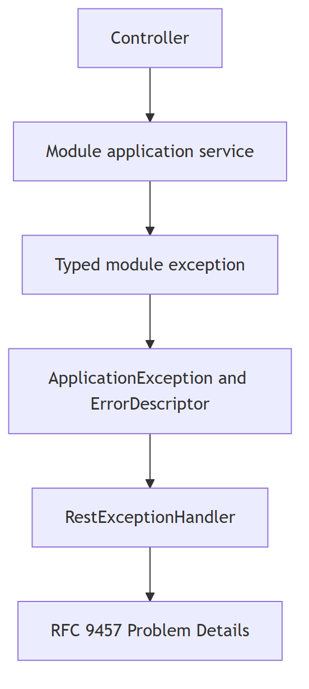
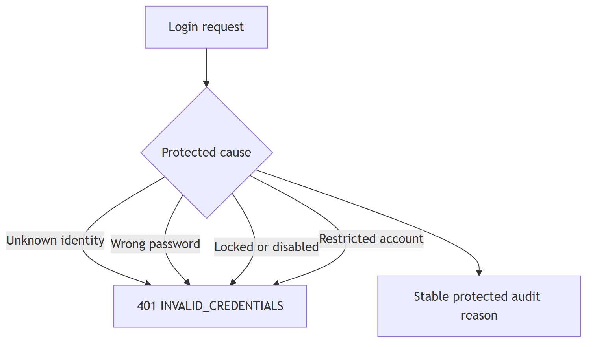

# KAN-24 — Identity, Security, and Participation Error Migration

**Status:** Approved design baseline

**Story:** KAN-24

**Parent epic:** KAN-16 — Establish production exception-handling foundation

## 1. Outcome

Migrate expected failures in the `identity`, `security`, and `participation`
modules from the legacy HTTP-coupled `ApiException` and `ErrorCode` model to
the transport-neutral `ApplicationException` contract introduced by KAN-20.

After this story, expected failures owned by these three modules use one safe
RFC 9457 Problem Details boundary. Successful responses and the modules that
have not yet been migrated remain unchanged.

## 2. Scope

KAN-24 includes:

- module-owned, allowlisted `ErrorDescriptor` catalogues;
- typed application exceptions with protected diagnostic context;
- migration of expected identity, security, and participation failures;
- indistinguishable public login rejection responses;
- stable sanitized security-audit reasons;
- removal of dead or replaced exception types in these modules;
- focused unit, API, disclosure, architecture, and PostgreSQL regression tests;
- separate implementation commits for identity, security, and participation.

KAN-24 does not include:

- JWT, stateless authentication, session, CSRF, or permission redesign;
- administrator reinstatement or another governance lifecycle feature;
- a database or Flyway migration;
- AOP, a new dependency, or runtime configuration changes;
- migration of marketplace, classification, governance, financial, or
  notification errors;
- generic unexpected-500 handling or removal of the global legacy handler.

## 3. Chosen architecture

Each module owns its public descriptors and typed exceptions. The neutral
contract remains in `common.error`, and the existing REST adapter remains the
only HTTP translation boundary.

Editable source: [architecture.mmd](assets/architecture.mmd)

The rejected alternatives are:

1. creating `ApplicationException` directly at every throw site, which would
   duplicate descriptors and hide business intent; and
2. a single global catalogue in `common`, which would weaken module ownership
   and grow into a shared catalogue of unrelated business rules.

## 4. Responsibility boundaries

- Module catalogues own stable public code, category, and public message.
- Typed exceptions own a stable diagnostic code and a protected diagnostic
  message or cause.
- Public response construction reads only the allowlisted descriptor.
- Module error catalogues and exception types do not depend on HTTP status,
  Spring Web, servlet APIs, `common.api`, `ApiException`, or legacy `ErrorCode`.
- Migrated service throw sites no longer construct `ApiException` or select an
  HTTP-coupled `ErrorCode`. Existing request/session orchestration in
  `AuthenticationService` and success-response types are outside this story.
- Expected user-driven state failures are translated at the application
  boundary.
- Mapper corruption, broken references, and impossible aggregate states are
  internal failures; they are not mislabeled as safe 404 or 409 responses.
- Expected module failures do not create duplicate exception logs.
- Audit remains an explicit security or business responsibility rather than a
  side effect of the REST exception handler.

## 5. Identity module

### 5.1 Public catalogue

| Code | Category | HTTP | Public detail |
|---|---|---:|---|
| `ACCOUNT_NOT_FOUND` | `NOT_FOUND` | 404 | The requested account was not found |
| `ACCOUNT_STATE_CONFLICT` | `CONFLICT` | 409 | The account state does not allow this operation |
| `PROFILE_STATE_CONFLICT` | `CONFLICT` | 409 | The profile state does not allow this operation |

### 5.2 Typed failures

- `AccountNotFoundException`
- `AccountStateConflictException`
- `ProfileStateConflictException`

`AccountApplicationService.requireAccount` returns `ACCOUNT_NOT_FOUND` instead
of throwing `IllegalArgumentException`. Expected state-transition failures from
`Account` and `Profile` are translated separately at the application boundary.
Account IDs and raw domain messages remain diagnostic-only.

The unused `AccountAlreadyExistsException` is removed after a reference check
confirms that it has no consumer.

### 5.3 Preserved behaviour

Account transactions, state changes, profile changes, domain events,
repositories, persistence mapping, and successful port behaviour do not change.

## 6. Security module

### 6.1 Public catalogue

| Code | Category | HTTP | Public detail |
|---|---|---:|---|
| `INVALID_CREDENTIALS` | `AUTHENTICATION` | 401 | Invalid email or password |
| `CURRENT_PASSWORD_INVALID` | `AUTHENTICATION` | 401 | Current password is incorrect |
| `EMAIL_ALREADY_REGISTERED` | `CONFLICT` | 409 | Email is already registered |
| `CREDENTIAL_NOT_FOUND` | `NOT_FOUND` | 404 | The requested credential was not found |
| `PASSWORD_POLICY_VIOLATION` | `VALIDATION` | 400 | Password must contain at least one letter and one digit |
| `SELF_REGISTRATION_NOT_ALLOWED` | `BUSINESS_RULE` | 422 | Only startup or investor accounts can self-register |
| `AUTHORIZATION_FAILED` | `AUTHORIZATION` | 403 | You are not authorized to perform this action |

### 6.2 Login disclosure policy

Unknown email, incorrect password, locked credential, disabled credential, and
suspended or deactivated account all produce the exact same public response:

- status `401`;
- code `INVALID_CREDENTIALS`;
- detail `Invalid email or password`;
- no cause-specific property or message.

Editable source: [login-flow.mmd](assets/login-flow.mmd)

Protected diagnostics and audits may distinguish stable reasons such as
`UNKNOWN_IDENTITY`, `INVALID_SECRET`, `CREDENTIAL_LOCKED`,
`CREDENTIAL_DISABLED`, and `ACCOUNT_RESTRICTED`. They must not persist a raw
Spring Security exception message or expose the reason publicly.

Incorrect current password is separate because the actor is already
authenticated and is explicitly proving the current secret for a password
change.

### 6.3 Consistency and authorization

- A credential-management operation may return `CREDENTIAL_NOT_FOUND` when its
  explicit target does not exist.
- A persisted credential or authenticated session referencing a missing account
  is an internal consistency failure, not a public account-not-found response.
- Admin password changes retain the governance-owned restriction but expose only
  the generic `AUTHORIZATION_FAILED` descriptor.

### 6.4 Preserved behaviour

Password hashing, login-attempt counting, lock threshold, managed sessions,
security context creation, logout, CSRF, endpoint permissions, and successful
registration/login/password-change responses do not change.

## 7. Participation module

### 7.1 Startup catalogue

| Code | Category | HTTP | Public detail |
|---|---|---:|---|
| `STARTUP_ALREADY_EXISTS` | `CONFLICT` | 409 | A startup profile already exists |
| `STARTUP_NOT_FOUND` | `NOT_FOUND` | 404 | The requested startup profile was not found |

### 7.2 Investor catalogue

| Code | Category | HTTP | Public detail |
|---|---|---:|---|
| `INVESTOR_ALREADY_EXISTS` | `CONFLICT` | 409 | An investor profile already exists |
| `INVESTOR_NOT_FOUND` | `NOT_FOUND` | 404 | The requested investor profile was not found |

### 7.3 Administrator catalogue

| Code | Category | HTTP | Public detail |
|---|---|---:|---|
| `ACTIVE_ADMIN_ALREADY_EXISTS` | `CONFLICT` | 409 | An active administrator already exists |
| `ADMIN_AUTHORITY_ALREADY_GRANTED` | `CONFLICT` | 409 | Administrator authority was previously granted to this account |
| `ACTIVE_ADMIN_NOT_FOUND` | `NOT_FOUND` | 404 | No active administrator was found |

The administrator model uses `AdminState.ACTIVE` and `AdminState.REVOKED`, not a
boolean flag. `admin.account_id` is unique for the lifetime of the record, and a
partial unique index permits only one globally active administrator. The domain
model currently supports `ACTIVE -> REVOKED` only.

A revoked administrator cannot currently be activated again. A future explicit
governance feature would need to restore the existing administrator record,
account, and credential and record the decision in audit history. KAN-24 neither
adds that workflow nor inserts a duplicate administrator record.

### 7.4 Shared authorization

Startup and investor role checks retain application-layer defence and use:

| Code | Category | HTTP | Public detail |
|---|---|---:|---|
| `AUTHORIZATION_FAILED` | `AUTHORIZATION` | 403 | You are not authorized to perform this action |

The precise expected and actual roles remain diagnostic-only.

### 7.5 Preserved behaviour

Profile persistence, profile-change events, administrator transfer behaviour,
transactions, repositories, and successful startup/investor responses do not
change.

## 8. Public contract

Every migrated expected error uses `application/problem+json` with the existing
properties:

- `type`;
- `title`;
- `status`;
- `detail`;
- `instance`;
- `code`;
- `requestId`; and
- `timestamp`.

Response content must not contain account IDs, emails, credential state,
passwords, tokens, cookies, authorization headers, rejected values, repository
details, class names, stack traces, raw exception messages, or diagnostic codes.

## 9. Intentional compatibility changes

- Migrated expected failures change from the legacy error envelope to RFC 9457
  Problem Details.
- Locked, disabled, restricted, unknown-account, and wrong-password login
  responses become indistinguishable `INVALID_CREDENTIALS` responses.
- Unsupported self-registration role changes from a structural 400 to semantic
  business-rule 422.
- Generic participation codes become startup-, investor-, or admin-specific.

Successful response bodies and statuses remain unchanged.

## 10. Verification strategy

### 10.1 Identity

- descriptor and typed-exception unit tests;
- missing-account and invalid-transition service tests;
- proof that identifiers and raw domain causes stay out of public responses.

### 10.2 Security

- equality tests for every public login rejection response;
- protected reason and masking assertions for login attempts and audits;
- password policy, duplicate email, current-password, credential-not-found, and
  admin password-change tests;
- registration, login, logout, and password-change success regressions.

### 10.3 Participation

- separate duplicate and not-found tests for startup and investor profiles;
- administrator active-authority, authority-history, and no-active-admin tests;
- application role-defence tests;
- startup/investor success and profile-event regressions.

### 10.4 Architecture and integration

- no `ApiException` or legacy `ErrorCode` import remains in the three migrated
  modules;
- migrated application/domain exceptions contain no HTTP, servlet, Spring Web,
  or `common.api` dependency;
- existing MVC and Spring Security Problem Details tests remain green;
- the complete unit and PostgreSQL integration suites pass against unchanged V1;
- success-response regressions remain explicit.

## 11. Delivery sequence

One KAN-24 feature branch targets `develop`, but review remains module-separated:

1. identity catalogue, exceptions, service migration, and focused tests;
2. security catalogue, login disclosure migration, audit assertions, and tests;
3. participation catalogues, typed failures, admin-history correction, and tests;
4. architecture rules, complete regressions, and execution evidence.

Each slice receives an intentional commit. The pull request is not merged until
the required review and exact-head CI checks pass. `main` remains unchanged.

## 12. Acceptance criteria

- [ ] Identity expected failures use the neutral contract and the approved
  identity catalogue.
- [ ] Security expected failures use the neutral contract and the approved
  security catalogue.
- [ ] Every login rejection cause has the same public response.
- [ ] Login audits retain stable protected reasons without exposing them.
- [ ] Participation expected failures use profile-specific neutral errors.
- [ ] Administrator authority-history conflict uses domain language rather than
  database-record language.
- [ ] Expected failures contain no protected or diagnostic content.
- [ ] Internal consistency failures are not mislabeled as expected 404 or 409
  responses.
- [ ] The three modules contain no legacy `ApiException` or `ErrorCode` use.
- [ ] Architecture tests enforce the new module boundaries.
- [ ] Existing successful API and event behaviour remains unchanged.
- [ ] Full unit and PostgreSQL integration verification passes with unchanged V1.
- [ ] No out-of-scope dependency, database, authentication, authorization,
  governance-lifecycle, runtime configuration, or deployment change is included.
