# KAN-29 — Notification Error Migration

**Status:** Approved design baseline

**Date:** 2026-08-22

**Jira:** [KAN-29](https://0707manna0895.atlassian.net/browse/KAN-29)

**Parent epic:** KAN-16 — Establish production exception-handling foundation

## 1. Outcome

Migrate expected notification API failures from the legacy HTTP-coupled
`ApiException` and `ErrorCode` model to notification-owned, transport-neutral
`ApplicationException` types rendered by the existing RFC 9457 adapter.

The migration preserves notification creation, feeds, subscriptions, outbox
correlation, delivery, retries, providers, audit, and the current Spring
Security boundary.

## 2. Observed baseline

The notification module has three production files coupled to the legacy
exception package:

- `NotificationController` constructs a controller-local legacy
  `AUTHENTICATION_REQUIRED` failure;
- `NotificationNotFoundException` extends legacy `ApiException` and is used by
  notification and subscription mutations; and
- `NotificationAccessDeniedException` extends legacy `ApiException` but has no
  production caller.

The frozen architecture store contains exactly six notification violations.
All notification and subscription endpoints are already protected by Spring
Security. Conditional mutations already include the authenticated account ID,
so an absent resource and a resource owned by another account both produce a
zero-row result.

## 3. Scope

KAN-29 includes:

- a notification-owned public error catalogue;
- separate typed failures for notification and subscription lookup;
- removal of the unused legacy access-denied exception;
- removal of the controller-local legacy authentication fallback;
- ownership-private RFC 9457 responses;
- focused contract, API, disclosure, architecture, and regression tests; and
- removal of every notification production dependency on `ApiException` and
  legacy `ErrorCode`.

KAN-29 does not include:

- anonymous-access, role, session, JWT, OAuth2, or CSRF policy redesign;
- Kafka adoption or notification architecture redesign;
- outbox, worker, retry, provider, delivery, audit, or logging hardening;
- database, Flyway, persistence-schema, or seed-data changes;
- financial exception migration or removal of shared legacy infrastructure;
- the approved real-port HTTP smoke layer; or
- new runtime dependencies, AOP, messaging, or caching.

## 4. Chosen architecture

The notification module owns stable public descriptors and typed application
exceptions. Spring Security remains responsible for anonymous requests. The
notification service remains responsible for resource ownership and lookup.
The existing REST adapter remains the only component that constructs Problem
Details.

[Editable diagram source](assets/error-flow.mmd)

[High-resolution PNG for Jira and offline review](assets/error-flow.png)

This narrow architecture was selected over:

1. one generic notification-resource code, which would make notification and
   subscription client handling unnecessarily ambiguous;
2. returning 403 for ownership mismatch, which would disclose that another
   account's resource exists; and
3. bundling worker hardening or Kafka-ready abstractions, which would mix a
   small API error migration with independent operational redesign.

## 5. Responsibility boundaries

- `NotificationErrors` owns safe public codes, categories, and details.
- `NotificationNotFoundException` represents failed notification-recipient
  mutations.
- `NotificationSubscriptionNotFoundException` represents failed subscription
  revocation.
- `NotificationController` assumes the already-enforced authenticated boundary
  and does not construct authentication or error responses.
- `NotificationService` retains resource IDs and account IDs only in protected
  diagnostic messages.
- Spring Security continues returning the shared 401 Problem Details response
  before controller execution for anonymous requests.
- `RestExceptionHandler` continues rendering application exceptions without
  logging expected failures twice.
- Outbox, delivery, provider, retry, audit, and worker components remain
  unchanged.

## 6. Public error catalogue

| Code | Category | HTTP | Public detail |
|---|---|---:|---|
| `NOTIFICATION_NOT_FOUND` | `NOT_FOUND` | 404 | The requested notification was not found |
| `NOTIFICATION_SUBSCRIPTION_NOT_FOUND` | `NOT_FOUND` | 404 | The requested notification subscription was not found |

The descriptors contain no Spring or HTTP type. `HttpErrorMapping` continues
deriving status and title from `ErrorCategory.NOT_FOUND`.

The typed exceptions use stable protected diagnostic codes:

- `NOTIFICATION.RECIPIENT.NOT_FOUND`; and
- `NOTIFICATION.SUBSCRIPTION.NOT_FOUND`.

## 7. Failure and ownership flow

1. An anonymous request is rejected by the existing Spring Security entry
   point with the unchanged `AUTHENTICATION_REQUIRED` 401 response.
2. An authenticated request reaches `NotificationController`, which supplies
   the authenticated account ID to `NotificationService`.
3. A notification or subscription mutation uses one conditional SQL statement
   containing both resource ID and account ID.
4. A successful row update preserves the existing success response.
5. A zero-row notification update throws `NotificationNotFoundException`.
6. A zero-row subscription update throws
   `NotificationSubscriptionNotFoundException`.
7. The existing adapter renders the selected descriptor as
   `application/problem+json`.

Missing, deleted or revoked, and non-owned resources are deliberately
indistinguishable within each endpoint family. This prevents ownership
enumeration while still giving clients a stable endpoint-specific code.

## 8. Transaction and unexpected-failure policy

- Existing `@Transactional` boundaries remain unchanged.
- Failed conditional mutations perform no partial notification or subscription
  state change.
- A zero-row result is the only condition translated to an expected not-found
  failure.
- SQL, connection, constraint, mapping, and unexpected runtime failures are not
  caught or relabelled as notification 404 responses.
- Unexpected failures continue through the generic 500 path and existing
  logging policy.
- Successful writes and all asynchronous processing behavior remain unchanged.

## 9. Disclosure policy

Public Problem Details may contain only the existing allowlisted response
properties: `type`, `title`, `status`, `detail`, `instance`, `code`,
`requestId`, and `timestamp`.

Responses must not expose account, recipient, notification, subscription, or
event IDs; subscription endpoints, public keys, authentication secrets;
ownership facts; SQL text; class names; raw exception messages; stack traces;
or diagnostic codes. Protected diagnostics may retain non-secret identifiers
needed for operations and debugging.

## 10. Compatibility

Intentional changes are limited to expected notification mutation failures:

- the legacy error envelope becomes RFC 9457 Problem Details;
- generic `RESOURCE_NOT_FOUND` becomes `NOTIFICATION_NOT_FOUND` or
  `NOTIFICATION_SUBSCRIPTION_NOT_FOUND`; and
- the unused legacy access-denied type is removed.

Successful statuses, bodies, feed pagination, subscription upsert behavior,
notification delivery, events, outbox correlation, audit, and the anonymous
401 response remain unchanged.

## 11. Verification strategy

### 11.1 Contract tests

- Assert both descriptors' exact code, category, and public detail.
- Assert both typed exceptions select the intended descriptor and diagnostic
  code.
- Prove protected diagnostic context does not enter public Problem Details.

### 11.2 PostgreSQL-backed API tests

- Verify missing, deleted, and non-owned notification mutations return the
  same `NOTIFICATION_NOT_FOUND` 404 response.
- Verify missing, revoked, and non-owned subscription revocation returns the
  same `NOTIFICATION_SUBSCRIPTION_NOT_FOUND` 404 response.
- Verify wrong-owner requests do not mutate the owner's row.
- Assert exact status, `application/problem+json`, code, safe detail, instance,
  request ID, timestamp, and absence of the legacy envelope.
- Assert account/resource IDs, endpoints, keys, secrets, ownership facts, and
  diagnostic codes are absent.
- Preserve successful owner operations and the existing anonymous 401
  response.

### 11.3 Architecture and regression tests

- Add `notification` to the migrated-module architecture boundary.
- Remove exactly the six obsolete notification entries from the frozen
  architecture store.
- Assert notification production code contains no legacy `ApiException` or
  `ErrorCode` dependency.
- Run the complete unit/architecture suite and complete Testcontainers
  PostgreSQL integration suite against unchanged Flyway V1.

MockMvc and Testcontainers remain test-only tools. The real-port HTTP smoke
layer remains a later dedicated KAN-16 story after module migrations.

## 12. Delivery sequence

One `feature/KAN-29-notification-error-migration` branch targets `develop` and
remains reviewable in four implementation slices:

1. add the notification catalogue, typed exceptions, and contract tests;
2. migrate controller and service failures without changing security policy;
3. add API ownership, disclosure, and success regressions; and
4. enforce the architecture boundary and run complete verification.

No production implementation begins until this written specification and the
subsequent implementation plan are reviewed and approved.

## 13. Acceptance criteria

- [ ] Both approved notification descriptors use the neutral contract.
- [ ] Missing and non-owned resources are publicly indistinguishable within
      each endpoint family.
- [ ] Wrong-owner requests cannot mutate notification or subscription rows.
- [ ] Notification controllers construct no authentication or error response.
- [ ] Anonymous notification requests retain the existing shared 401 response.
- [ ] Notification production code has no legacy exception-package dependency.
- [ ] Public responses exclude identifiers, subscription credentials,
      ownership facts, raw messages, and diagnostics.
- [ ] Unexpected persistence/runtime failures are not mislabeled as 404.
- [ ] Successful API, outbox, delivery, provider, retry, and audit behavior is
      unchanged.
- [ ] Full unit/architecture and PostgreSQL integration suites pass with
      unchanged Flyway V1.
- [ ] No out-of-scope financial, security-policy, database, Kafka, worker,
      logging, audit, runtime, or deployment change is included.
