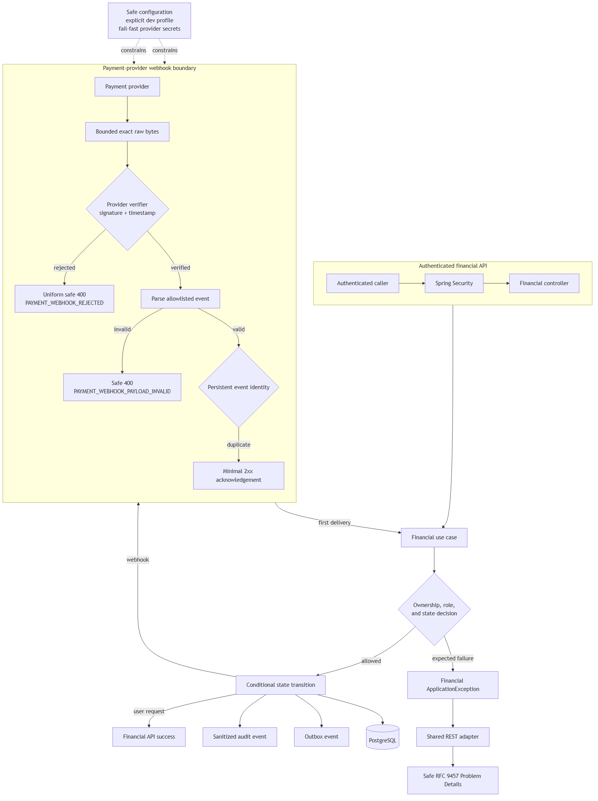

# KAN-30 — Financial Error Migration Design

**Status:** Approved written specification

**Date:** 2026-08-24

**Jira:** [KAN-30](https://0707manna0895.atlassian.net/browse/KAN-30)

**Parent epic:** KAN-16 — Establish production exception-handling foundation

**Prerequisite:** KAN-31 — Financial Security Boundary (complete)

## 1. Outcome

Define a secure, reviewable migration of the financial module from the legacy
HTTP-coupled `ApiException` and `ErrorCode` types to financial-owned,
transport-neutral `ApplicationException` types rendered by the shared RFC 9457
adapter.

The design also separates security hardening from mechanical error migration.
Webhook authentication, replay protection, configuration safety, disclosure,
and resource limits must be corrected before financial legacy exceptions are
removed.

KAN-30 is documentation-only. It changes no production code, database schema,
provider integration, or business rule.

## 2. Verified baseline

The financial module currently contains seventeen exception classes extending
legacy `ApiException`. `FinancialService`, the webhook controller, the webhook
signature verifier, and provider registries construct these failures.

The main capabilities are:

- payment intents and attempts;
- settlements;
- repayments and installments; and
- provider webhook ingress and processing.

KAN-31 now enforces user authentication before financial controllers execute.
Resource ownership, role permission, payment state, and provider decisions
remain application-service responsibilities.

The security review found these independent risks:

1. the application defaults to the `dev` profile when no profile is supplied;
2. development enables local and sandbox providers and supplies known fallback
   webhook secrets;
3. webhook JSON is parsed before its signature is verified;
4. the HMAC contract has no signed timestamp or freshness tolerance;
5. `providerEventId` is accepted but not persisted or checked;
6. Flyway already defines `payment_webhook_event` with a unique
   `(provider_code, provider_event_id)` constraint, but application code does
   not use it;
7. webhook responses expose the complete payment-attempt representation,
   including provider and failure data;
8. provider-controlled failure text can reach persistence, response, outbox,
   and audit paths without a defined size or disclosure policy;
9. loading a sequential identifier before returning 403 for a non-owner can
   reveal whether another account's resource exists; and
10. webhook body size, pagination size, provider text, and request rate lack an
    explicit financial boundary.

Positive controls that must be preserved include constant-time HMAC comparison,
conditional database state transitions, transactional outbox publication,
Spring Security authentication for user endpoints, and disabled local/sandbox
providers in base and production properties.

## 3. Scope

KAN-30 specifies:

- one financial-owned `FinancialErrors` catalogue;
- typed application exceptions with safe public descriptors and protected
  diagnostics;
- ownership-private not-found behavior;
- secure webhook ingress, acknowledgement, replay, and disclosure contracts;
- safe runtime-configuration requirements;
- transaction and idempotency rules;
- bounded inputs and operational controls;
- small follow-up stories and PR boundaries;
- verification gates for every follow-up; and
- conditions for deleting the legacy exception infrastructure.

KAN-30 does not implement:

- any production or test-code change;
- payment, settlement, or repayment rule redesign;
- payment-provider replacement;
- JWT, OAuth2, stateless-session, or principal-contract changes;
- Kafka, Redis, AOP, logging-platform, or deployment-platform adoption;
- unrelated anonymous endpoint-policy changes;
- the approved real-port HTTP smoke layer; or
- a Flyway migration before application-level persistence needs are confirmed.

## 4. Chosen architecture

Financial use cases own expected business failures. Spring Security owns user
authentication. Provider-specific adapters own webhook authentication. The
shared REST adapter alone maps an `ErrorCategory` to HTTP Problem Details.

Webhook requests cross a separate machine-to-machine trust boundary. Exact,
bounded raw bytes are authenticated before parsing. Authenticated events then
cross a persistent idempotency boundary before a financial state transition.

[Editable diagram source](assets/financial-error-flow.mmd)

This design supersedes the earlier capability-only order. Security hardening
must not be hidden inside or postponed behind a mechanical exception rewrite.

## 5. Responsibility boundaries

| Concern | Owner |
|---|---|
| Establish session, JWT, or OAuth2 identity | Spring Security adapter |
| Map HTTP input and output | Financial controller |
| Decide ownership, role permission, and financial state | Financial application service |
| Define safe public financial failures | `FinancialErrors` |
| Carry safe descriptor and protected diagnostics | Typed financial `ApplicationException` |
| Verify signature, timestamp, and provider configuration | Provider webhook verifier |
| Enforce exact-body and body-size boundary | Webhook HTTP adapter |
| Claim provider event identity exactly once | Webhook application/persistence boundary |
| Map expected failures to HTTP | Shared `RestExceptionHandler` |
| Preserve unexpected failure diagnostics | Internal logging and observability boundary |
| Record safe security/financial facts | Audit policy |

Controllers must not authenticate callers, make ownership decisions, construct
Problem Details, or translate arbitrary runtime failures. Provider verifiers
must not perform financial state transitions.

## 6. Public financial error catalogue

The implementation stories may add only the following approved public
descriptors unless a new design decision is reviewed.

| Code | Category | HTTP | Safe public detail |
|---|---|---:|---|
| `FINANCIAL_OPERATION_NOT_ALLOWED` | `AUTHORIZATION` | 403 | This financial operation is not allowed |
| `SETTLEMENT_NOT_FOUND` | `NOT_FOUND` | 404 | The requested settlement was not found |
| `SETTLEMENT_NOT_PAYABLE` | `CONFLICT` | 409 | The settlement cannot be paid in its current state |
| `SETTLEMENT_STATE_CONFLICT` | `CONFLICT` | 409 | The settlement state no longer permits this operation |
| `REPAYMENT_NOT_FOUND` | `NOT_FOUND` | 404 | The requested repayment was not found |
| `REPAYMENT_INSTALLMENT_NOT_FOUND` | `NOT_FOUND` | 404 | The requested repayment installment was not found |
| `REPAYMENT_INSTALLMENT_NOT_PAYABLE` | `CONFLICT` | 409 | The repayment installment cannot be paid in its current state |
| `REPAYMENT_STATE_CONFLICT` | `CONFLICT` | 409 | The repayment state no longer permits this operation |
| `PAYMENT_INTENT_NOT_FOUND` | `NOT_FOUND` | 404 | The requested payment intent was not found |
| `PAYMENT_ATTEMPT_NOT_FOUND` | `NOT_FOUND` | 404 | The requested payment attempt was not found |
| `PAYMENT_INTENT_EXPIRED` | `CONFLICT` | 409 | The payment intent has expired |
| `PAYMENT_INTENT_NOT_ACTIVE` | `CONFLICT` | 409 | The payment intent is not active |
| `PAYMENT_ALREADY_CONFIRMED` | `CONFLICT` | 409 | The payment has already been confirmed |
| `PAYMENT_STATE_CONFLICT` | `CONFLICT` | 409 | The payment state no longer permits this operation |
| `PAYMENT_METHOD_UNSUPPORTED` | `BUSINESS_RULE` | 422 | The selected payment method is not supported |
| `PAYMENT_PROVIDER_MISMATCH` | `BUSINESS_RULE` | 422 | The payment attempt cannot be handled by this provider |
| `PAYMENT_WEBHOOK_REJECTED` | `VALIDATION` | 400 | The webhook request was rejected |
| `PAYMENT_WEBHOOK_PAYLOAD_INVALID` | `VALIDATION` | 400 | The webhook payload is invalid |

`FINANCIAL_OPERATION_NOT_ALLOWED` is reserved for role/action denial that does
not reveal a resource's existence. Missing and non-owned resource identifiers
use the corresponding entity-specific 404 response.

Webhook authentication rejection deliberately uses a uniform 400 rather than
401. The provider protocol is HMAC-based and does not issue the
`WWW-Authenticate` challenge required for an HTTP 401 response. Unknown
provider, missing signature, malformed authentication envelope, invalid
signature, and stale timestamp are publicly indistinguishable.

## 7. Protected diagnostics

Typed exceptions carry stable internal diagnostic codes such as:

- `FINANCIAL.SETTLEMENT.NOT_FOUND`;
- `FINANCIAL.PAYMENT.STATE.CONFLICT`; and
- `FINANCIAL.WEBHOOK.SIGNATURE.REJECTED`.

Protected diagnostics may include non-secret resource identifiers, expected
and actual state, provider code, and a bounded reason category. They must not
include credentials, secrets, signatures, authorization headers, cookies, raw
webhook bodies, unrestricted provider messages, SQL, class names, or stack
traces.

Provider-controlled text is never used as a public exception message. A safe,
allowlisted business reason is stored separately from protected provider
diagnostics. Unknown internal, persistence, mapping, and infrastructure
failures continue through the generic 500 path and are never relabelled as an
expected financial failure.

## 8. Secure webhook protocol

### 8.1 Ingress order

1. Apply gateway or server rate and body-size limits.
2. Read exact raw bytes once without JSON normalization.
3. Resolve an allowlisted provider verifier without disclosing whether a
   provider is configured.
4. Validate the signature envelope and a signed timestamp against a configured
   tolerance.
5. Compute and compare the signature over the provider-defined canonical bytes
   using constant-time comparison.
6. Retain only the provider adapter's allowlisted signature, timestamp, and
   protocol headers; never copy all transport headers into the command.
7. Only after successful authentication, parse a strict allowlisted event
   schema that rejects duplicate JSON keys, invalid types, numeric overflow,
   and unsupported event values.
8. Validate field sizes, identifiers, and provider/payment binding.
9. Atomically claim `(providerCode, providerEventId)` together with a hash of
   the authenticated canonical payload.
10. Process a first delivery or acknowledge an identical authenticated
    duplicate.

Malformed JSON before authentication still receives
`PAYMENT_WEBHOOK_REJECTED`. `PAYMENT_WEBHOOK_PAYLOAD_INVALID` is available only
after webhook authentication succeeds.

### 8.2 Freshness and secret rotation

Each provider verifier defines its signature and timestamp headers and
canonicalization. The local HMAC contract must sign both timestamp and exact
body bytes, enforce a short configurable tolerance, reject missing or invalid
timestamps, and use constant-time comparison.

Secret rotation must support an active secret and a time-bounded previous
secret without placing either value in source control, responses, audit data,
or logs. Provider configuration validation fails startup when an enabled
provider lacks usable secret material.

### 8.3 Idempotency and acknowledgement

The existing `payment_webhook_event` unique provider-event constraint is the
database authority for duplicate detection. An in-memory check is insufficient.
Concurrent first deliveries must produce at most one financial transition,
outbox event, and business audit event.

An authenticated duplicate with the same canonical payload hash returns the
same minimal 2xx acknowledgement and does not repeat side effects. Reuse of an
existing provider event ID with a different payload hash or immutable event
identity is rejected as `PAYMENT_WEBHOOK_PAYLOAD_INVALID`, causes no financial
mutation, and creates a sanitized security audit event.

The webhook response must not contain a payment
intent, payment attempt, provider identifier, failure message, provider
payload, or account information. Authentication rejection must not acknowledge
success.

The webhook event row stores only the bounded, normalized fields required for
processing and investigation. Signature headers and raw secrets are never
stored. Any JSON payload column receives an allowlisted normalized event, not
an unrestricted copy of request headers or transport credentials.

## 9. Ownership and enumeration policy

Financial queries and mutations must scope lookup by both resource identifier
and authorized account whenever repository semantics permit. Missing,
expired/deleted, and non-owned resources are publicly indistinguishable within
an endpoint family.

If authorization requires a two-step load, the service still returns the
entity-specific 404 for a non-owner and must not log the ownership fact as an
expected warning. Role denial that can be decided without loading a sensitive
resource may use `FINANCIAL_OPERATION_NOT_ALLOWED` 403.

This policy applies to settlements, repayments, installments, payment intents,
and payment attempts. It does not weaken business authorization; it changes
only what an unauthorized caller can learn.

## 10. Transaction and concurrency policy

- Existing conditional state-transition SQL remains the final concurrency
  authority.
- A zero-row conditional update is translated only after re-reading enough
  state to select an approved conflict without exposing another owner.
- The webhook event claim, financial transition, outbox publication, and
  business audit record execute within one transaction where they represent
  one business outcome.
- Transaction rollback must remove both the event claim and partial financial
  mutations when processing fails unexpectedly.
- Expected duplicate delivery is not an exception and does not create a second
  outbox or business audit event.
- SQL, connection, constraint, serialization, and unexpected runtime failures
  remain internal 500 failures unless an explicitly tested unique-conflict
  path represents the provider-event idempotency contract.

## 11. Disclosure, limits, and audit policy

Public Problem Details use only the existing allowlisted fields: `type`,
`title`, `status`, `detail`, `instance`, `code`, `requestId`, and `timestamp`.

Public responses and ordinary audit details exclude account and resource IDs,
provider payment/event IDs, signatures, secrets, raw payloads, authorization
headers, cookies, session data, SQL, class names, causes, diagnostic codes, and
stack traces.

Follow-up stories must define and test finite limits for:

- webhook body bytes;
- header and provider-code lengths;
- provider event, payment, failure-code, and failure-message fields;
- financial page size; and
- webhook request rate/burst at the deployable ingress boundary.

Oversized bodies are rejected before parsing or signature work. Rate-limit and
payload-limit responses use the framework or gateway contract and are not
added to `FinancialErrors` unless the application itself owns that decision.

Webhook security auditing records a bounded event category, provider code when
safe, request ID, timestamp, and outcome. It never records a signature, secret,
body, unrestricted provider text, or a detail that distinguishes public
rejection reasons. Expected application exceptions are not logged twice.

## 12. Secure runtime configuration

- Remove the automatic fallback to `dev`; local development must select the
  profile explicitly.
- Base and production configuration keep local and sandbox providers disabled.
- Development-only providers and known local secrets remain confined to an
  explicitly selected development/test environment.
- Production deployment explicitly selects `prod` and supplies datasource and
  provider secrets through its secret-management boundary.
- Enabled provider configuration is validated at startup for required values,
  acceptable format, and non-development secret material.
- Missing or unsafe production provider configuration fails startup rather
  than silently disabling verification or using a repository default.

These controls are prerequisites to exposing a webhook endpoint outside an
isolated development environment.

## 13. Follow-up delivery stories

Each story uses one focused branch and PR targeting `develop`. Merged branches
are deleted according to the repository setting.

1. **[KAN-36](https://0707manna0895.atlassian.net/browse/KAN-36) — Secure configuration and webhook ingress**
   Remove the default development profile, add provider configuration
   validation, bound exact raw bytes, authenticate before parsing, add signed
   freshness, return uniform rejection, and emit sanitized security audit.

2. **[KAN-32](https://0707manna0895.atlassian.net/browse/KAN-32) — Webhook replay and disclosure control**
   Map the existing webhook-event table, claim provider event identity
   atomically, make concurrent duplicates side-effect-free, minimize the 2xx
   acknowledgement, and separate safe failure reason from provider diagnostics.

3. **[KAN-35](https://0707manna0895.atlassian.net/browse/KAN-35) — Payment intent and attempt error migration**
   Add the financial catalogue and payment exceptions, implement
   ownership-private lookup, migrate callers, and verify RFC 9457 contracts.

4. **[KAN-37](https://0707manna0895.atlassian.net/browse/KAN-37) — Settlement error migration**
   Migrate settlement lookup, ownership, payable-state, and concurrency
   failures without changing settlement rules.

5. **[KAN-34](https://0707manna0895.atlassian.net/browse/KAN-34) — Repayment and installment error migration**
   Migrate repayment/progress/installment lookup, ownership, payable-state,
   and concurrency failures without changing repayment rules.

6. **[KAN-33](https://0707manna0895.atlassian.net/browse/KAN-33) — Legacy exception-stack removal**
   Remove remaining legacy handlers, error codes, envelopes, and frozen
   architecture exceptions only after every production consumer is gone.

Stories 1 and 2 are security prerequisites. Stories 3–5 are independently
reviewable vertical migrations. Story 6 is cleanup, not a mixed feature PR.

## 14. Verification gates

### 14.1 Webhook security tests

- Modified raw bytes, missing/invalid signature, stale timestamp, unknown
  provider, and malformed unauthenticated JSON cause no parsing-side effect,
  repository mutation, outbox event, or business audit event.
- Public webhook rejection variants are indistinguishable and disclose no
  configuration fact.
- A verified malformed or unsupported event receives the safe payload-invalid
  contract.
- A first valid event succeeds; sequential and concurrent duplicates return a
  minimal 2xx response and execute side effects exactly once.
- Reusing a provider event ID with different authenticated content is rejected,
  audited safely, and performs no mutation.
- Secret rotation accepts only configured active/grace secrets and rejects an
  expired previous secret.
- Oversized bodies and fields fail at their owning boundary.
- Local/sandbox providers are absent outside explicit dev/test configuration;
  unsafe enabled-provider configuration fails startup.

### 14.2 Financial contract tests

- Each descriptor has the exact approved code, category, and public detail.
- Missing and non-owned resources return the same entity-specific 404 contract.
- Role denial that does not disclose a resource returns the approved 403.
- State and conditional-update conflicts select the intended 409 code.
- Unsupported method/provider combinations select the intended 422 code.
- Provider text and protected diagnostics never enter Problem Details.
- Unexpected persistence/runtime failures remain generic 500 responses.

### 14.3 PostgreSQL and architecture tests

- PostgreSQL Testcontainers verifies unique event identity, concurrent
  duplicate processing, conditional transitions, rollback, and exactly-once
  outbox/audit effects.
- Flyway validation passes from an empty PostgreSQL database.
- The financial module is added to the migrated architecture boundary only
  after all its production legacy dependencies are removed.
- The frozen architecture store is reduced only by violations proven obsolete.
- Full unit, architecture, MVC/API, security, and PostgreSQL integration suites
  pass at the exact PR head before merge.

MockMvc, Spring Security Test, and Testcontainers are verification tools only;
they do not enter the production runtime.

## 15. Legacy deletion conditions

The shared legacy `ApiException`, `ErrorCode`, `GlobalExceptionHandler`, legacy
error response, and supporting helpers may be deleted only when:

1. repository search finds no production import, construction, inheritance, or
   handler reference;
2. every module is enforced by the migrated architecture rule;
3. no test depends on the legacy public envelope except an intentional
   historical fixture;
4. all expected failures render through the neutral REST/security adapters;
5. framework validation and unexpected failures retain tested safe behavior;
6. full unit, architecture, API, and PostgreSQL suites pass; and
7. the cleanup PR contains no unrelated business or security redesign.

## 16. Acceptance criteria

- [ ] The approved financial error catalogue is transport-neutral and
      financial-owned.
- [ ] Authentication, controller mapping, financial authorization, provider
      verification, exception rendering, audit, and persistence have distinct
      owners.
- [ ] Webhook authentication operates on bounded exact bytes before parsing.
- [ ] Signed freshness and persistent provider-event idempotency are required.
- [ ] Authenticated duplicate deliveries produce one business outcome and a
      minimal 2xx acknowledgement.
- [ ] Missing and non-owned financial resources are publicly
      indistinguishable.
- [ ] Public responses, logs, and ordinary audit data exclude all prohibited
      provider and diagnostic material.
- [ ] Development provider behavior cannot activate through an implicit
      runtime-profile fallback.
- [ ] Inputs, pagination, provider text, and ingress rates have finite tested
      limits.
- [ ] Unexpected failures are never relabelled as expected financial errors.
- [ ] Security hardening and each financial capability migration use separate,
      reviewable stories and PRs.
- [ ] The legacy stack is removed only after the explicit deletion gates pass.
- [ ] JWT, OAuth2, payment rules, provider replacement, Kafka, Redis, AOP, and
      real-port smoke testing remain outside KAN-30.
