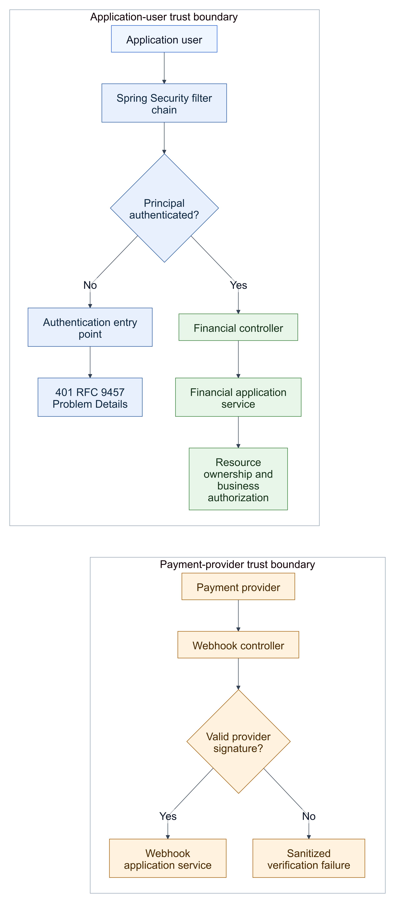

# KAN-31 — Financial Security Boundary

**Status:** Approved written specification

**Date:** 2026-08-24

**Jira:** [KAN-31](https://0707manna0895.atlassian.net/browse/KAN-31)

**Parent epic:** KAN-16 — Establish production exception-handling foundation

**Blocks:** KAN-30 — Design financial exception migration and delivery slices

## 1. Outcome

Enforce authentication for financial user endpoints in Spring Security and
remove controller-local authentication guards. Financial controllers consume
an already-authenticated principal, while `FinancialService` retains ownership
and business-authorization decisions.

This prerequisite establishes the correct boundary before KAN-30 migrates
financial business failures to the neutral error contract.

## 2. Verified baseline

`SecurityConfig` currently applies explicit authentication rules to marketplace
routes such as bids and agreements. Marketplace controllers therefore consume
`AuthenticatedUserPrincipal` directly without constructing authentication
failures.

The following financial route families have no equivalent rule and currently
fall through to `.anyRequest().permitAll()`:

- `/api/v1/settlements/**`;
- `/api/v1/repayments/**`;
- `/api/v1/repayment-installments/**`;
- `/api/v1/payment-intents/**`; and
- `/api/v1/payment-attempts/**`.

`FinancialController` and `LocalPaymentSimulationController` compensate by
calling a private `requirePrincipal()` helper that throws legacy
`ApiException(AUTHENTICATION_REQUIRED)`. This makes a financial HTTP adapter
partly responsible for authentication and bypasses the shared Spring Security
Problem Details entry point.

Investor, startup, and agreement paths are already authenticated by broader
existing matchers. Payment-provider webhooks are intentionally session-public
and CSRF-exempt, then authenticated independently through provider-signature
verification.

## 3. Scope

KAN-31 includes:

- explicit Spring Security authentication rules for the five uncovered
  financial user route families;
- removal of `requirePrincipal()` and its legacy exception imports from
  `FinancialController` and `LocalPaymentSimulationController`;
- direct consumption of the established `AuthenticatedUserPrincipal` contract;
- shared RFC 9457 authentication responses through
  `ProblemAuthenticationEntryPoint`;
- preservation of CSRF enforcement for authenticated unsafe user operations;
- preservation of session-public, CSRF-exempt payment-provider webhooks;
- focused real-filter-chain, controller-boundary, webhook, disclosure, and
  regression tests; and
- a narrow architecture rule preventing the two financial user controllers
  from reconstructing legacy authentication failures.

KAN-31 does not include:

- financial error descriptors or typed business-exception migration;
- resource-ownership or role-policy redesign;
- payment, settlement, repayment, or provider business-rule changes;
- JWT, OAuth2, stateless-session, or principal-contract redesign;
- webhook signature, provider, payload, or response-contract changes;
- database, Flyway, cache, messaging, audit, or logging changes; or
- removal of the shared legacy exception infrastructure.

## 4. Chosen architecture

Authentication occurs before a financial user controller executes. The
controller receives the established principal and supplies its account ID and
role to the application service. The service continues making resource-level
ownership and business-permission decisions.

Provider webhooks remain a separate trust boundary. They do not represent a
browser user and therefore do not require a session, JWT, or OAuth2 principal.
Their authenticity continues to depend on the configured provider signature.

[Editable diagram source](assets/authentication-flow.mmd)

This design follows the existing marketplace pattern and was selected over:

1. retaining controller null guards, which duplicates Spring Security and
   couples controllers to authentication-error construction;
2. introducing a new financial authentication abstraction, which would
   duplicate the established principal contract without enabling new behavior;
   and
3. protecting every `/api/v1/**` route, which would unintentionally change
   unrelated anonymous endpoint policy.

## 5. Responsibility boundaries

| Concern | Owner |
|---|---|
| Establish session, JWT, or OAuth2 authentication | Spring Security adapter |
| Reject missing or invalid user authentication | `ProblemAuthenticationEntryPoint` |
| Enforce CSRF for unsafe browser-session requests | Spring Security CSRF boundary |
| Supply the authenticated account and role | `AuthenticatedUserPrincipal` |
| Map HTTP input and delegate to a use case | Financial controller |
| Decide resource ownership and financial permissions | `FinancialService` |
| Verify payment-provider authenticity | Provider signature verifier |
| Render expected financial business failures | KAN-30 and the shared REST adapter |

Receiving `@AuthenticationPrincipal` is not authentication. It is consumption
of an identity already established by the security filter chain.

## 6. Endpoint policy

| Route family | User authentication | CSRF | Additional decision |
|---|---|---|---|
| `/api/v1/settlements/**` | Required | Required for unsafe methods | Financial ownership rules |
| `/api/v1/repayments/**` | Required | Required for unsafe methods | Financial ownership rules |
| `/api/v1/repayment-installments/**` | Required | Required for unsafe methods | Financial ownership rules |
| `/api/v1/payment-intents/**` | Required | Required for unsafe methods | Payer and payment-state rules |
| `/api/v1/payment-attempts/**` | Required | Required for unsafe methods | Payer, provider, and state rules |
| `/api/v1/investors/**` | Already required | Existing policy | No rule change |
| `/api/v1/startups/**` | Already required | Existing policy | No rule change |
| `/api/v1/agreements/**` | Already required | Existing policy | No rule change |
| `/api/v1/payment-providers/*/webhooks` | Not a user-authenticated route | Exempt | Provider signature required |

The webhook `permitAll` rule means only that browser-user authentication is not
required. It does not make the payload trusted or bypass signature verification.

## 7. Request flows

### 7.1 Anonymous financial user request

1. The request enters the Spring Security filter chain.
2. The explicit route matcher requires authentication.
3. Spring Security stops the request before controller execution.
4. `ProblemAuthenticationEntryPoint` returns the existing safe
   `AUTHENTICATION_REQUIRED` 401 Problem Details response.
5. No financial repository, service, or business exception executes.

For an unsafe anonymous request without a valid CSRF token, the existing CSRF
boundary may reject the request first with the established safe CSRF response.
Focused tests use a valid test CSRF token when isolating authentication behavior
and separately preserve the missing-CSRF behavior.

### 7.2 Authenticated financial user request

1. Spring Security supplies `AuthenticatedUserPrincipal`.
2. The controller maps HTTP values and delegates using account ID and role.
3. `FinancialService` verifies ownership, role, and financial state.
4. Existing success or business-failure behavior continues unchanged.

### 7.3 Payment-provider webhook

1. The webhook enters through the existing session-public and CSRF-exempt path.
2. The controller retains the raw payload required for signature verification.
3. The provider signature verifier validates provider configuration and the
   signature before business processing.
4. Invalid signatures remain sanitized failures; verified requests reach the
   webhook application service.

## 8. Authentication-mechanism compatibility

KAN-31 does not bind financial controllers to stateful sessions. Controllers
consume the existing principal contract, not the mechanism that created it.
Future session, JWT, or OAuth2 adapters may establish the same principal, so
changing authentication mechanisms does not require financial-controller or
financial-service redesign.

Any future change to the principal contract itself must be handled as a
separate security design. KAN-31 does not add speculative interfaces for that
possibility.

## 9. Error and disclosure policy

- Anonymous user failures use the existing allowlisted
  `AUTHENTICATION_REQUIRED` Problem Details response.
- Missing or invalid CSRF uses the existing allowlisted
  `CSRF_VALIDATION_FAILED` response.
- Authenticated resource-ownership failures remain financial business failures
  and are not relabelled as authentication failures.
- Provider verification remains separate from browser-user authentication.
- Responses must not expose authorization headers, cookies, session IDs, CSRF
  values, principal internals, provider signatures, secrets, raw payloads, raw
  exception messages, class names, causes, or stack traces.
- Expected filter-chain failures continue through the existing sanitized audit
  policy without duplicate exception logging.

## 10. Verification strategy

### 10.1 Focused RED tests

- Exercise representative anonymous GET requests for settlements, repayments,
  repayment installments, and payment intents.
- Exercise payment-attempt POST with a valid test CSRF token to isolate the
  authentication decision.
- Expect the exact shared 401 RFC 9457 contract and prove controller-generated
  legacy envelopes are absent.
- Verify an unsafe request without CSRF retains the established safe CSRF
  response.

These tests fail on the baseline because the uncovered routes reach controller
null guards and produce the legacy response contract.

### 10.2 GREEN and regression tests

- Verify all five route families are stopped by the real Spring Security chain
  before controller execution when the caller is anonymous.
- Verify authenticated GET and CSRF-valid POST requests continue reaching the
  current financial use cases.
- Preserve current resource-ownership and role outcomes.
- Preserve the local-payment simulation property boundary.
- Preserve webhook access without browser session or CSRF and prove a missing
  provider signature still fails through provider verification rather than the
  user-authentication entry point.
- Assert request IDs and `application/problem+json` response fields while
  checking that credentials and diagnostic material are absent.

### 10.3 Architecture and full verification

- Assert `FinancialController` and `LocalPaymentSimulationController` no longer
  depend on the legacy exception package or declare a principal null guard.
- Do not mark the entire financial module migrated; other financial legacy
  dependencies remain for KAN-30.
- Run the complete unit and architecture suite.
- Run the complete Testcontainers PostgreSQL integration suite against
  unchanged Flyway V1.
- Require exact-head GitHub Actions success before merge to `develop`.

MockMvc, Spring Security Test, Testcontainers, and PostgreSQL remain test-only
verification tools and are not part of the production runtime.

## 11. Delivery sequence

One `feature/KAN-31-financial-security-boundary` branch targets `develop`:

1. add focused failing real-filter-chain contract tests;
2. add the narrow financial route matchers;
3. remove the two controller authentication guards and legacy imports;
4. add architecture, authenticated-success, CSRF, webhook, and disclosure
   regressions; and
5. run complete verification and prepare a reviewable pull request.

KAN-30 remains To Do and blocked until the approved KAN-31 pull request is
merged into `develop`.

## 12. Acceptance criteria

- [ ] Every listed financial user route family requires authentication in
      Spring Security.
- [ ] Anonymous route access is stopped before financial controller execution.
- [ ] Shared filter-chain adapters produce the safe RFC 9457 authentication and
      CSRF responses.
- [ ] Financial user controllers do not authenticate callers, check for a null
      principal, or construct authentication failures.
- [ ] Authenticated controllers continue supplying account ID and role to the
      existing financial application service.
- [ ] Resource ownership and business authorization remain in
      `FinancialService`.
- [ ] Unsafe user operations retain CSRF protection.
- [ ] Provider webhooks remain free from browser-user authentication and CSRF
      while retaining provider-signature verification.
- [ ] Local payment simulation retains its existing configuration boundary.
- [ ] Session, JWT, and OAuth2 mechanisms can continue producing the same
      principal contract without financial changes.
- [ ] No secrets, credentials, signatures, raw payloads, principal internals,
      exception details, or stack traces enter public responses.
- [ ] No financial business rule, database, Flyway, provider, audit, logging,
      messaging, caching, or unrelated endpoint policy changes are included.
- [ ] Focused and complete verification suites pass before review.
