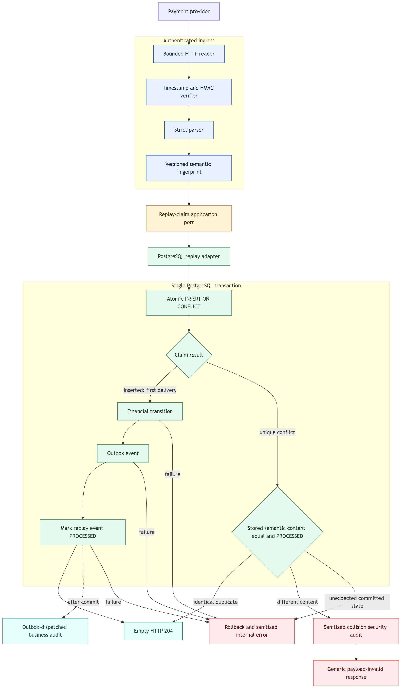

# KAN-32 — Payment Webhook Replay Protection and Safe Acknowledgement

**Status:** Approved written specification

**Date:** 2026-08-24

**Jira:** [KAN-32](https://0707manna0895.atlassian.net/browse/KAN-32)

**Parent epic:** KAN-16 — Establish production exception-handling foundation

**Depends on:** KAN-36 — Secure webhook ingress

**Blocks:** KAN-35 — Payment webhook operational recovery

## 1. Outcome

Make authenticated payment-provider webhook processing persistent,
idempotent, concurrency-safe, transactional, and disclosure-safe.

The first valid delivery performs the financial transition exactly once.
Sequential or concurrent identical deliveries receive the same empty HTTP 204
acknowledgement without repeating financial, outbox, or business-audit side
effects. Reuse of an event identity with different authenticated content is
rejected and audited without exposing provider data.

## 2. Verified baseline

KAN-36 already provides bounded exact-body capture, allowlisted protocol
headers, timestamp freshness, HMAC verification, strict post-authentication
parsing, uniform rejection contracts, and sanitized security auditing.

The remaining replay risks are:

- the existing `payment_webhook_event` table is not mapped or used;
- the provider event ID does not currently prevent repeated processing;
- concurrent deliveries can both reach the financial service;
- the controller returns the complete `PaymentAttemptResponse`;
- provider failure diagnostics flow into business state, outbox, and ordinary
  audit records; and
- no persistent semantic comparison detects reuse of an event ID with changed
  authenticated content.

## 3. Scope

KAN-32 includes:

- a versioned deterministic semantic fingerprint created after authentication
  and strict parsing;
- an application replay-claim port and PostgreSQL adapter;
- an atomic claim using the existing unique provider/event identity;
- one transaction covering claim, financial processing, outbox persistence,
  and completion;
- duplicate and collision classification;
- safe separation of provider diagnostics from business failure values;
- an empty HTTP 204 acknowledgement for first success and identical duplicate;
- sanitized replay-collision auditing; and
- focused unit, architecture, MockMvc, and PostgreSQL/Testcontainers tests.

KAN-32 does not change provider authentication, financial state rules, payment
authorization policy, real provider SDKs, distributed rate limiting, JWT or
OAuth2, asynchronous webhook processing, or operational recovery tooling.

## 4. Chosen architecture

The selected design keeps replay policy in the financial application boundary
and PostgreSQL mechanics behind an application port.

<a href="assets/webhook-replay-flow.png">
  
</a>

[Editable diagram source](assets/webhook-replay-flow.mmd)

```text
Provider
  -> bounded HTTP reader
  -> HMAC verifier
  -> strict parser
  -> semantic fingerprint
  -> transactional replay processor
       -> replay-claim port
            -> PostgreSQL adapter
       -> financial service, first delivery only
       -> mark PROCESSED
  -> empty HTTP 204
```

The design avoids an in-memory lock, a separate committed claim transaction,
and a read-before-insert check. Those alternatives either fail across
instances, leave partial claims after business rollback, or contain a race
between the read and write.

## 5. Responsibility boundaries

| Concern | Owner |
|---|---|
| Route mapping and empty HTTP 204 | Webhook controller |
| Bounded request capture and sanitized rejection audit | Webhook HTTP ingress |
| HMAC verification and strict parsing | Existing provider ingress service |
| Semantic normalization and fingerprinting | Financial application component |
| Claim, duplicate classification, financial call, and completion transaction | Transactional webhook processor |
| Replay persistence contract | Application replay-claim port |
| Atomic insert, lookup, and completion SQL | PostgreSQL replay adapter |
| Financial transition and outbox persistence | Existing financial service transaction participant |
| Downstream business-audit derivation | Existing outbox dispatcher and audit processor |
| Replay-collision security evidence | Security-audit port and adapter |
| RFC 9457 failure rendering | Shared REST exception adapter |

The controller does not authenticate, fingerprint, query replay state, or call
repositories. The application layer does not depend on JPA, JDBC, PostgreSQL,
servlet APIs, or HTTP response types.

## 6. Authentication and transaction boundary

HMAC verification and strict parsing remain outside the database transaction.
Untrusted or invalid requests therefore cannot create replay records.

After authentication, one `REQUIRED` transaction performs:

1. atomic replay claim;
2. first-delivery financial transition;
3. resulting outbox write;
4. linkage of the replay record to the affected payment attempt or intent; and
5. transition of the replay record to `PROCESSED` with `processed_at`.

The existing transactional financial methods join this outer transaction. Any
runtime failure rolls back the claim and every side effect. A genuine provider
retry can then claim and process the event.

The business-audit row is intentionally not written in the webhook
transaction. After commit, the existing outbox dispatcher processes the single
committed outbox event in its own transaction. `AuditEventHandler` derives the
audit record, whose `(event_id, action)` unique constraint supplies an
additional idempotency guard. A webhook rollback leaves no outbox event to
dispatch; an identical duplicate creates no second outbox event.

This relies on PostgreSQL's unique-conflict handling and normal Read Committed
behavior, not JVM-local synchronization. See the official PostgreSQL
[`INSERT`](https://www.postgresql.org/docs/current/sql-insert.html) and
[transaction-isolation](https://www.postgresql.org/docs/current/transaction-iso.html)
documentation and Spring's
[transaction propagation](https://docs.spring.io/spring-framework/reference/data-access/transaction/declarative/tx-propagation.html)
reference.

## 7. Atomic replay claim

The PostgreSQL adapter uses the equivalent of:

```sql
INSERT INTO payment_webhook_event (...)
VALUES (..., 'RECEIVED', ...)
ON CONFLICT (provider_code, provider_event_id) DO NOTHING
RETURNING payment_webhook_event_id;
```

- A returned ID means the request owns the event and may invoke financial
  processing.
- No returned ID means another committed or concurrent delivery owns that
  provider/event identity. The adapter reads the committed record and the
  application classifies it.
- PostgreSQL resolves the concurrent unique conflict; the application does not
  implement a timing-dependent polling loop.

The existing `payment_webhook_event` unique constraint and state columns are
sufficient, so KAN-32 plans no Flyway migration. If implementation discovery
proves a schema gap, work pauses and a new forward-only migration is designed;
`V1__baseline.sql` is never edited after release.

## 8. Semantic fingerprint and retained payload

The fingerprint is computed only after HMAC verification and strict parsing.
Version 1 canonical content contains:

- fingerprint schema version;
- normalized provider code;
- provider event ID;
- event type;
- payment attempt ID;
- provider payment ID when applicable; and
- bounded normalized provider failure code and message when applicable.

The component serializes this fixed allowlist deterministically and calculates
SHA-256. The record stores the hash and the same normalized allowlisted event
as JSONB. Duplicate classification requires both hash equality and equality of
the immutable normalized fields.

This deliberately ignores JSON whitespace and property order while detecting
meaningful changes. Raw request bytes, headers, signatures, secrets, unknown
fields, and unrestricted provider payloads are never persisted.

## 9. Lifecycle and duplicate classification

| Existing result | Classification | Behavior |
|---|---|---|
| Claim inserted | First delivery | Process once, mark `PROCESSED`, return 204 |
| `PROCESSED` and semantic content equal | Identical duplicate | No business call or side effect; return 204 |
| Same provider/event ID but content differs | Replay collision | Reject as `PAYMENT_WEBHOOK_PAYLOAD_INVALID`; sanitized security audit |
| Committed `RECEIVED`, `FAILED`, or `IGNORED` | Unexpected invariant | Fail closed through sanitized internal-error handling; do not process or acknowledge as duplicate |

`RECEIVED` normally exists only inside the open owner transaction. If owner
processing fails, rollback removes it. Therefore a committed non-`PROCESSED`
state is treated as an invariant or legacy-data problem rather than guessed
into a business decision.

## 10. Provider-diagnostic separation

For a `PAYMENT_FAILED` notification, the replay record may retain the bounded
normalized provider failure code and message inside its protected JSONB
payload. Those values participate in the fingerprint but never enter API
responses, logs, ordinary audit, or outbox messages.

The financial service receives only stable business-safe values:

| Field | Value |
|---|---|
| Failure code | `PROVIDER_REPORTED_FAILURE` |
| Failure message | `Payment provider reported that the payment failed` |

These safe values may appear in payment and repayment state, business audit,
and outbox events. `payment_webhook_event.failure_message` remains null for a
successfully processed provider-declared payment failure; that column is not a
provider-diagnostic store.

## 11. HTTP and disclosure contract

Both the first successful processing and an identical duplicate return:

```http
HTTP/1.1 204 No Content
```

There is no success envelope or response body. The response does not reveal
whether the event was first-seen, duplicated, which payment changed, or any
provider/account information. Processing is synchronous, so HTTP 202 is not
used.

A collision uses the existing generic authenticated-payload contract:

| Code | Category | HTTP | Public detail |
|---|---|---:|---|
| `PAYMENT_WEBHOOK_PAYLOAD_INVALID` | `VALIDATION` | 400 | The webhook payload is invalid |

Unexpected internal state uses the existing sanitized internal-error response.
No response contains a signature, hash, event ID, raw payload, provider
diagnostic, exception message, class, cause, or stack trace.

## 12. Audit, logging, and observability

A replay collision produces a fixed, bounded security-audit action with the
safe configured provider code, request ID, and denied outcome. It does not
contain the provider event ID, semantic hash, payload, signature, diagnostic,
headers, exception message, or stack trace.

The HTTP ingress remains responsible for best-effort rejection/collision audit
outside the rolled-back processing transaction. An identical duplicate is an
expected protocol event and is not logged as an error or written as a second
business audit. Operational metrics may later count aggregate outcomes without
high-cardinality event identifiers; that is not required for KAN-32.

## 13. Request flows

### 13.1 First valid delivery

1. Capture, authenticate, and strictly parse the request.
2. Build normalized content and its fingerprint.
3. Insert `RECEIVED` and become owner.
4. Perform the financial transition with safe business values.
5. Persist the associated outbox event and mark `PROCESSED`.
6. Commit once and return empty HTTP 204.
7. The existing outbox dispatcher later derives the business-audit record in a
   separate transaction.

### 13.2 Sequential or concurrent identical duplicate

1. Capture, authenticate, parse, and fingerprint normally.
2. Atomic insert conflicts on provider/event identity.
3. Read the committed record after PostgreSQL resolves the conflict.
4. Confirm `PROCESSED` and semantic equality.
5. Skip financial processing and return the same empty HTTP 204.

### 13.3 Replay collision

1. Atomic insert conflicts on provider/event identity.
2. Stored and incoming authenticated semantic content differ.
3. Perform no financial mutation.
4. Attempt a sanitized collision security audit.
5. Return generic `PAYMENT_WEBHOOK_PAYLOAD_INVALID` Problem Details.

### 13.4 Processing rollback and retry

1. First delivery inserts `RECEIVED` and starts financial processing.
2. Any processing or persistence step fails.
3. The transaction rolls back claim, financial changes, and outbox together;
   therefore no downstream business audit can be derived.
4. A later genuine delivery may acquire the claim and process normally.

## 14. Verification strategy

- Fingerprint unit tests prove deterministic output, JSON-order/whitespace
  independence, meaningful-field sensitivity, version inclusion, and bounded
  provider-diagnostic normalization.
- PostgreSQL/Testcontainers adapter tests cover first claim, sequential
  duplicate, concurrent duplicate, collision, committed-state lookup, and
  rollback followed by successful retry.
- Transaction integration tests prove at most one financial transition and one
  outbox record under concurrency, with no partial rows after rollback.
- Outbox-dispatch integration tests prove the single committed event derives
  one business-audit record and the existing `(event_id, action)` constraint
  rejects duplicate audit persistence.
- MockMvc filter-chain tests prove first success and duplicate both return an
  empty 204 while collision and invariant failures use disclosure-safe errors.
- Disclosure tests inspect responses, logs, replay JSONB, outbox, business
  audit, and security audit for prohibited raw or diagnostic data.
- Architecture tests keep servlet/HTTP concerns out of application replay
  policy and persistence mechanics behind the replay-claim port.
- The complete unit, architecture, PostgreSQL integration, and GitHub Actions
  suites must pass before review.

MockMvc and Testcontainers remain test-only dependencies and do not run in the
production application.

## 15. Compatibility and extension

Replay protection authenticates payment providers, not browser users. Future
session replacement with JWT or OAuth2 does not change this pipeline.

The port-based design allows a provider-specific canonicalizer or persistence
adapter without moving protocol or SQL concerns into the controller. A future
asynchronous design would require a separately approved durable-acceptance
contract; KAN-32 intentionally keeps processing synchronous and transactional.

## 16. Acceptance criteria

- [ ] Only authenticated, strictly parsed events may create replay records.
- [ ] The first valid delivery performs one financial transition.
- [ ] Sequential and concurrent identical duplicates return empty HTTP 204 and
      cause no repeated financial, outbox, or business-audit work.
- [ ] Provider/event identity reuse with different semantic content is rejected
      without financial mutation and creates sanitized collision evidence.
- [ ] Claim, financial state, outbox, and completion commit or roll back as one
      unit.
- [ ] The single committed outbox event derives at most one downstream
      business-audit record through the existing dispatcher and uniqueness
      guard.
- [ ] A rolled-back delivery can be retried successfully.
- [ ] Raw payloads, headers, signatures, secrets, hashes, provider event IDs,
      and provider diagnostics do not enter responses, logs, or security audit.
- [ ] Provider diagnostics remain protected while stable safe failure values
      cross into business state and events.
- [ ] Application replay policy remains independent of HTTP and PostgreSQL
      implementation types.
- [ ] No Flyway migration is added unless implementation discovery proves a
      documented schema gap.
- [ ] Focused and complete verification suites pass before review.
