# KAN-33 — Legacy Exception-Stack Removal

**Status:** Written specification ready for review

**Date:** 2026-08-25

**Parent:** [KAN-16](https://0707manna0895.atlassian.net/browse/KAN-16)

**Predecessors:** KAN-20 through KAN-24 and the completed module migrations,
including KAN-34

**Blocks:** [KAN-41](https://0707manna0895.atlassian.net/browse/KAN-41) —
successful API response modernization

## 1. Purpose

Remove the obsolete HTTP-coupled exception infrastructure after every active
business module has migrated to the transport-neutral error contract. The
result is one production error architecture:

- application failures use `ApplicationException` and module-owned
  descriptors;
- Spring MVC request and framework failures use explicit framework mappings;
- unexpected failures use one sanitized internal-server-error mapping;
- Spring Security failures remain at the security execution boundary; and
- all public failures use RFC 9457 Problem Details.

KAN-33 is a deletion and enforcement story. It does not redesign business
rules, successful responses, authentication, persistence, audit, or payment
provider behavior.

## 2. Audited current state

The repository audit found no active production construction or use of the
legacy application exceptions. The remaining production references form an
isolated obsolete stack:

| Remaining artifact | Current role | KAN-33 decision |
| --- | --- | --- |
| `ApiException` | Legacy HTTP-coupled exception base | Delete |
| `ErrorCode` | Legacy public code and `HttpStatus` owner | Delete |
| `ErrorField` | Legacy envelope field detail | Delete |
| `GlobalExceptionHandler` | Competing MVC error renderer | Delete |
| `ErrorResponse` | Legacy `{success,error,meta}` failure envelope | Delete |
| `ApiResponse.error(...)` | Constructs the legacy failure envelope | Delete method only |
| `PaymentWebhookVerificationException` | Unused legacy subclass | Delete |
| `UnsupportedPaymentWebhookEventException` | Unused legacy subclass | Delete |
| ArchUnit freeze store | Accepts six violations from the two unused subclasses | Delete |

Three MVC test classes still register `GlobalExceptionHandler`. One test
explicitly asserts the legacy JSON envelope. These are migration scaffolding,
not supported production contracts, and will be replaced rather than retained
as historical fixtures.

`ApiResponse.success(...)`, `SuccessResponse`, and `Meta` remain active across
controllers. KAN-33 removes only the error factory and legacy imports. KAN-41
owns the separately versioned successful-response redesign.

## 3. Approved decisions

1. Remove the complete executable legacy failure path in one focused story.
2. Preserve no runtime or test fixture capable of producing the old envelope;
   Git history and completed design documents provide historical traceability.
3. Treat unclassified `IllegalArgumentException`, `IllegalStateException`,
   `NullPointerException`, and other runtime failures as unexpected HTTP 500
   failures.
4. Preserve HTTP 400 only for explicit request-validation and framework
   mappings.
5. Preserve HTTP 409 only for typed business conflicts described by an
   `ApplicationException` descriptor.
6. Expose no raw Java exception message, class name, stack trace, rejected
   value, SQL detail, credential, or secret in an unexpected response.
7. Keep successful `/api/v1` response bodies unchanged.

## 4. Target architecture

`RestExceptionHandler` becomes the single Spring MVC exception boundary.
Spring Security keeps its dedicated filter-chain adapters because those
failures occur before controller advice. Both boundaries use
`ProblemDetailsFactory`, producing one public RFC 9457 representation.

[Editable architecture source](assets/single-error-contract.mmd)

[High-resolution PNG for Jira and offline review](assets/single-error-contract.png)

### 4.1 Expected application failure

1. A module raises `ApplicationException` with an approved descriptor.
2. `RestExceptionHandler` maps the neutral category through
   `HttpErrorMapping`.
3. `ProblemDetailsFactory` renders the fixed public descriptor values.
4. Diagnostic code, Java message, cause, and non-allowlisted data remain
   internal.

### 4.2 Request or framework failure

Existing explicit mappings remain responsible for binding, validation,
malformed bodies, missing routes, unsupported methods, and media negotiation.
The change must not alter their status, code, title, detail, headers, or
violation allowlist.

### 4.3 Unexpected failure

1. A failure not covered by an application or framework mapping reaches the
   generic MVC boundary.
2. The handler records an error log with the stack trace. Method, path, and
   request ID are already available through structured request context.
3. The public response is the fixed `INTERNAL_SERVER_ERROR` Problem Details
   contract.
4. The exception type and message do not influence the public status or body.

### 4.4 Spring Security failure

Authentication and authorization failures continue to use the existing
`ProblemAuthenticationEntryPoint` and `ProblemAccessDeniedHandler`. KAN-33 does
not move security failures into MVC advice or change session, CSRF, JWT/OAuth2,
or role policy.

## 5. Public unexpected-error contract

| Field | Required value |
| --- | --- |
| HTTP status | `500 Internal Server Error` |
| Content type | `application/problem+json` |
| `type` | `urn:optrabidz:problem:internal-server-error` |
| `title` | `Internal server error` |
| `detail` | `An unexpected error occurred` |
| `code` | `INTERNAL_SERVER_ERROR` |
| `instance` | `urn:optrabidz:request:<requestId>` |
| `requestId` | Same safe value as the `X-Request-Id` response header |
| `timestamp` | UTC instant supplied by `ProblemDetailsFactory` |
| `violations` | Absent |

The same contract applies to unclassified argument, state, null, and general
runtime exceptions. This is an intentional security correction from the
legacy behavior, which exposed raw argument/state exception messages as 400 or
409 responses.

## 6. Deletion and preservation boundary

[Editable boundary source](assets/legacy-deletion-boundary.mmd)

[High-resolution PNG for Jira and offline review](assets/legacy-deletion-boundary.png)

### 6.1 Delete

- all Java types under the legacy `common.api.exception` package;
- the legacy `ErrorResponse` type;
- the two unused financial webhook exception classes; and
- the ArchUnit stored-rule map and its single violation file.

### 6.2 Modify

- remove `ApiResponse.error(...)` and its legacy imports;
- add the fixed internal-server-error framework descriptor;
- add the generic sanitized exception mapping to `RestExceptionHandler`;
- replace legacy-envelope assertions with single-contract assertions; and
- replace the frozen architecture rule with unconditional enforcement.

### 6.3 Preserve

- `ApiResponse.success(...)`, `SuccessResponse`, and `Meta`;
- `RequestMetadataFilter` and the current request-ID header/body correlation;
- every approved application, framework, and security error mapping;
- successful endpoint bodies and status codes; and
- all persistence, transaction, outbox, notification, audit, and scheduled
  worker behavior.

`RequestIdProvider` may continue to use the existing request attribute during
KAN-33. Moving that ownership out of `ApiResponse` belongs to KAN-41 and must
not expand this cleanup.

## 7. Architecture enforcement

The current `BUSINESS_EXCEPTIONS_ARE_TRANSPORT_NEUTRAL` rule is frozen only
because the two unused webhook exceptions violate it. After deleting those
classes:

1. remove the `freeze(...)` wrapper and static import;
2. delete the complete freeze store because it contains no other rule;
3. enforce the transport-neutral rule unconditionally for domain and
   application exceptions;
4. keep the module-specific migration rules that document narrower ownership
   boundaries; and
5. add a production-wide rule or source assertion that rejects dependencies on
   the removed `common.api.exception` package and the competing handler name.

The enforcement must fail if a future production class recreates or depends on
the deleted stack. A scan that passes only because the old files were renamed
is insufficient.

## 8. Logging and audit policy

- Unexpected failures are logged once at error level with their stack trace.
- The request filter supplies request ID, HTTP method, and path through MDC.
- Raw request bodies, credentials, provider secrets, signatures, session
  identifiers, and unrestricted user values are not added to the log event.
- Expected `ApplicationException` responses are not promoted to generic error
  logs by this story.
- Technical exceptions do not create business-audit records.
- KAN-33 does not introduce new logging infrastructure or AOP advice.

## 9. Test strategy

### 9.1 Required RED evidence

Before production deletion, focused tests must fail because:

- unexpected exceptions still render through the legacy JSON envelope;
- MVC tests still require `GlobalExceptionHandler` registration;
- the architecture rule still requires a freeze store; and
- legacy production types and dependencies still exist.

### 9.2 Focused GREEN verification

Add or revise tests proving:

- `ApplicationException` mappings are unchanged;
- validation and framework mappings are unchanged;
- argument, state, null, and generic runtime exceptions produce the identical
  fixed 500 Problem Details contract;
- sensitive sentinels, exception types, messages, and stack traces are absent
  from responses;
- request-ID response header, body property, and instance URN agree;
- valid successful responses are unchanged;
- Spring Security 401/403 mappings remain unchanged;
- no legacy error envelope can be emitted; and
- strict architecture rules pass without a freeze store.

Use both standalone MVC tests and an application-context test so advice
discovery and handler precedence are verified rather than assumed.

### 9.3 Complete verification

Run:

- focused common-error and architecture tests;
- the complete unit suite;
- security and API integration coverage;
- Flyway clean-schema validation;
- the complete PostgreSQL integration profile;
- repository scans for deleted types, imports, inheritance, and handler names;
- documentation-link and publication checks; and
- exact-head GitHub unit and PostgreSQL integration checks.

The previously approved real-port HTTP smoke layer remains a separate KAN-16
story. KAN-33 neither implements nor removes that future requirement.

## 10. Delivery sequence

1. Capture a reproducible focused-test and architecture-test baseline.
2. Add failing contract, disclosure, and architecture tests.
3. Add the sanitized unexpected-error path to the neutral MVC boundary.
4. Remove legacy tests, handler, DTOs, exception base, error codes, unused
   subclasses, and freeze artifacts.
5. Strengthen architecture enforcement and run focused verification.
6. Run complete local verification and protected-scope scans.
7. Record the exact verification evidence with the delivered change.

## 11. Alternatives rejected

### 11.1 Two cleanup pull requests

Strengthening the new handler and deleting the old handler separately would
leave an intermediate dual-handler state. The change is cohesive and safer to
review as one test-first cleanup.

### 11.2 Deprecating the legacy types

No active production consumer requires a compatibility period. Deprecation
would preserve a competing public contract and allow accidental reuse.

### 11.3 Keeping a historical executable fixture

An executable legacy fixture would require retaining deleted DTOs or duplicating
dead JSON contracts. Git history and completed design documents provide the
needed traceability without production-shaped test code.

### 11.4 Removing all of `ApiResponse`

Successful response construction remains widely used and is a separate public
contract. Removing it here would turn a focused error cleanup into a breaking
API migration. KAN-41 owns that work.

## 12. Compatibility and security impact

Unchanged:

- approved expected-error codes, statuses, titles, details, and allowlisted
  violation fields;
- Spring Security 401/403 behavior;
- successful endpoint responses;
- request-ID correlation; and
- persistence and business behavior.

Intentionally changed:

- unclassified argument and state exceptions no longer expose raw messages or
  masquerade as expected 400/409 outcomes;
- all unexpected MVC failures use the fixed sanitized 500 Problem Details
  contract; and
- the legacy JSON failure envelope is no longer producible.

This change can expose previously hidden programming errors as 500 responses.
That is correct: expected client and business failures must be modeled
explicitly instead of relying on generic Java exception types.

## 13. Rollback

KAN-33 requires no database or data rollback. If a verified expected path was
missed, revert the pull request through a reviewed rollback PR, restore the
previous handler stack temporarily, and open a focused module-migration defect.
Do not partially restore individual legacy classes or silently remap an
unclassified exception to a public client error.

## 14. Out of scope

- successful-response redesign or removal of `ApiResponse.success(...)`;
- `/api/v2` rollout, pagination redesign, or OpenAPI success-contract changes;
- JWT/OAuth2 or stateless-authentication migration;
- role, CSRF, session, or anonymous-access policy changes;
- payment provider, webhook protocol, replay, or financial rule redesign;
- database, Flyway, cache, Kafka, notification, audit, or AOP changes; and
- the real-port HTTP smoke layer.

## 15. Acceptance criteria

- [ ] The legacy exception package, handler, error enum, field type, and error
      envelope are absent from production code.
- [ ] The two unused financial webhook exception classes are deleted.
- [ ] `ApiResponse` has no error-construction responsibility or legacy import.
- [ ] Expected application, framework, validation, and security mappings remain
      unchanged.
- [ ] Unexpected MVC failures return the fixed sanitized 500 Problem Details
      contract and are logged internally once.
- [ ] No executable legacy-envelope fixture remains.
- [ ] Business exceptions are transport-neutral under an unconditional
      architecture rule.
- [ ] The ArchUnit freeze store is removed and reintroduction is prevented.
- [ ] Successful `/api/v1` responses and request-ID correlation remain
      unchanged.
- [ ] Focused, complete unit, Flyway, PostgreSQL, disclosure, documentation, and
      exact-head CI verification pass.
- [ ] The implementation PR contains no unrelated business, security,
      successful-response, database, dependency, or configuration redesign.
