# KAN-34 — Repayment and Installment Error Migration

**Status:** Architecture approved; written specification awaiting review

**Date:** 2026-08-25

**Jira:** [KAN-34](https://0707manna0895.atlassian.net/browse/KAN-34)

**Parent epic:** KAN-16 — Establish production exception-handling foundation

**Depends on:** KAN-30, KAN-35, and KAN-37

**Blocks:** KAN-33 — Legacy exception-stack removal

## 1. Outcome

Replace the remaining repayment, repayment-progress, and installment failures
with financial-owned, transport-neutral errors rendered by the shared RFC 9457
adapter. Identifier-based reads and mutations use role-specific persistence
queries so missing and non-owned resources are publicly indistinguishable.

The migration preserves repayment calculations, schedules, payment rules,
routes, success DTOs, transactions, conditional SQL, outbox publication,
notifications, audit policy, session security, and CSRF behavior. It completes
the final module migration required before KAN-33 can remove the legacy
exception stack.

## 2. Verified baseline

The repayment flow already has useful production foundations:

- Spring Security supplies the authenticated account and role;
- payment-intent and payment-attempt failures use the KAN-35 neutral contract;
- settlement failures use the KAN-37 neutral contract;
- active payment-intent creation is database-idempotent;
- installment state changes use state-qualified PostgreSQL updates;
- payment, repayment, event, outbox, notification, and audit effects share
  Spring transaction boundaries; and
- integration tests exercise repayment creation, payment, expiry, overdue
  processing, and concurrent intent creation.

The remaining problems are:

- repayment and installment reads load by unrestricted identifier and check
  ownership afterward;
- non-owned resources return distinguishable legacy authorization failures;
- repayment payment-intent creation can inspect a resource before rejecting an
  ineligible role;
- `RepaymentNotFoundException`, `RepaymentInstallmentNotFoundException`,
  `RepaymentInstallmentNotPayableException`, `InvalidRepaymentStateException`,
  and `FinancialAccessException` depend on the legacy `ApiException` stack;
- mutually exclusive installment filters throw legacy `ApiException` directly;
- zero-row installment transitions are not consistently classified or checked;
- same-result transition races can publish a duplicate repayment event unless
  the idempotent branch returns before side effects; and
- API and architecture tests still preserve repayment exceptions in the legacy
  allowlist.

No optimistic version column is present. State-qualified SQL remains the
authoritative concurrency mechanism for this workflow.

## 3. Scope

KAN-34 includes:

- the four approved repayment descriptors in `FinancialErrors`;
- typed repayment exceptions extending `ApplicationException`;
- reuse of `FinancialOperationNotAllowedException` for safe pre-lookup role
  denial;
- startup- and investor-scoped repayment, installment, and agreement lookups;
- uniform missing/non-owned behavior for repayment, installment, progress, and
  payment-intent endpoint families;
- deterministic role, ownership, filter, payable-state, and concurrency error
  precedence;
- framework-owned validation for mutually exclusive query filters;
- protected diagnostics separated from public details;
- deletion of repayment-only legacy helpers and exceptions after callers are
  migrated;
- contract, repository, service, API, disclosure, concurrency, rollback,
  architecture, and regression tests; and
- rendered and editable architecture documentation.

KAN-34 does not include:

- repayment schedule or interest calculation redesign;
- payment, settlement, provider, or webhook redesign;
- administrator business-policy redesign;
- anonymous-access policy changes;
- JWT or OAuth2 implementation;
- a new authorization subsystem or deployable service;
- optimistic locking; or
- a Flyway migration.

## 4. Chosen architecture

The selected design is a focused vertical migration inside the modular
monolith. Spring Security establishes identity. The financial application
service decides role policy, lookup selection, state rules, and error
precedence. Repository ports enforce ownership in queries. PostgreSQL remains
the state-transition authority. The shared adapter renders only allowlisted
public descriptors.

<a href="assets/repayment-error-boundary.svg">
  
</a>

[Editable architecture source](assets/repayment-error-boundary.mmd)

[High-resolution PNG for Jira and offline review](assets/repayment-error-boundary.png)

Rejected alternatives:

1. Replacing exception base classes while retaining global lookup followed by
   authorization would preserve resource-existence disclosure.
2. Creating a new authorization or policy subsystem would duplicate the
   established financial-service boundary and create unrelated JWT/OAuth2
   scope.
3. Adding optimistic locking would introduce schema and persistence changes
   without improving the existing state-qualified transition contract.

## 5. Responsibility boundaries

| Concern | Owner |
|---|---|
| Session identity now; JWT/OAuth2 identity later | Spring Security adapter |
| Query binding and mutually exclusive filter validation | Financial API adapter and Bean Validation |
| Role policy, lookup selection, state checks, and error precedence | Financial application service |
| Safe public financial descriptors | `FinancialErrors` |
| Typed failures and protected diagnostics | Financial `ApplicationException` subclasses |
| Ownership-scoped resource selection | Repayment, installment, and agreement repository ports/adapters |
| Atomic installment transitions | Repayment-installment repository adapter and PostgreSQL |
| RFC 9457 rendering and framework validation response | Shared `RestExceptionHandler` |
| Payment, outbox, notification, and audit effects | Existing transactional boundaries |

The controller does not authenticate callers, decide ownership, inspect
repayment state, translate runtime failures, or construct Problem Details.
The query model owns only request-shape validation; it does not contain
repayment business policy. Repositories select data and perform conditional
updates but do not choose public errors.

## 6. Authority matrix

| Operation | `ADMIN` | Owning `STARTUP` | Owning `INVESTOR` | Ineligible role/non-owner |
|---|---|---|---|---|
| Read repayment | Global lookup | Startup-scoped lookup | Investor-scoped lookup | 403 for role; 404 for non-owner |
| Read repayment installments | Global repayment lookup | Startup-scoped repayment lookup | Investor-scoped repayment lookup | 403 for role; 404 for non-owner |
| Read one installment | Global lookup | Startup-scoped lookup | Investor-scoped lookup | 403 for role; 404 for non-owner |
| Read repayment progress | Global agreement lookup | Startup-scoped agreement lookup | Investor-scoped agreement lookup | 403 for role; 404 for non-owner |
| List `/investors/me/**` | Not allowed | Not allowed | Existing investor-scoped list | 403 before data lookup |
| List `/startups/me/**` | Not allowed | Existing startup-scoped list | Not allowed | 403 before data lookup |
| Create repayment payment intent | Not allowed | Startup-scoped lookup | Not allowed | 403 before lookup; 404 for non-owner |
| Create installment payment intent | Not allowed | Startup-scoped lookup | Not allowed | 403 before lookup; 404 for non-owner |

Role denial is decided without loading a requested financial resource and uses
`FINANCIAL_OPERATION_NOT_ALLOWED`. After a permitted role is established,
missing and outside-scope identifiers use the appropriate repayment 404.

Administrator read visibility is retained. KAN-34 does not grant an
administrator or investor repayment-payment authority.

## 7. Repository contract

The repayment repository gains explicit participant-scoped identifier lookups:

```java
Optional<Repayment> findByIdForStartup(Long repaymentId, Long startupId);
Optional<Repayment> findByIdForInvestor(Long repaymentId, Long investorId);
```

The installment repository gains equivalent lookups by joining an installment
to its owning repayment:

```java
Optional<RepaymentInstallment> findByIdForStartup(Long installmentId, Long startupId);
Optional<RepaymentInstallment> findByIdForInvestor(Long installmentId, Long investorId);
```

Repayment-progress access first selects the agreement by identifier and the
caller's startup or investor profile. The existing unrestricted agreement
lookup remains for administrator reads and trusted internal flows. After
agreement authority is established, the existing progress projection remains
unchanged. An authorized agreement without a repayment schedule continues to
return the existing empty progress response.

The existing profile-scoped list queries remain unchanged. No identity or
security table is joined into financial queries. No schema or index change is
required because identifier lookups begin with primary keys and use existing
ownership columns and foreign keys.

## 8. Public error contract

| Code | Category | HTTP | Safe public detail |
|---|---|---:|---|
| `FINANCIAL_OPERATION_NOT_ALLOWED` | `AUTHORIZATION` | 403 | This financial operation is not allowed |
| `REPAYMENT_NOT_FOUND` | `NOT_FOUND` | 404 | The requested repayment was not found |
| `REPAYMENT_INSTALLMENT_NOT_FOUND` | `NOT_FOUND` | 404 | The requested repayment installment was not found |
| `REPAYMENT_INSTALLMENT_NOT_PAYABLE` | `CONFLICT` | 409 | The repayment installment cannot be paid in its current state |
| `REPAYMENT_STATE_CONFLICT` | `CONFLICT` | 409 | The repayment state no longer permits this operation |

Repayment-progress requests use `REPAYMENT_NOT_FOUND` when their agreement is
missing or outside the caller's permitted scope. This avoids adding an
unapproved public code and avoids exposing whether an agreement exists.

Supplying both `installmentState` and `paymentView` is request-shape failure,
not a financial state failure. Bean Validation and the shared framework
adapter return the existing `VALIDATION_ERROR` 400 response. No new financial
descriptor is introduced for that condition.

Stable protected diagnostic codes are:

- `FINANCIAL.OPERATION.NOT.ALLOWED`;
- `FINANCIAL.REPAYMENT.NOT.FOUND`;
- `FINANCIAL.REPAYMENT.INSTALLMENT.NOT.FOUND`;
- `FINANCIAL.REPAYMENT.INSTALLMENT.NOT.PAYABLE`; and
- `FINANCIAL.REPAYMENT.STATE.CONFLICT`.

## 9. Error-selection order

For identifier-based reads:

1. Spring Security establishes an authenticated principal.
2. The service rejects a role that cannot perform the operation.
3. It resolves the caller's startup or investor profile when required.
4. It selects the administrator-global or participant-scoped repository
   method.
5. Missing and outside-scope resources return the same entity-specific 404.
6. Only an authorized resource is mapped to the unchanged success response.

For repayment payment-intent creation:

1. Require the `STARTUP` role before repayment or installment lookup.
2. Resolve the caller's startup profile.
3. Load the repayment or installment through a startup-scoped query.
4. Return the entity-specific 404 for missing or non-owned identifiers.
5. Reuse an existing active intent when present.
6. Evaluate payable state only after authority is established.
7. Create or recover the canonical active intent and conditionally mark the
   installment in progress.

For list queries, role validation happens before profile lookup and the
existing profile-scoped repository query remains the only resource selection.

## 10. Request-filter validation

The three installment-list endpoint variants share an immutable query model
for `installmentState`, `paymentView`, `page`, and `size`. Bean Validation
rejects simultaneous state and payment-view filters at the API boundary. The
application service continues to resolve either accepted filter to its set of
installment states.

This is separation of concerns: HTTP query-shape validation belongs to the API
adapter, while the meaning of an accepted financial filter remains in the
application layer. The controller contains no manual `if` statement and
constructs no error response.

## 11. State and concurrency behavior

An authorized request may create an intent only for an installment in
`NOT_STARTED`, `PAYMENT_FAILED`, or `OVERDUE`. An initially observed other
state returns `REPAYMENT_INSTALLMENT_NOT_PAYABLE`.

Conditional transition SQL remains authoritative:

- a one-row update continues the transaction;
- an existing canonical active intent is idempotent success;
- an installment already paid by the same payment intent is idempotent
  success and returns before duplicate event publication;
- a zero-row transition caused by a competing incompatible state returns
  `REPAYMENT_STATE_CONFLICT`;
- a missing trusted internal repayment/installment returns its entity-specific
  404; and
- persistence, connection, mapping, or unexpected runtime failures remain on
  the generic sanitized 500 path.

<a href="assets/repayment-transition-state.svg">
  
</a>

[Editable state-flow source](assets/repayment-transition-state.mmd)

[High-resolution PNG for Jira and offline review](assets/repayment-transition-state.png)

Scheduled expiry and overdue workers retain batch semantics. A row that no
longer matches the worker's conditional update because another transaction
already produced a terminal outcome is skipped; it is not exposed as an HTTP
application error and must not generate duplicate events.

## 12. Transaction and side-effect guarantee

Payment-attempt, payment-intent, installment, repayment status, and event
publication retain the existing Spring transaction boundary. An incompatible
conditional-transition loss throws inside that transaction, rolling back the
payment changes and preventing repayment outbox, notification, and audit
effects.

Same-intent idempotent success must return before publishing another
`RepaymentInstallmentPaidEvent` or
`RepaymentInstallmentPaymentFailedEvent`. A successful first transition
publishes exactly one business event. Unexpected failures roll back all
partial changes.

## 13. Exception migration

The following classes are rewritten as final `ApplicationException`
subclasses using the approved descriptors and protected diagnostics:

- `RepaymentNotFoundException`;
- `RepaymentInstallmentNotFoundException`; and
- `RepaymentInstallmentNotPayableException`.

`RepaymentStateConflictException` is added for incompatible conditional
transition outcomes. `FinancialOperationNotAllowedException` replaces the
repayment callers of `FinancialAccessException`.

The unused `applyRepaymentTransition` helper and
`InvalidRepaymentStateException` are deleted. After all repayment callers are
migrated, the repayment-only `FinancialAccessException` is deleted. Direct
`ApiException` and `ErrorCode` imports are removed from repayment production
paths. Remaining unused legacy classes outside this story are removed by
KAN-33, not mixed into KAN-34.

## 14. Protected diagnostics and disclosure

Diagnostics may include bounded non-secret values such as a repayment or
installment ID, normalized role, normalized state, payment-intent ID, and a
fixed reason category. They must not contain credentials, cookies,
authorization headers, personal financial data, provider payloads, signatures,
SQL, stack traces, class names, or arbitrary exception messages.

Public responses are generated only from allowlisted descriptors. Missing and
non-owned requests within an endpoint family must have identical status, code,
title, detail, content type, and response shape. Expected ownership misses are
not logged as warnings. Internal diagnostics never enter Problem Details.

## 15. Compatibility

Routes, request parameter names, successful query behavior, response DTOs,
success statuses, repayment schedules, amount calculations, payable states,
payment intent and attempt rules, outbox messages, notifications, audit events,
session authentication, and CSRF remain unchanged.

The immutable query model changes only controller binding structure; clients
continue sending the same query parameters. Future JWT or OAuth2 adapters can
replace session authentication without changing repository scoping or
financial-service authorization decisions.

## 16. Expected file impact

Production changes are limited to:

- repayment descriptors and exception classes;
- the financial service's repayment lookup, role, filter, and transition
  classification;
- repayment, installment, and agreement repository scoped methods and
  adapters;
- an API query-validation model used by installment-list routes; and
- deletion of repayment-only legacy helpers and exceptions.

Tests update or add:

- financial repayment error contract tests;
- PostgreSQL scoped-repository integration tests;
- service authorization, precedence, state, idempotency, and rollback tests;
- MockMvc validation, Problem Details, and disclosure comparisons;
- conditional-transition concurrency coverage; and
- architecture migration rules.

No runtime dependency, configuration, database schema, or Flyway migration is
expected.

## 17. Verification strategy

- Descriptor tests assert all approved codes, categories, HTTP mappings, and
  public details exactly.
- Exception tests assert stable diagnostic codes and public/protected text
  separation.
- Testcontainers tests prove startup and investor scoped repayment,
  installment, and agreement lookups against PostgreSQL.
- Service tests prove role denial precedes lookup, missing and non-owned
  resources are uniform, and state is checked only after authority.
- MockMvc tests compare complete sanitized Problem Details for missing and
  other-participant resources.
- Query tests prove both filters produce framework `VALIDATION_ERROR`, while
  either filter alone preserves existing results.
- Concurrency tests retain canonical active-intent idempotency and prove
  incompatible zero-row transitions roll back without duplicate events.
- Disclosure tests prove diagnostic sentinels and internal exception messages
  never enter public responses.
- Architecture tests remove repayment exceptions from the legacy allowlist and
  prohibit repayment production dependencies on `common.api.exception`.
- Focused tests and the complete Maven/GitHub Actions suites must pass before
  review.

MockMvc and Testcontainers remain test-only tools and never execute in the
production application.

## 18. Residual risks and follow-up

KAN-33 must still remove the remaining legacy exception handler, error codes,
envelopes, and unused financial webhook exception classes after KAN-34 merges.
Administrator financial authority, anonymous marketplace access, real payment
provider integration, JWT/OAuth2, and repayment business-rule redesign remain
separate work.

## 19. Acceptance criteria

- [ ] Approved repayment descriptors exactly match KAN-30.
- [ ] Repayment failures use typed, transport-neutral exceptions.
- [ ] Ineligible roles receive a neutral 403 before resource lookup.
- [ ] Missing and non-owned repayment, installment, and progress requests are
      publicly indistinguishable within their endpoint families.
- [ ] Administrator read visibility and participant list behavior remain
      unchanged.
- [ ] Only the owning startup can create repayment payment intents.
- [ ] Initial non-payable state and a lost conditional transition use the
      approved distinct 409 failures.
- [ ] Same-intent behavior remains idempotent without duplicate events.
- [ ] Filter conflict uses framework validation without a new financial code.
- [ ] Protected diagnostics never enter Problem Details.
- [ ] Repayment production paths no longer depend on `ApiException` or
      `ErrorCode`.
- [ ] Existing financial, outbox, notification, audit, session-security, and
      CSRF behavior do not regress.
- [ ] No dependency or Flyway migration is introduced.
- [ ] Focused and complete verification suites pass before review.
