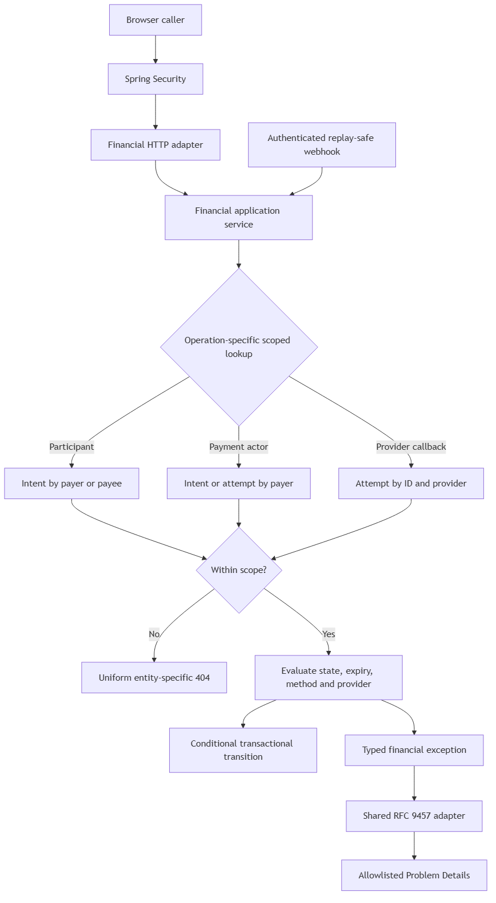
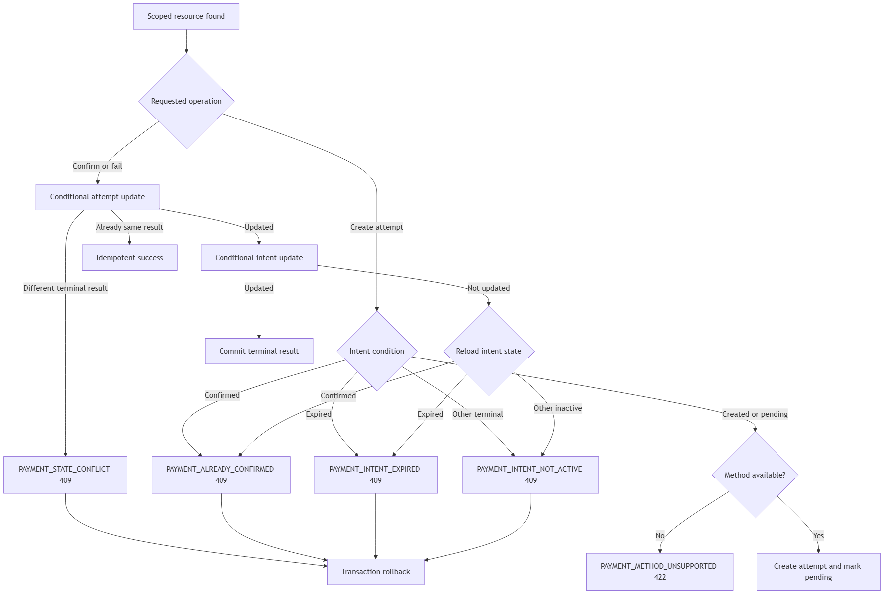

# KAN-35 — Payment Intent and Attempt Error Migration

**Status:** Approved design; written specification awaiting approval

**Date:** 2026-08-25

**Jira:** [KAN-35](https://0707manna0895.atlassian.net/browse/KAN-35)

**Parent epic:** KAN-16 — Establish production exception-handling foundation

**Depends on:** KAN-30, KAN-31, KAN-36, and KAN-32

**Blocks:** KAN-37 — Settlement error migration

## 1. Outcome

Replace the legacy payment-intent and payment-attempt exceptions with
financial-owned, transport-neutral failures rendered by the shared RFC 9457
adapter. Missing and non-owned payment resources become publicly
indistinguishable, while authorized callers still receive precise, stable
state and provider/method errors.

The migration preserves the existing payment rules, success responses,
conditional transitions, transactions, webhook authentication and replay
protection, outbox behavior, and audit behavior.

## 2. Verified baseline

The payment flow already has useful production foundations:

- browser identity is supplied by the KAN-31 Spring Security boundary;
- webhook ingress is authenticated before parsing by KAN-36;
- provider events are persistently replay-protected by KAN-32;
- payment-attempt and payment-intent terminal transitions use conditional SQL;
- confirm and fail participate in one Spring transaction; and
- the test suite exercises duplicate and competing terminal transitions.

The remaining error-contract and disclosure problems are:

- payment intent and attempt lookup starts with an unrestricted identifier;
- ownership is checked only after the resource has been loaded;
- missing resources and non-owned resources produce different public results;
- legacy `ApiException` and `ErrorCode` types remain in payment exceptions;
- provider mismatch is currently reported as unsupported-method validation;
- raw exception messages are used to construct several legacy responses; and
- the payment API tests still assert the legacy error envelope.

The persistence entities do not use optimistic version columns. Confirm and
fail are nevertheless protected by state-qualified database updates. A
separate pre-existing risk permits concurrent creation of multiple attempts
for one active intent; KAN-35 records but does not redesign that payment rule.

## 3. Scope

KAN-35 includes:

- the eight approved payment descriptors in `FinancialErrors`;
- typed payment exceptions extending `ApplicationException`;
- participant-, payer-, and provider-scoped repository lookups;
- uniform missing/non-owned payment resource behavior;
- deterministic state, method, and provider error selection;
- protected diagnostic messages separated from public details;
- migration of payment-intent and payment-attempt callers away from the
  corresponding legacy exceptions;
- RFC 9457 contract, ownership, state, concurrency, disclosure, repository,
  API, architecture, and regression tests; and
- deletion of the migrated legacy payment exception implementations.

KAN-35 does not include:

- settlement or repayment error migration;
- webhook authentication or replay redesign;
- payment authorization or administrator-policy redesign;
- concurrent payment-attempt creation redesign;
- success DTO or provider-payload redesign;
- real provider SDK integration;
- JWT or OAuth2 implementation;
- legacy-stack deletion for unmigrated financial paths; or
- Flyway schema changes.

## 4. Chosen architecture

The selected design is a focused vertical migration. The existing financial
application service keeps the payment orchestration, while neutral errors and
scoped persistence methods replace transport-coupled exceptions and
load-then-authorize behavior.

[Editable architecture source](assets/payment-error-boundary.mmd)

Two alternatives were rejected:

1. replacing exception base classes without scoped lookup, because it would
   preserve resource-existence disclosure; and
2. extracting a new payment microservice or fully separate application
   service, because it would mix error migration with a broad business and
   deployment redesign.

## 5. Responsibility boundaries

| Concern | Owner |
|---|---|
| Session identity now; JWT/OAuth2 identity later | Spring Security adapter |
| Route, request, and success-response mapping | Financial HTTP controllers |
| Ownership, role policy, and error precedence | Financial application service |
| Safe payment descriptors | `FinancialErrors` |
| Typed failure and protected diagnostics | Financial `ApplicationException` subclasses |
| Participant-, payer-, and provider-scoped lookup | Payment repository ports and adapters |
| Conditional state transitions | Payment repository adapters and PostgreSQL |
| Provider webhook authentication and replay claim | Existing KAN-36/KAN-32 pipeline |
| RFC 9457 rendering | Shared `RestExceptionHandler` |
| Outbox and audit side effects | Existing financial/outbox/audit boundaries |

Controllers do not authenticate callers, decide ownership, construct Problem
Details, or inspect provider state. Repository adapters do not decide public
errors. The shared renderer never interprets financial business state.

## 6. Ownership and disclosure policy

Authorization is established through scoped lookup before state, provider,
method, or expiry details are evaluated.

| Operation | Scoped identity | Missing or outside scope |
|---|---|---|
| Read payment intent | Account is payer or payee | `PAYMENT_INTENT_NOT_FOUND` |
| Create payment attempt | Account is payer | `PAYMENT_INTENT_NOT_FOUND` |
| Local confirm/fail attempt | Account is payer of the linked intent | `PAYMENT_ATTEMPT_NOT_FOUND` |
| Provider confirm/fail callback | Attempt ID and normalized provider code | `PAYMENT_ATTEMPT_NOT_FOUND` |

Existing administrator behavior is preserved through an explicit
administrator path. It does not weaken the scoped path used by ordinary
participants or providers. Redesigning administrator payment authority is a
separate business-policy decision.

Missing and non-owned identifiers must produce the same status, code, title,
detail, and response shape. Tests compare both cases. Protected diagnostics
may distinguish a bounded internal lookup outcome but cannot enter the public
response.

## 7. Provider-mismatch rule

The catalogue retains `PAYMENT_PROVIDER_MISMATCH`, but the application exposes
it only after resource authority has already been established.

| Scenario | Public result |
|---|---|
| Provider A callback references an attempt owned by provider B | `PAYMENT_ATTEMPT_NOT_FOUND` — 404 |
| Authorized browser/local action selects a handler different from its owned attempt | `PAYMENT_PROVIDER_MISMATCH` — 422 |

This prevents the callback route from becoming a cross-provider existence
oracle. The distinction refines error selection; it does not change the
KAN-30 public error catalogue.

## 8. Public error contract

| Code | Category | HTTP | Safe public detail |
|---|---|---:|---|
| `PAYMENT_INTENT_NOT_FOUND` | `NOT_FOUND` | 404 | The requested payment intent was not found |
| `PAYMENT_ATTEMPT_NOT_FOUND` | `NOT_FOUND` | 404 | The requested payment attempt was not found |
| `PAYMENT_INTENT_EXPIRED` | `CONFLICT` | 409 | The payment intent has expired |
| `PAYMENT_INTENT_NOT_ACTIVE` | `CONFLICT` | 409 | The payment intent is not active |
| `PAYMENT_ALREADY_CONFIRMED` | `CONFLICT` | 409 | The payment has already been confirmed |
| `PAYMENT_STATE_CONFLICT` | `CONFLICT` | 409 | The payment state no longer permits this operation |
| `PAYMENT_METHOD_UNSUPPORTED` | `BUSINESS_RULE` | 422 | The selected payment method is not supported |
| `PAYMENT_PROVIDER_MISMATCH` | `BUSINESS_RULE` | 422 | The payment attempt cannot be handled by this provider |

The shared mapping renders `NOT_FOUND` as 404, `CONFLICT` as 409, and
`BUSINESS_RULE` as 422. Titles remain category-owned by the shared adapter.

## 9. Error-selection order

For browser payment operations:

1. Spring Security establishes an authenticated principal.
2. The application performs the operation-specific scoped lookup.
3. Missing or non-owned resources return the uniform entity-specific 404.
4. The application evaluates intent state and expiry.
5. It validates the provider, method, and currency combination.
6. The conditional transition decides the terminal result under concurrency.

For provider callbacks, KAN-36 authentication and KAN-32 replay processing run
before the provider-scoped attempt lookup. A wrong-provider attempt identifier
uses the same attempt 404 as a missing identifier.

This ordering prevents state, expiry, method, and provider details from
revealing a resource that the caller is not allowed to know exists.

## 10. State and concurrency behavior

[Editable state-flow source](assets/payment-state-errors.mmd)

Attempt creation requires an owned intent in `CREATED` or
`PAYMENT_PENDING` whose expiry is still in the future. Selection is:

| Current intent condition | Result |
|---|---|
| `PAYMENT_CONFIRMED` | `PAYMENT_ALREADY_CONFIRMED` |
| Expired by state or time | `PAYMENT_INTENT_EXPIRED` |
| Other terminal state | `PAYMENT_INTENT_NOT_ACTIVE` |
| Active but provider/method/currency disabled | `PAYMENT_METHOD_UNSUPPORTED` |

Confirm and fail keep their state-qualified SQL updates and one transaction:

- attempt active states are `CREATED`, `INITIATED`, and `REQUIRES_ACTION`;
- intent active states are `CREATED` and `PAYMENT_PENDING`, and the intent must
  not be expired;
- repeating confirm on a confirmed attempt returns the existing success;
- repeating fail on a failed attempt returns the existing success;
- a competing or incompatible attempt terminal state returns
  `PAYMENT_STATE_CONFLICT`;
- an intent transition that cannot proceed is classified from freshly loaded
  intent state as confirmed, expired, or otherwise inactive; and
- an exception rolls back the attempt, intent, outbox, and joined business
  side effects in that transaction.

No optimistic-locking or attempt-creation rule is introduced in KAN-35.

## 11. Protected diagnostics

Typed exceptions carry stable internal diagnostic codes such as:

- `FINANCIAL.PAYMENT.INTENT.NOT_FOUND`;
- `FINANCIAL.PAYMENT.ATTEMPT.NOT_FOUND`;
- `FINANCIAL.PAYMENT.STATE.CONFLICT`;
- `FINANCIAL.PAYMENT.METHOD.UNSUPPORTED`; and
- `FINANCIAL.PAYMENT.PROVIDER.MISMATCH`.

Diagnostic messages may contain bounded non-secret identifiers, normalized
state names, configured provider code, method, currency, and a fixed reason
category. They must not contain credentials, signatures, authorization
headers, cookies, raw webhook bodies, unrestricted provider payloads or
messages, SQL, class names, stack traces, or arbitrary domain-exception text.

The public renderer uses only the allowlisted descriptor. A caught domain or
persistence failure is not translated into a public payment error unless the
application can classify it from trusted state. Unexpected failures retain
the generic sanitized 500 path.

## 12. Compatibility

Success DTOs, routes, HTTP success statuses, session and CSRF behavior,
webhook acknowledgements, provider replay behavior, outbox messages, and audit
events remain unchanged.

Future session replacement by JWT or OAuth2 does not affect this design.
Spring Security will still construct the same authenticated principal, and the
financial service will continue to receive stable account and role values.

The raw `providerPayload` currently present in `PaymentAttemptResponse` and
broad administrator payment authority require separate review before real
provider production rollout. They are recorded as residual risks rather than
silently redesigned in this error-migration story.

## 13. Verification strategy

- Descriptor tests assert every code, category, HTTP mapping, and public
  detail exactly.
- Exception tests assert stable diagnostic codes and separation of public and
  protected text.
- Repository/Testcontainers tests prove participant-, payer-, and
  provider-scoped lookup behavior against PostgreSQL.
- Application tests cover ownership precedence, every state classification,
  unsupported provider/method/currency, safe provider mismatch, and generic
  handling of unexpected failures.
- MockMvc filter-chain tests assert RFC 9457 `application/problem+json`
  responses and compare missing with non-owned requests.
- Existing concurrent integration tests continue to prove duplicate confirm
  and fail are idempotent and confirm-versus-fail yields one success and one
  conflict with consistent terminal state.
- Disclosure tests use sentinel provider and diagnostic text and prove it is
  absent from Problem Details.
- Architecture tests prevent migrated payment exceptions from depending on
  `common.api.exception`; the complete financial module is not declared
  migrated while settlement and repayment remain.
- Regression tests cover webhook ingress/replay, production-disabled local
  simulation, outbox, audit, session security, and unaffected financial API
  behavior.
- Focused tests and the complete Maven/GitHub Actions suites must pass before
  review.

MockMvc and Testcontainers are test-only tools and do not execute in the
production application.

## 14. Residual risk and follow-up

Concurrent payment-attempt creation can currently produce more than one active
attempt for a single active intent because attempt creation has neither an
active-attempt uniqueness rule nor a conditional intent claim. Fixing it may
change retry and multi-method business behavior, so it requires a separate
Jira defect with an explicit invariant and concurrency design.

Before real provider rollout, separately review:

- administrator payment authority;
- `PaymentAttemptResponse.providerPayload` disclosure;
- provider-specific retry and idempotency contracts; and
- gateway rate limits and operational monitoring.

These follow-ups do not weaken the KAN-35 error and ownership guarantees.

## 15. Acceptance criteria

- [ ] All eight descriptors exactly match the approved KAN-30 catalogue.
- [ ] Payment intent and attempt failures use typed, transport-neutral
      `ApplicationException` subclasses.
- [ ] Missing and non-owned resource requests are publicly indistinguishable.
- [ ] Wrong-provider callbacks cannot reveal another provider's attempt.
- [ ] State, method, and provider errors follow the approved precedence.
- [ ] Duplicate terminal operations remain idempotent and competing outcomes
      remain concurrency-safe.
- [ ] Provider text, protected diagnostics, domain messages, and internal
      implementation details never enter Problem Details.
- [ ] Migrated payment exceptions no longer depend on `ApiException` or
      `ErrorCode`.
- [ ] Settlement, repayment, webhook, outbox, audit, and security behavior do
      not regress.
- [ ] No Flyway migration is introduced.
- [ ] Focused and complete verification suites pass before review.
