# KAN-36 — Secure Webhook Ingress

**Status:** Approved written specification

**Date:** 2026-08-24

**Jira:** [KAN-36](https://0707manna0895.atlassian.net/browse/KAN-36)

**Parent epic:** KAN-16 — Establish production exception-handling foundation

**Depends on:** KAN-30 — Financial error migration design

**Blocks:** KAN-32 — Payment webhook replay protection and safe acknowledgement

## 1. Outcome

Make payment-provider webhook ingress secure by default before financial error
migration continues. An HTTP adapter reads a bounded exact body, an
application-level ingress service authenticates the provider envelope, and a
strict parser creates the normalized event only after authentication succeeds.

The financial business service receives an authenticated event. It never owns
HTTP header extraction, raw-body limits, signature parsing, timestamp
freshness, or provider-secret selection.

## 2. Verified baseline

The current implementation has useful foundations: the webhook route is
separate from browser authentication, HMAC comparison is constant time, local
and sandbox providers have feature flags, and the provider verifier is exposed
through an application port.

The following risks remain:

- `application.properties` activates `dev` when no profile is selected;
- development provider secrets have repository fallback values;
- local and sandbox beans depend only on mutable properties, not a dev/test
  profile boundary;
- the controller converts the body to `String` and parses JSON before the
  signature verifier runs;
- every request header is copied into the application command;
- HMAC covers only the payload string and has no signed freshness value;
- provider lookup and signature failures disclose different legacy messages;
- the normal application `ObjectMapper` does not define a webhook-specific
  strict schema boundary; and
- body, header, provider-code, and event-field limits are not explicit.

## 3. Scope

KAN-36 includes:

- safe explicit runtime-profile behavior;
- dev/test-only local and sandbox provider components;
- validated, type-safe webhook provider configuration;
- bounded exact-byte request capture and allowlisted protocol headers;
- provider resolution, signed timestamp freshness, HMAC verification, and
  controlled secret rotation before JSON parsing;
- a strict post-authentication JSON and field-validation boundary;
- neutral, uniform webhook rejection and payload-invalid errors;
- sanitized webhook security audit events; and
- focused configuration, protocol, controller, disclosure, and integration
  tests.

KAN-36 does not include persistent replay detection, database changes, minimal
acknowledgements, financial state-rule redesign, real provider SDKs, gateway
deployment, JWT/OAuth2, or the real-port smoke layer.

## 4. Chosen architecture

The selected design uses a dedicated ingress pipeline. The controller remains
an HTTP adapter: it extracts the path value and delegates request capture. It
does not authenticate the provider or parse the business payload.

[Editable diagram source](assets/webhook-ingress-flow.mmd)

[High-resolution PNG for Jira and offline review](assets/webhook-ingress-flow.png)

This design was selected over:

1. a Spring Security filter, which would couple provider-specific HMAC
   protocol rules to browser-user security configuration; and
2. reordering logic inside the existing controller, which would retain mixed
   HTTP, authentication, parsing, and business responsibilities.

## 5. Responsibility boundaries

| Concern | Owner |
|---|---|
| Session, JWT, or OAuth2 user authentication | Spring Security adapter |
| CSRF exemption for the machine webhook route | Spring Security configuration |
| Provider-code syntax and exact bounded body capture | Webhook HTTP adapter |
| Signature/timestamp header allowlist | Webhook HTTP adapter |
| Provider configuration and verifier selection | Webhook ingress service and verifier registry |
| HMAC, freshness, and secret rotation | Provider webhook verifier |
| Strict post-authentication JSON conversion | Dedicated webhook event parser |
| Financial state transition | `PaymentProviderWebhookService` and `FinancialService` |
| Public Problem Details rendering | Shared REST exception adapter |
| Sanitized rejection evidence | Webhook security audit port and audit adapter |
| Persistent event idempotency and minimal acknowledgement | KAN-32 |

`permitAll` means the route does not require a browser-user principal. The
request remains untrusted until provider verification succeeds.

## 6. Runtime configuration policy

- Remove the packaged `spring.profiles.active` fallback. Local execution must
  select `dev`; tests select `test`; production deployment selects `prod`.
- Base and production configuration keep local and sandbox providers disabled.
- Local and sandbox components require both their feature flag and an active
  `dev` or `test` profile. A property override alone cannot enable them in
  another environment.
- Bind webhook settings through validated `@ConfigurationProperties` rather
  than reading unstructured maps throughout the code.
- Each enabled provider defines an active secret and may define one previous
  secret with an expiry instant.
- An enabled provider with missing, blank, malformed, or insufficient secret
  material fails application startup.
- A previous secret without a future expiry is invalid. Once its expiry passes,
  it is not accepted.
- Known development/test secret values are accepted only under explicit
  `dev`/`test`; a non-development environment rejects them at startup.
- Secret values come from external configuration in production and never enter
  responses, logs, audit details, or checked-in production properties.

The default environment remains safe even when an operator forgets to choose a
profile: it does not silently enable development providers or credentials.

## 7. Local HMAC protocol

The current local protocol remains versioned by the `sha256=` signature prefix
and adds a signed timestamp:

| Value | Contract |
|---|---|
| Timestamp header | `X-Payment-Timestamp`, Unix epoch seconds |
| Signature header | `X-Payment-Signature`, `sha256=` plus 64 hexadecimal characters |
| Canonical bytes | ASCII timestamp, one `.` byte, then the exact request-body bytes |
| Algorithm | HMAC-SHA-256 |
| Freshness | Configurable short tolerance, default five minutes |

The verifier rejects missing, repeated, malformed, stale, or unreasonably
future timestamps and malformed signatures. It computes candidates for the
active secret and any still-valid previous secret and compares fixed-form
signature bytes in constant time. A match does not reveal which secret was
used.

Real providers may later supply provider-specific verifier adapters and
canonicalization. They must preserve the same ingress port and public rejection
contract.

## 8. Ingress order and limits

1. Validate the bounded provider-code syntax.
2. Reject a declared body length above the configured limit.
3. Read the servlet input stream once, stopping at the limit plus one byte so
   chunked requests cannot bypass the limit.
4. Retain only the timestamp and signature headers required by the selected
   protocol. Reject repeated or oversized values.
5. Resolve a configured verifier without exposing whether the provider exists.
6. Validate timestamp freshness and HMAC over the exact body bytes.
7. Only after authentication, parse with a dedicated strict Jackson reader.
8. Validate event type, identifiers, field lengths, and conditional fields.
9. Supply an immutable authenticated event to the financial application
   service.

Initial finite limits are configuration values with conservative defaults:

| Input | Default maximum |
|---|---:|
| Raw body | 64 KiB |
| Provider code | 32 characters |
| Timestamp header | 20 characters |
| Signature header | 80 characters |
| Provider event/payment identifier | 128 characters |
| Failure code | 64 characters |
| Failure message | 512 characters |

The strict reader rejects duplicate keys, unknown fields, trailing content,
invalid types, numeric overflow, unsupported enum values, excessive nesting,
and overlong JSON strings. An empty body is rejected before authentication
work that requires payload bytes.

The application enforces deterministic request-size limits. Distributed rate
and burst limits remain a deployment-ingress responsibility because this
repository currently has no shared gateway or distributed limiter; KAN-36 does
not add a misleading single-instance in-memory rate limiter.

## 9. Error and disclosure contract

All pre-authentication failures use one descriptor:

| Code | Category | HTTP | Public detail |
|---|---|---:|---|
| `PAYMENT_WEBHOOK_REJECTED` | `VALIDATION` | 400 | The webhook request was rejected |

This includes unknown provider, unavailable verifier, missing or malformed
authentication headers, stale timestamp, invalid signature, malformed
unauthenticated JSON, and authentication-envelope limit failures. The HMAC
protocol does not issue a `WWW-Authenticate` challenge, so the approved
contract uses 400 rather than browser-oriented 401.

After authentication succeeds, schema or field failure uses:

| Code | Category | HTTP | Public detail |
|---|---|---:|---|
| `PAYMENT_WEBHOOK_PAYLOAD_INVALID` | `VALIDATION` | 400 | The webhook payload is invalid |

Both are typed `ApplicationException` failures rendered by the existing RFC
9457 adapter. Public responses never contain the provider lookup result,
signature reason, timestamp comparison, secret state, raw body, provider
diagnostics, exception message, class name, cause, or stack trace.

## 10. Audit and observability

Rejected webhook requests create a best-effort security audit event with a
bounded action, safe configured provider code or `UNKNOWN`, request ID,
timestamp, and denied outcome. The ordinary audit detail does not distinguish
signature, timestamp, secret, or provider-configuration failure variants.

Signatures, secrets, raw bodies, unrestricted provider values, cookies,
authorization headers, credentials, diagnostic messages, and stack traces are
never recorded. Audit persistence failure does not change the public webhook
response or cause financial processing.

Authenticated payload-validation failures may be recorded separately as the
bounded category `PAYMENT_WEBHOOK_PAYLOAD_INVALID`; field values are omitted.
Expected failures are not logged again by the global exception adapter.

## 11. Request flows

### 11.1 Authenticated valid delivery

1. The HTTP adapter captures bounded exact bytes and allowlisted headers.
2. The verifier validates freshness and signature.
3. The strict parser creates the normalized event.
4. The application service performs the existing financial transition.
5. The current response remains unchanged until KAN-32 introduces the minimal
   acknowledgement and persistent duplicate handling.

### 11.2 Authentication rejection

1. Provider resolution, envelope validation, freshness, or HMAC fails.
2. JSON parsing and financial services do not execute.
3. A sanitized audit event is attempted.
4. The shared adapter returns uniform `PAYMENT_WEBHOOK_REJECTED` Problem
   Details.

### 11.3 Authenticated invalid payload

1. Provider authentication succeeds over exact bytes.
2. Strict parsing or field validation fails.
3. Financial services do not execute.
4. The response uses `PAYMENT_WEBHOOK_PAYLOAD_INVALID` without field values.

## 12. Verification strategy

- Configuration-context tests prove there is no implicit dev profile, local
  and sandbox beans cannot exist outside dev/test, and unsafe enabled-provider
  configuration fails startup.
- Raw-ingress tests cover declared and chunked oversized bodies, empty bodies,
  repeated/oversized headers, provider-code limits, and exact byte preservation.
- Verifier tests cover altered bytes, valid/stale/future/malformed timestamps,
  malformed signatures, active secret, valid previous secret, expired previous
  secret, and constant-time comparison behavior.
- Parser tests prove it is never invoked for unauthenticated input and reject
  duplicate/unknown keys, trailing JSON, invalid types, numeric overflow,
  unsupported events, excessive nesting, and bounded fields.
- Real MockMvc filter-chain tests prove the route remains session-public and
  CSRF-exempt while every authentication rejection has identical Problem
  Details and causes no financial interaction.
- Disclosure tests scan responses, captured logs, and audit details for
  signatures, secrets, raw bodies, headers, provider text, diagnostic codes,
  exception data, and stack traces.
- Complete unit, architecture, Testcontainers PostgreSQL, and GitHub Actions
  verification must pass before review.

MockMvc and Testcontainers are test-only tools and do not enter production.

## 13. Compatibility and extension

The ingress port is independent of browser sessions. Moving user endpoints to
JWT or OAuth2 does not change payment-provider authentication.

Adding a real provider requires a provider-specific verifier and configuration
entry, not controller or financial-service authentication logic. KAN-32 can
add persistent replay claims after authentication without changing the HTTP
capture and verification boundaries defined here.

## 14. Acceptance criteria

- [ ] No runtime profile silently activates `dev`.
- [ ] Local and sandbox provider components cannot start outside dev/test.
- [ ] Unsafe enabled-provider configuration fails startup.
- [ ] Exact request bytes are bounded and read once before parsing.
- [ ] Only allowlisted bounded protocol headers cross the HTTP boundary.
- [ ] Timestamp freshness and HMAC are verified before JSON parsing.
- [ ] Active and time-limited previous secrets support controlled rotation.
- [ ] Authentication rejection variants expose the same safe 400 contract.
- [ ] Strict parsing occurs only after authentication and returns the approved
      payload-invalid contract.
- [ ] Rejected or invalid requests cause no financial mutation.
- [ ] Audit and logs contain no secrets, signatures, bodies, credentials,
      unrestricted provider data, or exception diagnostics.
- [ ] Existing valid webhook business behavior remains compatible until
      KAN-32 changes acknowledgement and replay semantics.
- [ ] Focused and complete verification suites pass before review.
