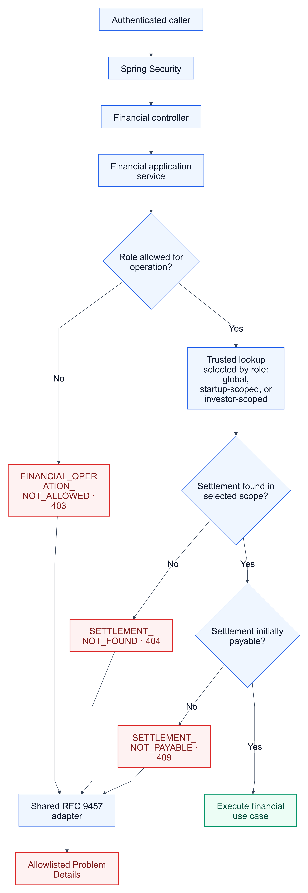
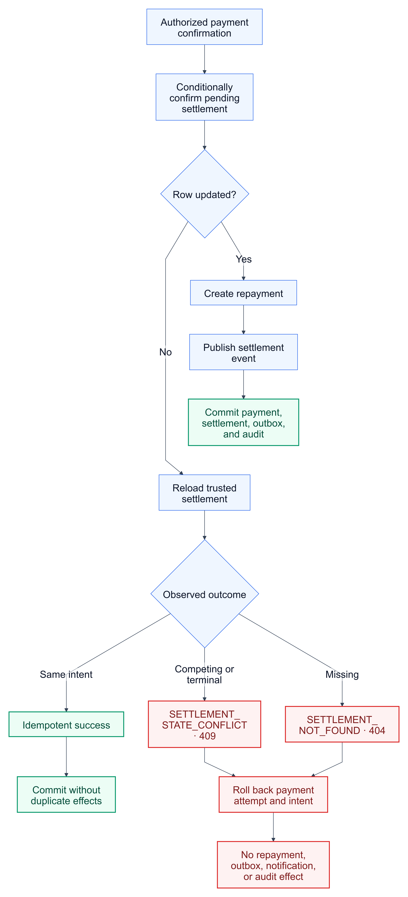

# KAN-37 — Settlement Error Migration

**Status:** Approved

**Date:** 2026-08-25

**Jira:** [KAN-37](https://0707manna0895.atlassian.net/browse/KAN-37)

**Parent epic:** KAN-16 — Establish production exception-handling foundation

**Depends on:** KAN-30 and KAN-35

**Blocks:** KAN-34 — Repayment error migration

## 1. Outcome

Replace legacy settlement exceptions with financial-owned, transport-neutral
failures rendered by the shared RFC 9457 adapter. Settlement reads use
role-specific persistence queries so a missing settlement and a settlement
outside the caller's ownership scope are publicly indistinguishable.

The migration also separates an initially non-payable settlement from a
concurrent state-transition loss. It preserves the existing settlement,
payment, repayment, outbox, notification, audit, and transaction behavior.

## 2. Verified baseline

The settlement flow already has important production foundations:

- Spring Security supplies the authenticated account and role;
- payment intent and attempt failures use the neutral KAN-35 contract;
- settlement confirmation uses state-qualified SQL;
- payment confirmation, settlement confirmation, repayment creation, and
  event publication participate in one Spring transaction;
- repeated confirmation by the same payment intent is idempotent; and
- integration tests cover payment races, expiry, repayment creation, and
  outbox behavior.

The remaining settlement problems are:

- single-settlement access begins with an unrestricted identifier lookup;
- ownership is checked only after the settlement has been loaded;
- non-owned access produces a distinguishable legacy authorization response;
- `SettlementNotFoundException` and `SettlementNotPayableException` extend
  the legacy `ApiException` hierarchy;
- a conditional confirmation loss is reported as merely not payable;
- an unused transition helper exposes raw domain exception messages through
  `InvalidSettlementStateException`; and
- API tests still assert legacy settlement error envelopes.

No optimistic version column is present. The state-qualified confirmation
update remains the concurrency control for this workflow.

## 3. Scope

KAN-37 includes:

- the four approved settlement descriptors in `FinancialErrors`;
- typed settlement exceptions extending `ApplicationException`;
- explicit role denial before resource lookup;
- startup- and investor-scoped repository lookup methods;
- uniform missing/non-owned settlement behavior;
- deterministic authorization, ownership, and state-error precedence;
- a distinct concurrent settlement-state conflict;
- protected diagnostic context separated from public details;
- removal of the unused raw-message transition helper and its legacy
  exception;
- settlement contract, repository, service, API, concurrency, rollback,
  disclosure, architecture, and regression tests; and
- rendered and editable architecture documentation.

KAN-37 does not include:

- repayment exception migration;
- payment-provider or webhook redesign;
- administrator business-policy redesign;
- settlement lifecycle or success-response redesign;
- anonymous-access policy changes;
- JWT or OAuth2 implementation;
- service extraction or a new deployable component;
- optimistic locking; or
- a Flyway migration.

## 4. Chosen architecture

The selected design is a focused vertical migration within the modular
monolith. The financial application service owns role policy, error
precedence, and orchestration. Repository ports enforce ownership in the
query. The shared adapter renders only allowlisted descriptors.

<a href="assets/settlement-error-boundary.png">
  
</a>

[Editable architecture source](assets/settlement-error-boundary.mmd)

Two alternatives were rejected:

1. replacing exception base classes while retaining global lookup followed
   by an ownership check, because it preserves resource-existence disclosure;
2. joining settlement queries to account and security tables, because profile
   identifiers already express financial ownership and avoid cross-module
   persistence coupling.

## 5. Responsibility boundaries

| Concern | Owner |
|---|---|
| Session identity now; JWT/OAuth2 identity later | Spring Security adapter |
| Route, request, and success-response mapping | Financial controller |
| Role policy, lookup selection, state checks, and error precedence | Financial application service |
| Safe public descriptors | `FinancialErrors` |
| Typed failure and protected diagnostics | Financial `ApplicationException` subclasses |
| Startup- and investor-scoped access | Settlement repository port and adapter |
| Atomic pending-to-confirmed transition | Settlement repository adapter and PostgreSQL |
| RFC 9457 rendering | Shared `RestExceptionHandler` |
| Repayment, outbox, notification, and audit effects | Existing transactional boundaries |

The controller does not authenticate callers, decide ownership, inspect
settlement state, or construct Problem Details. The repository does not
decide public errors. The shared renderer does not interpret financial state.

## 6. Authority matrix

| Operation | `ADMIN` | Owning `STARTUP` | Owning `INVESTOR` | Other authenticated role |
|---|---|---|---|---|
| Read settlement | Global lookup | Startup-scoped lookup | Investor-scoped lookup | 403 before lookup |
| List startup settlements | Not changed | Existing startup list | Not allowed | 403 before lookup |
| List investor settlements | Not changed | Not allowed | Existing investor list | 403 before lookup |
| Create settlement payment intent | Not allowed | Not allowed | Investor-scoped lookup | 403 before lookup |

An investor may create a payment intent only for a settlement owned by that
investor. Existing administrator read behavior is retained; KAN-37 does not
grant administrators payment authority.

Role denial happens before settlement lookup and returns the neutral
`FINANCIAL_OPERATION_NOT_ALLOWED`. After an allowed role is established,
missing and non-owned identifiers both return `SETTLEMENT_NOT_FOUND`.

## 7. Repository contract

The settlement repository port gains two explicit methods:

```java
Optional<Settlement> findByIdForStartup(Long settlementId, Long startupId);
Optional<Settlement> findByIdForInvestor(Long settlementId, Long investorId);
```

The existing unrestricted `findById` remains for:

- administrator reads; and
- trusted internal settlement confirmation reached through an already
  authorized payment intent.

The scoped queries filter by the settlement primary key and the appropriate
financial profile identifier in one database operation. They do not load a
settlement first and authorize it later, and they do not join identity or
security tables.

No schema or index change is required. The settlement primary-key predicate
selects at most one row before the ownership predicate is evaluated.

## 8. Public error contract

| Code | Category | HTTP | Safe public detail |
|---|---|---:|---|
| `FINANCIAL_OPERATION_NOT_ALLOWED` | `AUTHORIZATION` | 403 | This financial operation is not allowed |
| `SETTLEMENT_NOT_FOUND` | `NOT_FOUND` | 404 | The requested settlement was not found |
| `SETTLEMENT_NOT_PAYABLE` | `CONFLICT` | 409 | The settlement cannot be paid in its current state |
| `SETTLEMENT_STATE_CONFLICT` | `CONFLICT` | 409 | The settlement state no longer permits this operation |

The shared mapping renders `AUTHORIZATION` as 403, `NOT_FOUND` as 404, and
`CONFLICT` as 409. Titles remain category-owned by the shared adapter.

The corresponding stable diagnostic codes are:

- `FINANCIAL.OPERATION.NOT.ALLOWED`;
- `FINANCIAL.SETTLEMENT.NOT.FOUND`;
- `FINANCIAL.SETTLEMENT.NOT.PAYABLE`; and
- `FINANCIAL.SETTLEMENT.STATE.CONFLICT`.

## 9. Error-selection order

For settlement reads:

1. Spring Security establishes an authenticated principal.
2. The service rejects a role that cannot perform the operation.
3. The service resolves the caller's financial profile when required.
4. It selects the administrator-global, startup-scoped, or investor-scoped
   repository method.
5. Missing and outside-scope settlements return the same settlement 404.
6. An authorized settlement is mapped to the unchanged success response.

For payment-intent creation:

1. Spring Security establishes an authenticated principal.
2. The service requires the `INVESTOR` role before any settlement lookup.
3. It resolves the caller's investor profile.
4. It performs the investor-scoped settlement lookup.
5. Missing and non-owned identifiers return the same settlement 404.
6. It evaluates settlement state and expiry.
7. It reuses or creates the active payment intent under existing rules.

This order prevents role, ownership, state, and expiry differences from
forming a settlement-existence oracle.

## 10. State and concurrency behavior

An authorized payment-intent request requires a settlement whose state is
`PENDING` and whose expiry remains in the future. Any initially observed
terminal, non-pending, or expired condition returns
`SETTLEMENT_NOT_PAYABLE`.

Settlement confirmation retains `confirmPending`, which updates only a
currently pending, unexpired settlement. If the update affects no row, the
service reloads trusted settlement state:

- a settlement already confirmed by the same payment intent is idempotent
  success;
- a settlement confirmed by another payment intent returns
  `SETTLEMENT_STATE_CONFLICT`;
- an expired, failed, or cancelled settlement returns
  `SETTLEMENT_STATE_CONFLICT`; and
- a missing internal settlement returns `SETTLEMENT_NOT_FOUND` without
  exposing payment-provider data.

<a href="assets/settlement-confirmation-state.png">
  
</a>

[Editable state-flow source](assets/settlement-confirmation-state.mmd)

The distinction is deliberate:

- `SETTLEMENT_NOT_PAYABLE` describes state known before the operation starts;
- `SETTLEMENT_STATE_CONFLICT` describes a conditional transition that lost a
  race or found an incompatible state at the write boundary.

## 11. Transaction and side-effect guarantee

Payment confirmation and settlement confirmation remain one transaction.
Repayment schedule creation, `SettlementConfirmedEvent`, outbox publication,
notification policy, and audit policy run only after the settlement transition
succeeds or the same-intent replay is recognized.

A competing settlement transition must throw inside that transaction. The
payment attempt and payment intent changes roll back, and no repayment,
settlement event, outbox record, notification, or audit record is committed.

The same-intent idempotent path must not create duplicate repayment rows or
duplicate settlement-confirmed events.

## 12. Exception migration

`SettlementNotFoundException` and `SettlementNotPayableException` are
rewritten as `ApplicationException` subclasses using the approved descriptors
and protected diagnostic messages.

`SettlementStateConflictException` is added for conditional-transition
conflicts. `FinancialOperationNotAllowedException` is added or reused only
for pre-lookup role denial in migrated settlement paths. General repayment
authorization remains on the legacy path until KAN-34.

The unused `applySettlementTransition` helper and
`InvalidSettlementStateException` are deleted. Raw `IllegalStateException`
messages must not become public or protected diagnostic text through that
legacy translation.

## 13. Protected diagnostics and disclosure

Diagnostics may contain bounded non-secret values such as a settlement ID,
normalized role, normalized state, payment intent ID, and a fixed reason
category. They must not contain credentials, cookies, authorization headers,
payment-provider payloads, signatures, SQL, stack traces, arbitrary exception
messages, or personal financial data.

The public response is produced exclusively from the allowlisted descriptor.
Missing and non-owned requests must have identical status, code, title,
detail, content type, and response shape. Unexpected persistence and runtime
failures retain the generic sanitized 500 response.

## 14. Compatibility

Routes, request bodies, success DTOs, success statuses, session and CSRF
behavior, payment rules, settlement lifecycle, repayment calculations, outbox
messages, notifications, and audit events remain unchanged.

Future replacement of session authentication with JWT or OAuth2 does not
change this design. Spring Security will still supply a stable authenticated
account and role; the financial service will continue to own authorization
decisions and scoped repository selection.

The general `FinancialAccessException` and repayment exceptions remain until
KAN-34. Architecture rules remove only migrated settlement exceptions from
the legacy allowlist; they do not declare the complete financial module
migrated.

## 15. Expected file impact

Production changes are limited to:

- `FinancialErrors` settlement descriptors;
- settlement exception classes;
- `FinancialService` settlement selection and conflict classification;
- `SettlementRepository`, `SettlementRepositoryAdapter`, and
  `JpaSettlementRepository` scoped methods; and
- deletion of the unused legacy transition helper and exception.

Tests update or add:

- financial error descriptor and diagnostic contracts;
- settlement repository integration coverage against PostgreSQL;
- service authorization, precedence, state, idempotency, and rollback cases;
- MockMvc Problem Details and disclosure comparisons;
- concurrency and side-effect regression coverage; and
- architecture migration rules.

No controller production behavior, dependency, configuration, or Flyway file
is expected to change.

## 16. Verification strategy

- Descriptor tests assert all four codes, categories, HTTP mappings, and safe
  details exactly.
- Exception tests assert stable diagnostic codes and public/protected text
  separation.
- Testcontainers repository tests prove startup and investor scoped lookup
  against PostgreSQL.
- Service tests prove role denial happens before lookup, missing and non-owned
  resources are uniform, administrators use global read access, and state is
  checked only after authority.
- MockMvc filter-chain tests compare complete sanitized Problem Details for a
  missing settlement and another participant's settlement.
- Existing tests retain active-intent uniqueness, same-intent confirmation
  idempotency, and a single repayment/event chain.
- A forced zero-row settlement confirmation proves a 409 conflict rolls back
  payment attempt and intent changes and commits no repayment, outbox,
  notification, or audit effect.
- Disclosure tests prove diagnostic sentinels and internal exception messages
  never enter the response.
- Architecture tests prevent migrated settlement exceptions from depending
  on `common.api.exception` while preserving the narrow legacy allowlist for
  repayment.
- Focused tests and the complete Maven/GitHub Actions suites must pass before
  review.

MockMvc and Testcontainers are test-only tools and do not execute in the
production application.

## 17. Residual risks and follow-up

Administrator financial authority remains broad and requires a separate
business-policy review. Anonymous listing policy, real payment-provider
integration, JWT/OAuth2, and repayment migration also remain separate work.

These items are not silently combined with KAN-37 because each changes a
different trust boundary or business invariant.

## 18. Acceptance criteria

- [ ] All four descriptors exactly match the approved KAN-30 catalogue.
- [ ] Settlement failures use typed, transport-neutral
      `ApplicationException` subclasses.
- [ ] Disallowed roles receive a neutral 403 before settlement lookup.
- [ ] Missing and non-owned settlement requests are publicly
      indistinguishable.
- [ ] Administrator reads preserve existing global visibility.
- [ ] Only the owning investor can create a settlement payment intent.
- [ ] Initial non-payable state and a conditional-transition conflict use the
      approved distinct 409 errors.
- [ ] Same-intent confirmation remains idempotent without duplicate effects.
- [ ] Competing confirmation rolls back payment and produces no downstream
      effects.
- [ ] Protected diagnostics and internal messages never enter Problem
      Details.
- [ ] Migrated settlement exceptions no longer depend on `ApiException` or
      `ErrorCode`.
- [ ] Repayment, payment, outbox, notification, audit, session-security, and
      CSRF behavior do not regress.
- [ ] No dependency or Flyway migration is introduced.
- [ ] Focused and complete verification suites pass before review.
