# KAN-42 — Real-Port HTTP Problem Details Smoke Verification

**Status:** Written specification ready for review.

**Date:** 2026-08-25

**Jira:** [KAN-42](https://0707manna0895.atlassian.net/browse/KAN-42)

**Parent:** [KAN-16](https://0707manna0895.atlassian.net/browse/KAN-16) —
production exception-handling foundation

**Depends on:** KAN-33 — legacy exception-stack removal

## 1. Purpose

Add a small integration-test layer that starts the complete Spring Boot
application on a random localhost port and sends real HTTP requests through
the embedded servlet container. The layer verifies that the error contract
already proven with MockMvc also survives real socket transport, servlet
filters, Spring Security, session cookies, CSRF, exception translation, JSON
serialization, and response headers.

This is a production-readiness test, not production runtime code. It closes a
specific verification gap without replacing the broader and faster MockMvc
suite.

## 2. Verified baseline and gap

The existing suite already provides strong coverage:

- focused unit tests verify descriptors, mappings, and disclosure rules;
- MockMvc integration tests verify controllers, Spring Security, sessions,
  CSRF, Problem Details, PostgreSQL behavior, and Flyway migrations; and
- CI runs the complete unit and PostgreSQL integration profiles.

However, every current API integration test uses Spring Boot's mock web
environment. No test binds an actual port or exercises Java's HTTP cookie and
header behavior. A configuration error that appears only across the real HTTP
boundary could therefore escape the existing suite.

## 3. Scope

KAN-42 includes:

- one `RANDOM_PORT` Spring Boot integration-test base;
- Java 21 `HttpClient` with an isolated cookie store;
- the shared PostgreSQL Testcontainer and Flyway startup path;
- one focused smoke suite for a successful session flow and representative
  400, 401, 403, 404, 409, and sanitized 500 responses;
- exact checks for status, `application/problem+json`, stable error code,
  request-ID correlation, and disclosure safety; and
- automatic execution through the existing Failsafe integration-test profile.

KAN-42 does not include:

- replacing or duplicating the full MockMvc suite;
- OpenAPI generation or the separate error-catalogue story;
- successful-response modernization owned by KAN-41;
- JWT, OAuth2, anonymous-access, role, or business-policy changes;
- TLS, reverse-proxy, browser, load, deployment, or external-environment tests;
- database schema or Flyway migration changes; or
- a new production endpoint, dependency, or runtime configuration.

## 4. Chosen architecture

The test uses Java 21 `HttpClient` because it exercises real HTTP while making
cookies, redirects, headers, timeouts, and request bodies explicit. The
application starts once per Spring test context on a random loopback port.
PostgreSQL comes from the existing shared Testcontainer, and Flyway prepares
the same clean schema used by the current integration suite.

[Editable diagram source](assets/real-http-boundary.mmd)

[High-resolution PNG for Jira and offline review](assets/real-http-boundary.png)

The request path under test is:

1. Java `HttpClient` opens a real connection to the random localhost port.
2. The embedded servlet container parses the HTTP request.
3. request metadata, Spring Security, session, and CSRF filters execute.
4. the selected controller and application path execute.
5. the MVC or security error adapter renders RFC 9457 Problem Details.
6. the servlet container serializes the response and sends real headers,
   cookies, content type, status, and body back to the client.

## 5. Test component responsibilities

| Component | Responsibility |
|---|---|
| `RealHttpIntegrationTestSupport` | Start `RANDOM_PORT`, expose the base URI, register the shared PostgreSQL properties, and provide bounded HTTP helpers |
| Java `HttpClient` | Preserve cookies for one logical caller, never follow redirects automatically, and send requests with explicit timeouts |
| `RealHttpProblemDetailsIT` | Arrange unique data and assert the approved success and Problem Details contracts |
| Test-only fault probe | Raise one deterministic unexpected exception so the real sanitized 500 path is testable |
| Existing production application | Supply the real servlet, filter, security, controller, advice, Jackson, persistence, and Flyway behavior |

The support class owns transport mechanics only. It does not decide expected
business results or hide assertions behind a large custom test framework.

## 6. Stateful HTTP client flow

Each logical authenticated caller receives a new `CookieManager` and
`HttpClient`. Registration and login use the public authentication routes.
The cookie manager retains `JSESSIONID` and `XSRF-TOKEN` exactly as a normal
HTTP client would. If login has not materialized the CSRF cookie, a successful
`GET /api/v1/me` primes it. Unsafe requests copy the decoded `XSRF-TOKEN`
cookie value into the configured `X-CSRF-TOKEN` header.

Cookie state is never shared between test methods. Emails and identifiers are
unique, so the suite does not depend on method order or database cleanup.

## 7. Representative contract matrix

| Scenario | Route or mechanism | Expected result |
|---|---|---|
| Successful real session | register, login, then `GET /api/v1/me` | 201, 200, and 200 success responses with retained session cookies |
| Invalid request | Bean Validation-invalid registration body | 400 `VALIDATION_ERROR` |
| Anonymous protected request | `GET /api/v1/me` | 401 `AUTHENTICATION_REQUIRED` |
| Missing CSRF proof | authenticated `POST /api/v1/auth/logout` without the CSRF header | 403 `CSRF_VALIDATION_FAILED` |
| Missing application resource | `GET /api/v1/funding-listings/{unusedLongId}` | 404 `LISTING_NOT_FOUND` |
| Duplicate registration | register the same normalized email twice | 409 `EMAIL_ALREADY_REGISTERED` |
| Unexpected failure | authenticated request to the test-only fault probe | 500 `INTERNAL_SERVER_ERROR` |

These cases sample each public boundary; they are not an attempt to retest
every endpoint. Detailed variations remain in their focused unit and MockMvc
tests.

## 8. Problem Details invariants

Every sampled failure must prove:

- the exact HTTP status;
- content type compatible with `application/problem+json`;
- the approved stable `code`;
- a non-blank `X-Request-Id` response header;
- equality between the header and body `requestId`;
- `instance` equal to `urn:optrabidz:request:<requestId>`;
- no legacy `success` or `error` envelope fields; and
- absence of scenario-specific secret or diagnostic sentinels.

The 500 response must additionally match the fixed public title and detail and
must not contain the thrown exception's message, type, stack trace, or fault
sentinel.

## 9. Deterministic 500 verification

The suite imports a nested test configuration containing a fault controller at
`/api/v1/notifications/__test/problem-details-fault`. It exists under
`src/test`, is loaded only by `RealHttpProblemDetailsIT`, and is absent from
the production artifact and normal application component scan. The controller
throws a runtime exception containing a unique sentinel.

The probe uses the normal authenticated security chain; it does not disable or
replace Spring Security, the request metadata filter, MVC advice, or JSON
serialization. This provides deterministic 500 coverage without corrupting a
real business service or adding a production-only testing switch.

## 10. Database and Spring context strategy

The new base reuses `SharedPostgresContainer`. The four dynamic datasource
properties are registered through one package-private helper so the existing
mock-web base and new real-web base cannot drift. No container is created per
test method, no second PostgreSQL image is introduced, and no external Docker
port is assumed.

`@SpringBootTest(webEnvironment = RANDOM_PORT)`, `@ActiveProfiles("test")`, and
the existing `integration` JUnit tag identify the layer. The suite avoids
`@DirtiesContext`, ordered tests, fixed ports, sleeps, and manual server
lifecycle management.

## 11. CI and performance boundary

The test class ends in `IT`, so the existing Maven Failsafe configuration and
`verify -Pintegration-tests` CI command discover it automatically. No workflow
or dependency change is required.

The layer remains intentionally small: one Spring context and a bounded set of
representative requests. Every HTTP request has a timeout, redirects are not
followed, and failures report the response body. MockMvc remains the primary
API integration tool because it is faster and offers better focused failure
diagnostics.

## 12. Alternatives rejected

### `TestRestTemplate`

It can send real HTTP, but Java 21 `HttpClient` makes cookie storage, CSRF
header propagation, redirects, and timeouts explicit without adding an
abstraction or dependency. The explicit behavior is valuable for this
boundary test.

### Converting the MockMvc integration suite

Converting all API tests would slow feedback, duplicate transport setup, and
discard precise MockMvc assertions. Layered testing gives better coverage at
lower cost.

### Testing a deployed environment now

A deployed smoke test would also involve TLS termination, infrastructure,
secrets, and deployment ownership. That is useful later but does not replace a
deterministic repository integration test.

## 13. Expected file impact

Expected test changes:

- add `RealHttpIntegrationTestSupport`;
- add `RealHttpProblemDetailsIT` with its nested test-only fault probe; and
- extract shared datasource-property registration from
  `PostgresIntegrationTestSupport` into `SharedPostgresContainer`.

Expected documentation changes:

- this design and its three diagram assets;
- a focused implementation plan after written-spec approval; and
- lifecycle and verification evidence updates during delivery.

No production Java source, `pom.xml`, workflow, database migration, or runtime
property file is expected to change.

## 14. Verification strategy

Implementation will follow test-first checkpoints:

1. add the real-port smoke assertions and capture the meaningful RED boundary;
2. add only the required test transport support and fault probe;
3. run the focused `RealHttpProblemDetailsIT` suite;
4. run documentation-link and publication checks;
5. run the complete unit and PostgreSQL integration profiles; and
6. require exact-head GitHub unit and PostgreSQL checks before merge review.

The RED checkpoint may be a missing support capability or a real boundary
failure; it must not be manufactured by changing production behavior.

## 15. Acceptance criteria

- [ ] A Spring Boot test binds a random loopback port and sends real HTTP.
- [ ] The application uses the shared PostgreSQL Testcontainer and Flyway.
- [ ] Registration, login, cookies, session authentication, and CSRF operate
      through the real HTTP client.
- [ ] Representative 400, 401, 403, 404, 409, and sanitized 500 responses use
      the approved Problem Details contracts.
- [ ] Request-ID header, body, and instance values agree for every sampled
      failure.
- [ ] Secret and diagnostic sentinels are absent from public responses.
- [ ] The test-only fault probe cannot enter the production artifact.
- [ ] Existing MockMvc coverage remains the primary detailed API suite.
- [ ] Existing Maven integration CI discovers the new test without workflow
      changes.
- [ ] Focused, complete local, documentation, and exact-head CI checks pass.
- [ ] No production API, security policy, business rule, database schema,
      dependency, or successful response changes are mixed into KAN-42.
