# KAN-43 — OpenAPI Problem Details Contract and Public Error Catalogue

**Status:** Implemented and locally verified

**Date:** 2026-08-25

**Jira:** [KAN-43](https://0707manna0895.atlassian.net/browse/KAN-43)

**Parent:** [KAN-16](https://0707manna0895.atlassian.net/browse/KAN-16) —
production exception-handling foundation

**Depends on:** KAN-33 — legacy exception-stack removal; KAN-42 — real-port
HTTP Problem Details verification

**Verification evidence (2026-08-27):**

- verified implementation head: `b470edd`;
- 69 unique public error codes composed from 61 module descriptors, seven
  framework problems, and three Spring Security problems;
- 439 unit tests passed with zero failures, errors, or skips;
- 145 PostgreSQL integration tests passed with zero failures, errors, or
  skips;
- deterministic catalogue snapshot and repository documentation links passed;
- base-disabled, test-public JSON, authenticated JSON, and UI-disabled
  exposure modes passed; and
- OpenAPI components and representative operation references matched real
  invalid-registration and missing-listing Problem Details responses.

## 1. Purpose

Publish the existing RFC 9457 Problem Details behavior as a verifiable OpenAPI
contract and a reviewer-friendly error catalogue. The documentation must come
from the same safe public definitions used by the application, remain aligned
with runtime responses, and stay unavailable by default in production.

This story documents the failure contract. It does not redesign successful
responses, business authorization, authentication technology, or error
handling behavior.

## 2. Verified baseline and gap

The application already has:

- a framework-free `ErrorDescriptor` and `ErrorCategory` contract;
- 61 public module descriptors across 11 module catalogue classes;
- seven framework problems and three Spring Security problems;
- one `ProblemDetailsFactory` that renders the public wire format;
- stable category-to-status and title mappings;
- disclosure-safe MVC and Spring Security boundaries; and
- unit, MockMvc, PostgreSQL integration, and real-port HTTP verification.

The runtime Problem Details body contains:

- `type`, `title`, `status`, `detail`, and `instance`;
- `code`, `requestId`, and `timestamp`; and
- `violations` only for validation problems.

Springdoc is present, but there is no explicit OpenAPI configuration, no
documented reusable Problem Details schema or response components, no
environment exposure policy, and no test connecting OpenAPI and repository
documentation to the runtime catalogue. The current security fallback also
permits unmatched routes, so enabling Springdoc without an explicit matcher
would expose its endpoints anonymously.

## 3. Scope

KAN-43 includes:

- explicit immutable descriptor collections in each module error catalogue;
- one outer documentation adapter that composes module, framework, and
  security problems into a normalized public catalogue;
- conflict detection and test-only inventory reflection;
- reusable OpenAPI Problem Details schemas and response components;
- representative operation-level references to those responses;
- a fail-closed environment and Spring Security exposure policy;
- a checked-in Markdown error catalogue generated deterministically from the
  normalized definitions; and
- unit, architecture, OpenAPI, security, snapshot, and real-port parity tests.

KAN-43 does not include:

- changing any HTTP status, error code, title, detail, or runtime error flow;
- successful-response documentation or retirement of the existing
  `ApiResponse` utility, which remains owned by KAN-41;
- JWT, OAuth2, session, CSRF, role, anonymous-access, or business-rule changes;
- documenting every possible error against every controller operation;
- publishing stack traces, diagnostic context, database identifiers, secrets,
  implementation classes, or internal exception messages;
- database, Flyway, Kafka, cache, notification, payment, or audit changes; or
- upgrading Spring Boot or Springdoc.

## 4. Chosen architecture

The source definitions remain with the modules that own them. A top-level
documentation adapter may depend on those definitions because it is an outer
integration layer. `common`, domain, application, and feature modules must not
depend on the documentation adapter.

[Editable diagram source](assets/error-contract-publication.mmd)

[High-resolution PNG for Jira and offline review](assets/error-contract-publication.png)

The publication flow is:

1. each module exposes an explicit immutable list of its descriptors;
2. the documentation adapter adds the safe framework and security definitions;
3. the adapter normalizes every source into one public definition;
4. identical duplicate codes are merged and retain all source owners;
5. conflicting duplicates fail immediately;
6. the OpenAPI customizer publishes schemas, response components, and the
   global code enumeration; and
7. a deterministic renderer produces the checked-in Markdown catalogue while
   parity tests protect all outputs from drift.

Runtime exceptions do not query this catalogue. The existing exception and
Problem Details path remains unchanged.

## 5. Component responsibilities

| Component | Responsibility |
|---|---|
| Module `*Errors` catalogues | Own descriptors and expose an immutable explicit collection without framework dependencies |
| Framework problem catalogue | Expose only fixed public code, status, title, and detail definitions used by the MVC boundary |
| `SecurityProblem` | Continue to own fixed public Spring Security failures |
| Public error definition | Represent code, status, title, detail, type URN, category where applicable, and source owners |
| Documentation catalogue | Compose, normalize, sort, validate, and deduplicate all public definitions |
| OpenAPI configuration | Register schemas, reusable responses, response headers, and allowable error codes |
| Markdown renderer | Render the normalized catalogue in a stable order and format |
| Exposure policy | Coordinate Springdoc availability with authorization rules and reject unsafe configuration combinations |
| Verification tests | Detect omitted constants, dependency inversion, conflicts, output drift, exposure regressions, and runtime mismatch |

The public error definition belongs to the documentation adapter. The neutral
`common.error` package stays dependent only on Java and itself.

## 6. Catalogue source and inventory rules

Each module catalogue gains one method returning `List<ErrorDescriptor>`. The
list is explicit and immutable. Production code does not use reflection to
discover constants because reflection makes ownership and completeness hard to
review and can change silently during refactoring.

Reflection is allowed only in tests. The inventory test scans every public
static `ErrorDescriptor` field in the known `*Errors` classes and proves that
the corresponding explicit collection contains exactly the same descriptor
instances. It also proves that the central documentation catalogue includes
every module collection, every framework problem, and every security problem.

Adding a new public error therefore requires an intentional catalogue update.
If a developer adds a constant but forgets the collection or documentation
composition, the build fails.

## 7. Normalized public definition and duplicate policy

Every source is projected to this safe external meaning:

| Field | Rule |
|---|---|
| `code` | Stable upper-snake-case client discriminator |
| `status` | Numeric HTTP status rendered by the boundary |
| `title` | Fixed public problem title |
| `detail` | Fixed disclosure-safe public explanation |
| `type` | `urn:optrabidz:problem:<lower-hyphen-code>` |
| `category` | Neutral category for module errors; absent only where the transport problem has no neutral category |
| `sources` | Sorted set of owning modules or transport boundaries |

The documentation adapter compares duplicate codes using the complete external
contract: code, status, title, detail, and type. An exact match becomes one
catalogue entry whose `sources` contains every owner. Any difference is a
configuration error and fails catalogue construction and tests.

This permits the existing identical `AUTHORIZATION_FAILED` definitions to
share one public code without permitting two meanings for the same code.

## 8. OpenAPI schemas

The OpenAPI document defines two reusable schemas.

### `ProblemDetails`

Required application contract fields:

| Field | OpenAPI type | Constraint |
|---|---|---|
| `type` | string, URI | Approved OptraBidz problem URN |
| `title` | string | Fixed public title |
| `status` | integer | HTTP status represented in the body |
| `detail` | string | Fixed safe public detail |
| `instance` | string, URI | `urn:optrabidz:request:<requestId>` |
| `code` | string | Allowable values derived from the normalized catalogue |
| `requestId` | string | Same value returned in `X-Request-Id` |
| `timestamp` | string, date-time | UTC instant |

Although RFC 9457 permits some members to be omitted generally, the application
currently emits every field above; the OpenAPI schema documents the stricter
OptraBidz contract.

### `ValidationProblemDetails`

This schema composes `ProblemDetails` and adds required `violations`. Each
`ValidationViolation` contains only required `field` and `message` strings.
No rejected values, binding internals, exception types, or diagnostic context
are documented or returned.

The schemas describe the real serialized `ProblemDetail` contract. KAN-43 does
not create fake runtime response DTOs merely to satisfy documentation tooling.

## 9. Reusable responses and operation references

Reusable `application/problem+json` responses are registered for:

- 400 Bad Request using the base schema;
- 400 Request Validation using the validation schema;
- 401 Unauthorized;
- 403 Forbidden;
- 404 Not Found;
- 405 Method Not Allowed;
- 406 Not Acceptable;
- 409 Conflict;
- 415 Unsupported Media Type;
- 422 Unprocessable Entity; and
- sanitized 500 Internal Server Error.

Every reusable response documents the `X-Request-Id` response header. Separate
400 components are necessary because malformed requests and module validation
errors use the base schema, while framework request validation adds required
`violations`. Other responses reference `ProblemDetails`.

A small representative set of controller operations references the reusable
components through standard Swagger annotations. The project already imports
`com.project.optrabidz.common.api.response.ApiResponse` in many controllers,
which collides with Swagger's annotation simple name. Those few annotations
therefore use the fully qualified
`io.swagger.v3.oas.annotations.responses.ApiResponse` name. KAN-43 does not
introduce a custom annotation framework or alter successful response code.

The global `code` enumeration is exhaustive, but an operation's reusable status
references are representative rather than a promise that every global code can
occur on that operation.

## 10. Exposure policy

Documentation endpoints follow this matrix:

| Environment | OpenAPI JSON | Swagger UI | Authorization |
|---|---|---|---|
| Base or unspecified profile | Disabled | Disabled | Documentation routes denied |
| Development | Enabled | Enabled | Anonymous local access |
| Test | Enabled | Disabled | Anonymous test access |
| Production default | Disabled | Disabled | Documentation routes denied |
| Production with explicit JSON enablement | Enabled | Disabled | Authenticated access |

Production Swagger UI cannot be enabled by the KAN-43 production properties.
The optional production JSON endpoint remains compatible with the current
session system and future JWT or OAuth2 adapters because the policy requires an
authenticated Spring Security context rather than a specific authentication
mechanism.

Security matching covers all known Springdoc surfaces before the current
permit-all fallback:

- `/v3/api-docs`;
- `/v3/api-docs/**`;
- `/v3/api-docs.yaml`;
- `/swagger-ui.html`;
- `/swagger-ui/**`; and
- `/webjars/swagger-ui/**`.

Springdoc enablement and the application-owned documentation access mode are
validated together at startup. An unsafe or contradictory combination fails
startup instead of exposing documentation accidentally.
`springdoc.use-management-port` remains explicitly disabled so documentation
cannot bypass the application security chain through a second port.

## 11. Repository error catalogue

`docs/error-handling/error-catalogue.md` is the stable, always-reviewable public
catalogue. It contains one row per unique code with:

- code;
- category when applicable;
- HTTP status;
- title;
- safe detail;
- type URN; and
- all source owners.

The table is sorted by code. It contains no timestamps, local paths, internal
identifiers, diagnostics, secrets, exception classes, or implementation-plan
language.

A pure deterministic renderer produces the expected Markdown from the
normalized catalogue. A snapshot test compares the rendered bytes with the
checked-in file. The test does not parse a hand-maintained Markdown table,
which would add a brittle second interpretation of the contract.

The error-handling README links to the catalogue and explains the update rule:
change the owning error definition, update its explicit collection, regenerate
the catalogue, and run parity verification.

## 12. Verification strategy

### Focused unit verification

- module collections are immutable and contain every declared descriptor;
- normalized entries derive the correct status, title, detail, and type;
- identical duplicates merge their sources;
- conflicting duplicates fail with a deterministic explanation; and
- output ordering is stable.

### Architecture verification

- `common.error` remains framework-free;
- domain, application, and feature code do not depend on the documentation
  adapter; and
- runtime production error handling does not depend on catalogue generation.

### OpenAPI verification

- `/v3/api-docs` contains the required schemas and fields;
- `code` allowable values exactly match the normalized unique code set;
- every reusable response uses `application/problem+json` and documents
  `X-Request-Id`;
- representative operations reference the expected reusable responses; and
- no diagnostic or secret-oriented field appears in the schemas or examples.

### Exposure verification

- the base policy denies or removes every JSON and UI route;
- development exposes JSON and UI anonymously;
- test exposes JSON but not UI;
- production default exposes neither;
- explicitly enabled production JSON rejects anonymous requests and permits an
  authenticated request; and
- invalid property combinations fail startup.

### Documentation and real-HTTP parity

- deterministic Markdown output exactly matches the checked-in catalogue;
- repository documentation links and assets pass the existing validator;
- a real-port test fetches `/v3/api-docs` in the test profile;
- representative real runtime failures match the documented status, content
  type, code, title, safe detail, and request-ID behavior; and
- complete unit and PostgreSQL integration profiles remain green.

The real-port check extends the small KAN-42 smoke layer. It does not duplicate
the full endpoint suite.

## 13. Security and disclosure invariants

- Disabled documentation endpoints are not reachable through alternate JSON,
  YAML, Swagger configuration, redirect, WebJar, or static-resource paths.
- Springdoc is not permitted to publish through the management port.
- Production JSON, when enabled, requires authentication before content is
  returned.
- Swagger UI remains disabled in production.
- The catalogue contains only already-approved public information.
- No diagnostic context from `ApplicationException`, raw exception message,
  SQL value, stack trace, secret, credential, webhook signature, session value,
  or internal database identifier enters OpenAPI or Markdown.
- Error examples use synthetic request IDs and timestamps only.
- Future authentication replacement changes the authentication adapter, not
  the documentation contract or authorization requirement.

## 14. Expected file impact

Expected production changes:

- add explicit immutable collections to the 11 module `*Errors` catalogues;
- expose safe framework problem definitions consistently with security
  problems;
- add the top-level documentation catalogue, OpenAPI configuration, and
  exposure-policy configuration;
- add explicit documentation matchers to Spring Security; and
- add base, development, test, and production Springdoc properties.

Expected test changes:

- add inventory, conflict, renderer, OpenAPI, exposure, architecture, and
  real-port parity coverage; and
- extend existing test support only where needed to select documentation
  properties and authenticated callers.

Expected documentation changes:

- this design and its diagram assets;
- `docs/error-handling/error-catalogue.md`;
- error-handling and global documentation indexes; and
- this focused implementation plan.

No controller success body, exception runtime behavior, database migration,
CI workflow, authentication mechanism, or business policy changes are
expected.

## 15. Alternatives rejected

### Runtime reflection over every error class

Reflection would reduce explicit registration but obscure ownership and make
production behavior depend on classpath scanning. Explicit collections plus a
test-only reflection guard provide stronger reviewability without runtime
magic.

### Hand-maintained OpenAPI and Markdown lists

Independent lists would drift as soon as an error is added or changed. One
normalized catalogue with parity tests makes drift a build failure.

### Putting composition in `common`

`common` would need to depend outward on every feature module, reversing the
dependency direction and risking cycles. The documentation adapter is the
correct outer composition root.

### Public production Swagger UI

Interactive UI increases discovery and request-execution surface without being
required by production runtime. Local UI plus optional authenticated JSON gives
developers useful documentation with a smaller production exposure.

### A custom controller annotation framework

A custom meta-annotation could hide the Swagger `ApiResponse` name collision,
but it would add another abstraction before endpoint-wide documentation is
needed. A few explicit fully qualified annotations are easier to inspect and
remove when KAN-41 retires the conflicting utility.

### Upgrading Springdoc in this story

Spring Boot 3.3.x and Springdoc 2.6.x are compatible. An upgrade would mix
dependency maintenance and possible generated-contract changes into a contract
publication story.

## 16. Risks and mitigations

| Risk | Mitigation |
|---|---|
| A new descriptor is omitted | Test-only reflection compares fields, module collections, and aggregate catalogue |
| One code gains two meanings | Full public-definition conflict detection fails the build |
| OpenAPI and Markdown drift | Both derive from one normalized catalogue and exact parity tests |
| Documentation becomes public unintentionally | Base-disabled properties, explicit route matchers, startup validation, and profile tests |
| The adapter creates dependency inversion | Top-level package plus ArchUnit rule preventing inward dependencies |
| Documentation leaks diagnostics | Safe projection allowlist plus schema, example, and sentinel tests |
| Controller annotations become noisy | Limit standard references to representative endpoints; leave comprehensive success documentation to KAN-41 |

## 17. Acceptance criteria

- [x] All module, framework, and security public errors appear in one validated
      normalized catalogue.
- [x] Module catalogues expose explicit immutable collections and test-only
      reflection detects omissions.
- [x] Exact duplicate definitions merge source owners; conflicting duplicate
      codes fail.
- [x] OpenAPI publishes the approved base and validation Problem Details
      schemas with exhaustive unique error codes.
- [x] Separate base and validation 400 components plus reusable 401, 403, 404,
      405, 406, 409, 415, 422, and sanitized 500 responses use
      `application/problem+json` and document `X-Request-Id`.
- [x] Representative operations reference reusable failures without changing
      successful responses or adding a custom annotation framework.
- [x] Base and production defaults expose neither OpenAPI JSON nor Swagger UI.
- [x] Development exposes both; tests expose JSON only; explicitly enabled
      production JSON requires authentication and production UI stays disabled.
- [x] Every known JSON, YAML, Swagger configuration, redirect, WebJar, static
      UI, and management-port route follows the exposure policy.
- [x] The checked-in Markdown catalogue is deterministic, complete, sorted,
      safe, and byte-for-byte protected against drift.
- [x] Architecture tests preserve inward dependency direction.
- [x] OpenAPI, repository catalogue, and representative real HTTP failures
      agree on the public contract.
- [x] Focused, complete unit, PostgreSQL integration, and documentation
      verification pass before review.
- [ ] Exact-head CI verification passes for the published review branch.
- [x] No business rule, authentication mechanism, database schema, runtime
      failure behavior, successful response, or unrelated dependency change is
      mixed into KAN-43.
